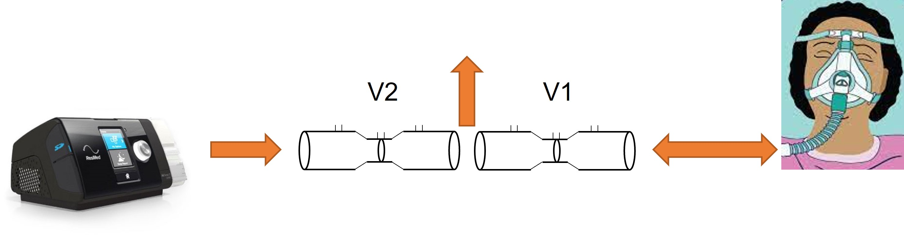

# CPAP Measurements Assignment

## Background

Obstructive sleep apnea is a condition in which breathing stops involuntarily
for brief periods of time during sleep.  The flow of air stops because the
airways may constrict due to "floppy" muscles that do not keep the airways
open.  This disruption of airflow can lead to periods of decreased oxygen
supply to the brain and other parts of the body, as well as poor sleep quality
leading to daytime drowsiness.
(Source:  <https://www.healthline.com/health/sleep/obstructive-sleep-apnea>)

Obstructive sleep apnea is often treated with the use of a continuous positive
airway pressure (CPAP) machine.  The patient wears a mask connected to the
CPAP.  The mask provides pressurized air for the patient to breath.  The
pressure is set high enough to help keep open the airways so that they cannot
collapse and block air flow.  Breathing is not interrupted.

In this assignment, we will be writing code that reads in raw pressure
data from venturi flow tubes of a CPAP device, converting that data into
flow measurements, and analyzing these flow results.

## Pressure/Flow Measurement Set-up
The general flow set-up is as follows.



A CPAP machine is connected to the patient mask through a device which contains
two venturi tubes.  Flow from the CPAP is unidirectional and changes to 
maintain a reasonably constant pressure at the CPAP outlet.  Flow to/from the
patient is bi-directional as they breath in and out.  When the patient breathes
in (inspiration), flow from the CPAP increases to maintain pressure.  When the 
patient exhales (expiration), less (or no) flow is required from the CPAP to
maintain pressure because the exhalation is also adding pressure.  Excess 
pressure is relieved via an outlet tube between the two venturi tubes.  The V1
venturi tube measures inspiration and expiration flow for the patient.  The
V2 venturi measures flow to/from the CPAP.

The venturi tubes are set up to measure flow in both directions.  A diagram
for the V1 tube is shown below.


Flow through a venturi tube is calculated from the pressure drop between the
wider portion of the tube upstream of the constriction and the narrow portion 
of the tube. From the Bernoulli equation and conservation of mass, at a 
constant volume flow rate, the linear velocity of the flow will change as the 
cross-sectional area for flow changes.  This change in linear velocity will 
change the pressure.  The ratio of pressures and areas can be used to calculate 
the volumetric flow.


$Q$ is the volumetric flow rate ($m^3 / sec$)    
$A_1$ is the upstream cross-sectional area ($m^2$)  
$A_2$ is the cross-sectional area at the constriction ($m^2$)  
$\rho$ is the density of air ($kg / m3$)  
$p_1$ is the upstream pressure ($Pa$)  
$p_2$ is the pressure at the constriction ($Pa$)

For this device, the following values should be used:
* $\rho$, moist air density = 1.199 $kg / m^3$
* $d_1$, the diameter of the larger part of the venturi tube = 15 $mm$
* $d_2$, the diameter of the constriction = 12 $mm$

## Pressure Readings / Input Data
The input data consists of a series of pressures measured over time.  At each
time point, the following information is recorded:
1. Time (seconds)
2. $p_2$ pressure of venturi 1 (patient-side)
3. $p_{1,ins}$ pressure of venturi 1 (patient-side during inspiration)
4. $p_{1,exp}$ pressure of venturi 1 (patient-side during expiration)
5. $p_2$ pressure of venturi 2 (CPAP-side)
6. $p_{1,ins}$ pressure of venturi 2 (CPAP-side during inspiration)
7. $p_{1,exp}$ pressure of venturi 2 (CPAP-side during expiration)

The pressure measurements are all reported in ADC units, an integer 
representing the analog-to-digital conversion result of the measured pressure.
The ADC spec sheet gives the following conversion for ADC to a pressure
reading in cm-H2O:

```
Pressure (cm-H2O) = [(25.4) / (14745 - 1638)] * (ADC_value - 1638)
```

For each time point, the ADC values need to be converted into pressure 
readings.  Then, the flow through each venturi can be calculated as follows.
The $p_{1,ins}$ and the $p_{1,exp}$ values are compared.  
* If
$p_{1,ins}$ is greater than or equal to $p_{1,exp}$, the flow is moving towards
the patient (inspiration).  The volumetric flow rate is calculated using 
$p_{1,ins}$ and $p_2$ in the above equation.  The resulting flow rate is 
assigned a positive value to indicate flow towards the patient.
* If $p_{1,ins}$ is less than $p_{1,exp}$, the flow is moving away from the
patient (expiration).  The volumetric flow rate is calculated using $p_{1,exp}$
and $p_2$ in the above equation.  The resulting flow rate is assigned a
negative value to indicate flow away from the patient.

The input file is a text file with the data for each time point on a separate 
line.  The seven data points for each time period are separated by commas.  The 
first line of the data file contains the description of the seven data columns.

## Program Specifications
* The program should read the input data from a text file.  Example input files 
can be found in the `sample_data` folder of the repository.  Each line of data 
will contain the seven readings as described above.  The code does not need a
user interface for selecting an input file.  And, the code only needs to be 
able to analyze one file at a time.  The desired filename may be entered
directly in the code.
* If any of the seven values on a line are missing, contains a non-numeric
string, or is NaN, the program should recognize that the data point is missing
or incorrect, create an `error` log entry in the log file, ignore this time
point, and skip to the next line.
* Create an `info` log entry in the log indicating the start of data analysis
  and the name of the input file.
* The program should calculate the flow versus time based on the inputted
pressure versus time data.  This can be done from the Venturi 1 data.
* From the flow versus time data, the following information should be 
calculated and saved as key-value pairs in a Python dictionary called 
`metrics`.  The key-value pairs should be:
  * `duration`: float, the time duration of the data in seconds
  * `breaths`: integer, number of breaths in the data
  * `breath_rate_bpm`: float, the average breathing rate from the data in 
     breaths per minute
  * `breath_times`: list of floats, the identified times for each breath
  * `apnea_count`: integer, number of apnea events in the data
  * `leakage`: float, the total amount of mask leakage observed in the data
    in liters
* The `metrics` dictionary should be output as a JSON file.  The JSON file
  should have the same name as the input file, but with an extension of `.json`
  instead of `.txt`.  Example:  the dictionary created from the input file of
  `patient_04.txt` should be saved in a JSON file called `patient_04.json`.
* All numeric values above should be reported as numbers (i.e., `int` or 
  `float`), not as numeric strings (i.e., not `"5.3"`)
* When calculating the `leakage`, if the leakage value is negative, a `warning`
  log entry should be added to the log indicating that the leakage is negative.

A breath can be identified by a positive peak in volumetric flow (the 
inhalation) followed by a negative peak in flow (the exhalation).

An apnea event occurs when the time elapsed between breaths is more than
10 seconds.  

The leakage is calculated by determining the total net flow through Venturi 1.
If more flow is observed going to the patient than coming back from the 
patient, the difference is volume lost due to leaks in the mask seal.

## Git Version Control Expectations
* Frequent and meaningful commits!
* Branches should be used for specific feature implementations, bug fixes, etc.
* Branch names should be meaningful.
* Merge your feature branches into the main branch using Pull Requests on Git
Hub.
  * Feature branches should be merged only after a passing GitHub Actions
    result.  GitHub Actions should be running unit tests for all existing code
    on the branch and doing a PEP-8 style check.
  * Do not delete your branches after merging them into main.
* Create an annotated tag title `v1.0` or subsequent version number when your
  assignment is completed and ready to be graded.
* Make sure that your project has a `README.md` file that contains:
  * instructions on how to run your program
  * how you identified the breaths
  * a software license with your project (<http://choosealicense.com/>)
  * anything else you think the graders should know to understand the operation
    and function of your code

## Python Code Expectations
* Modular code:  write a single function for each functional element of your 
    code, and all functions must have associated unit tests with comprehensive 
    coverage.
* Utilize a virtual environment with `requirements.txt`
* Have correctly formatted docstrings for all methods/functions.  
* Unit tests should exist using standard naming conventions. 
* Achieve the functional specifications with passing unit tests.  
* All methods should have well-defined input-action-output (as the unit tests 
    will demand).
* There should be no "hard-coded" values in your methods.
* Adhere to [PEP8](https://www.python.org/dev/peps/pep-0008/) style. 
* Implement exception handling as needed: when reading in data, non-numeric
    values could be detected using a try/except block, with the appropriate
    exceptions being handled
* Gracefully terminate when the input file ends
* A logging text file should be created with the log entries contained in the
  specifications above, along with any other log entries you would like to
  create.

## Grading Criteria
* Meeting the expectations outlined above, including...
* Effective version control usage
* Adequate unit test coverage and functional modularity
* Python style and docstrings
* Achieves functional specifications and correct analysis results
* Works with all the provided test data
* Any of the workflow, python methodology, or other criteria from previous 
  assignments

## References
This assignment and the sample data used are derived from data found on 
[PhysioNet](https://physionet.org/).

Goldberger, A., Amaral, L., Glass, L., Hausdorff, J., Ivanov, P. C., Mark, R., 
... & Stanley, H. E. (2000). PhysioBank, PhysioToolkit, and PhysioNet: 
Components of a new research resource for complex physiologic signals. 
Circulation [Online]. 101 (23), pp. e215–e220.

Guy, E., Knopp, J., & Chase, G. (2022). CPAP Pressure and Flow Data from a 
Local Trial of 30 Adults at the University of Canterbury (version 1.0.1). 
PhysioNet. https://doi.org/10.13026/xfae-vv63.
