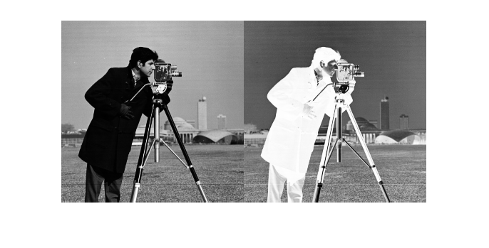

# Medical Image Database Final Project (Spring 2020)

**Final Project DUE:** Monday, April 27, 2020, 9:00 AM EST 

## Overview
The final project in this class will require you to leverage the
industry-standard skills you've learned over this semester to design and
implement a software system to upload a medical image to a
web-server, store the image in a database, perform image-processing tasks on 
the web-server, and then display
/ download the original and/or processed image.  

This final project can be somewhat open-ended if you would like to tailor this to
your areas of interest.  If you plan to stray away from the recommended project
and requirements below, please submit a one-page project proposal to Dr. Ward
by *Friday, April 17, 2020* for evaluation to ensure the proposed
project meets the requirements for the class. Be sure to include motivations,
technologies, functional specifications, and anticipated deliverables.

It is expected that you will follow proper professional software
development and design conventions taught in this class, including:
* git feature-branch workflow
* continuous integration
* unit testing
* PEP8
* docstrings
* Use of issues and milestones to track development progress (new to this 
assignment)

## Functional Specifications
### GUI Client
At a minimum, your GUI client should do the following:
* Provide a __graphical__ user interface that will allow a user to select an 
  image for upload to your web-server, and then issue a RESTful API request
  to your cloud service to upload the image.
  
* Your __graphical__ user interface should allow the user to choose an uploaded
image and conduct an image processing step on that image.  For this assignment,
the image processing step will be to invert an image (see example below).  This
processing step should happen on the server, not the client.
  
  

* Your user interface should also provide:
  + The ability to choose and display an image (original or processed) from the
  server.
  + The option to show two images from the server side-by-side.
  + The option to download an image (original or processed) from the server and
  save it on the local computer.
  + Display useful metadata of displayed images, including:
    - Timestamp when uploaded (or processed)
    - Image size (e.g., X x Y pixels)
  
* In order to complete these tasks, the client GUI will need to make RESTful 
API requests to the server to get the list of uploaded images, to initiate the 
image processing step on a selected image, and to 
download images for either display or saving on the computer.

### Cloud Server
At a minimum, your server should be a cloud-based web service running on your 
virtual machine that exposes a well-crafted RESTful API that will implement 
the tasks needed by the client as described above and outlined here:

* Accept images for uploading and storage in a persistent database and include
a timestamp in the database for when the image was uploaded

* Conduct the image processing methods on selected files as specified above 
  (check out
  [scikit-image](http://scikit-image.org/) to make your life easier on the 
  image processing algorithms!) and store the processed image in the database
  along with a timestamp of when the processing took place
  
* Communicate with and utilize a persistent database that will:
  + Store uploaded images and timestamps
  + Store processed images and timestamps

* Provide a list of available images to the client

* Provide for the downloading of an image from the database to the client
  
* Provide any other services as needed for the client to perform its needed
functions.

**Note**: The GUI should only make requests to the server and should not make 
contact with the database.  All database functions should be handled from the
server.  If the GUI needs to interact with the database, it should do it by
making requests of the server. 

## Deliverables
* A detailed `README` describing the final performance and state of your
  project.  This should include a basic instruction manual for your GUI client.
* Recorded video demo of your client program in action.      
* All project code for GUI client, server, and tests (in the form of a tagged 
GitHub repository).  Client and server code should be well documented with docstrings.
* Link to deployed web service in your`README.md`.

#### Video demo
* This can be a recorded screen capture or a video taken by camera.
* Zoom allows an easy way to record actions on your screen with narration.
Visit <https://support.zoom.us/hc/en-us/articles/201362473-Local-Recording> or
do a web search on "using zoom to record screen" for lots of tutorials.
* The video can be shared in many ways: in your GitHub repository, via a link
to your cloud Zoom recording, on YouTube, or any other method.  Just indicate
in your `README.md` how I can access the video.

<!--## Recommended Datasets
Your project may utilize some existing databases of images (or you can choose to
use your own images).  Here are some example datasets that you can access for
this project:

* <https://medpix.nlm.nih.gov/home>
* http://www.vision.caltech.edu/Image_Datasets/Caltech101/
* <https://www.cs.toronto.edu/~kriz/cifar.html>
* https://github.com/beamandrew/medical-data
* Over 13000 annotated skin lesion images are available from the International
  Skin Imaging Collaboration (ISIC) project:
  https://isic-archive.com. 
-->
## Grading

The following is a partial list of aspects of the project that will be graded.

* Git Repository
  + Issues/Milestones (New for this assignment)
  + Commits are discrete, logical changesets
  + Feature-branch workflow
* Software best practices
  + Modularity of software code
  + Handling and raising exceptions
  + Language convention and style (PEP8)
  + Docstrings for all functions
* Testing and CI
  + Unit test coverage of all functions (except Flask handler and GUI calls)
  + Travis CI passing build
* Cloud-based Web Service
  + RESTful API Design 
  + Validation Logic 
  + Returning proper error codes
  + Robust deployment on virtual machine 
  + Image processing functionality
* Proper use of a database 
* User interface functionality
* Demo of the final working project
* Robust README