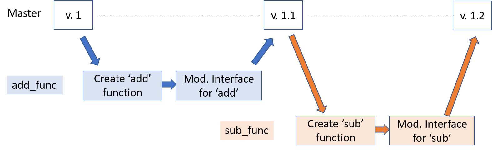

# Git Workflow
## Feature Branch Approach

In this approach, each major feature of the software is developed on its own
branch in git.  Once the feature is complete, tested, and approved, it can
then be merged into the main branch.  No development should be done directly
on the main branch.  In this way, the main branch always contains the 
latest, correctly working copy of the program.

Code development on each feature should be kept reasonably independent from 
other features and branches.

## When to Commit
A commit should represent a discrete piece of work or code, not a hodgepodge
of changes.  When writing new code, at a minimum each new function should be
its own commit.  When fixing bugs, each bug fix should be one commit.  Or, if
it is a major bug requiring lots of changes, the bug fix might be done on a
branch with multiple commits for when each function is changed.

Commit messages should describe what is added or changed in the program and,
most importantly, why.  A message like "fixed bug" does not
communicate anything.  Whereas "fixed bug where typing 'a' in interface led
to crash in function 'addition'" is better.  

<table>
<tr>
<th>Bad Commit Message</th>
<th>Good Commit Message</th>
</tr>

<tr>
<td>Fixed bug</td>
<td>Fixed bug where typing 'a' in interface led to crash in function 'addition"</td>
</tr>

<tr>
<td>Added new code</td>
<td>Implement multiplication function in calculator</td>
</tr>

<tr>
<td> Working more on feature</td>
<td> Add two buttons to GUI to allow for scrolling through list</td>
</tr>

<tr>
<td>Change pt_limit from 5 to 10</td>
<td>Extended the number of points that will be plotted by changing constant pt_limit</td>
</tr>
<table>

## Example of branch/commit design
Lets say you were working on a calculator app.  You might choose to develop
the user interface on the `interface` branch, and the code to do the math on 
a different branch called `calculation`.  On the `calculation` branch, you 
might have one commit be the function for doing addition, and another commit
for the function doing subtraction, etc.

Alternatively, you might choose to do the branches differently, such as
developing the addition on a single branch, and the commits could be the code
for doing the math and then the code for the interface.  Subtraction would be
developed on a different branch.

## Exercise
Lets write a program that will do some basic laboratory test result checks.

#### Specifications
* Allows user to select the type of test (HDL vs LDL vs Total)
* Allows user to enter the test result
* Calculates whether the entered test results is in or out of desired ranges
* Outputs the result to the user

__Question__:  How might we split up this work?

#### If not already done
* Create a GitHub repository with a `README.md` file
* Clone repository to your local computer

#### Interface Branch
* Create and checkout a branch called `interface`
* Create a file and add the following code for the interface
```python
def interface():
    print("My Program")
    print("Options:")
    print("9 - Quit")
    choice = input("Enter your choice: ")
    if choice=='9':
        return
   
interface()
```
* Run code to test, then commit it to repository.
* Modify code, using a `while` loop, so that it continues until quit is hit.
<!---
```python
def interface():
    keep_running = True
    while keep_running:
        print("My Program")
        print("Options:")
        print("9 - Quit")
        choice = input("Enter your choice: ")
        if choice=='9':
            keep_running = False
    return
   
```
--->
* Commit
* Push Branch to GitHub
* On GitHub, open Pull Request to merge `interface` into `main`.
* Confirm Pull Request.
* On local computer, checkout `main` and pull the updated `main` branch 
from GitHub to your local repository.

#### HDL Branch
The first check will be categorizing the results of an HDL test.
* From main, create and checkout a new branch called `HDL`.
* Write a function to accept input from the user.
<!---
```python
def accept_input():
    entry = input("Enter the test result: ")
    return int(entry)
```
--->
* Commit
* Write a function, called `check_HDL`, for checking the HDL result:
<table>
<tr>
<th>If HDL Is</th> <th>Return</th>
</tr>
<tr>
<td> 60 or greater</td> <td>"Normal"</td>
</tr>
<tr>
<td>40 or greater but less than 60</td> <td>"Borderline Low"</td>
</tr>
<tr>
<td>below 40</td> <td>"Low"</td>
</tr>

</table>

<!---
```python
def check_HDL(HDL):
    if HDL >= 60:
        return "Normal"
    elif 40 <= HDL < 60:
        return "Borderline Low"
    else:
        return "Low"        
```
--->
* Commit
* Write a "driver" function that calls your input function and then your 
`check_HDL` function
<!---
```python
def HDL_test_checker():
    test_result = accept_input()
    HDL_level = check_HDL(test_result)
```
--->
* Commit
* Write a function to output your results, and call that function from your
driver function.
<!---
```python
def output_result(test_name, test_score, test_result):
    print(f"For the {test_name} test, a result of {test_score} is {test_result}")

def HDL_test_checker():
    test_result = accept_input()
    HDL_level = check_HDL(test_result)
    output_results("HDL", test_result, HDL_level)
```
--->
* Commit
* Modify interface to add the HDL analysis option and call your HDL driver 
function.
<!---
```python
def interface():
    keep_running = True
    while keep_running:
        print("My Program")
        print("Options:")
        print("1 - Cholesterol Check")
        print("9 - Quit")
        choice = input("Enter your choice: ")
        if choice=='9':
            keep_running = False
        elif choice == '1':
            cholesterol_check()
    return
```
--->
* Commit
* Test everything, and make changes as needed.  Commit any changes.
* Push `HDL` branch to GitHub.
* On GitHub, open a Pull Request to merge `HDL` into `main`.
* Confirm pull request.
* Pull updated `main` branch to local repository.

### LDL Branch
On your own:  make a new branch and modify your program to include the
ability to analyze for LDL:
* LDL less than 130 is normal
* LDL 130 to 159 is borderline high
* LDL 160-189 is high
* LDL 190 and above is very high.
   

### Total Cholesterol Branch
* Using the feature branch approach, add a total cholesterol check feature 
to your code.
  - <200: Normal
  - 200 - 239: Borderline high
  - \>=240: High

If you want to practice working with shared repositories, work with a partner:
* Find a partner and give permission for them to access your repository
  - Navigate to your repository that you want to share with someone else.
  - Click on "Settings" in the repository toolbar.
  - Select the "Collaborators" option in the left-side menu list.
  - Enter a GitHub username in the box and click Add Collaborator.
  - This should send an e-mail to the other user to accept and will then give
  them read/write permissions to your repository.
  
* Clone your partner's repository to your local computer.  If their repository
has a name that you are already using, you can clone the repository into a
folder with a different name using the following syntax:
```bash
git clone https://github.com/<userID>/<repoName>.git <NewFolderName>

Example:  git clone https://github.com/dward2/calculator.git partner_calculator
```
 
* Develop the total cholesterol code on a feature branch of your partner's
repository and push it up to their GitHub repository.
* On GitHub in your partner's repository, open a Pull Request and include your 
partner as a reviewer.  Do not merge
the Pull Request.  That is up to the partner who owns the repository.
