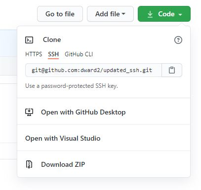

# Intro to Git
Git is a distributed version control system.  It is used, among other things,
to track changes made to a project and allow different versions of a project
to be created.

## Creating a local git repository
We will be using a command line interface (CLI) for interacting with git.  The
CLI could be a Git Bash window on a Windows machine or a Terminal window on
a Mac.

Open a CLI.  Examples here will be from a Git Bash window.  

```
dwonl@DESKTOP-G8L84L6 MINGW64 ~
$
```
You will see the command line prompt.  The exact content and format of the
prompt will depend on your operating system and settings.  The default prompt
in the Git Bash window will show your local user name (`dwonl`), your computer 
name (`DESKTOP-GBL4L6`), the current window platform (`MINGW64`) and the current
path `~`.

Both Git Bash windows and the Terminal on Mac use Linux-like commands.  The `~` 
is shorthand for your home directory.  To see in which directory you currently 
are in, you can use the `pwd`command.  `pwd` is short for "print working 
directory".

```
dwonl@DESKTOP-G8L84L6 MINGW64 ~
$ pwd
/c/Users/dwonl
```

I would suggest creating a directory in which to keep all of your repositories 
for this class.  Create a folder called `repos` or `BME547` or such, as follows.

```
dwonl@DESKTOP-G8L84L6 MINGW64 ~
$ mkdir repos

dwonl@DESKTOP-G8L84L6 MINGW64 ~
$ cd repos

dwonl@DESKTOP-G8L84L6 MINGW64 ~/repos
$ 
```

The command `mkdir <directory_name>` creates a new directory (
mkdir = make directory) as a subdirectory within the current one.  The command 
`cd <directory_name>` moves into the stated directory (cd = change directory).

Now, in this new directory, lets make a subdirectory to contain our first
repository.

```
dwonl@DESKTOP-G8L84L6 MINGW64 ~/repos
$ mkdir first

dwonl@DESKTOP-G8L84L6 MINGW64 ~/repos
$ ls
first/
```
The command `ls` lists the files and directories contained in the current 
directory.

Navigate into this new subdirectory in which we will make our repository.
```
dwonl@DESKTOP-G8L84L6 MINGW64 ~/repos
$ cd first

dwonl@DESKTOP-G8L84L6 MINGW64 ~/repos/first
$
```

A directory is simply a place to store files on your computer. (Note, the terms
directory and folder are used interchangeably.)


To create a git repository in this directory, enter the following command:
```
dwonl@DESKTOP-G8L84L6 MINGW64 ~/repos/first
$ git init
Initialized empty Git repository in C:/Users/dwonl/repos/first/.git/

dwonl@DESKTOP-G8L84L6 MINGW64 ~/repos/first (main)
$ 
```
The command prompt now has `(main)` added to it, to indicate that we are
currently on the main branch.  More about that later.

If we look at what is now in the directory, we see the following:
```
dwonl@DESKTOP-G8L84L6 MINGW64 ~/repos/first (main)
$ ls -a
./  ../  .git/
```

The command `ls -a` shows all the content of a directory, including hidden items.
A hidden directory called `.git` has been created to store information about
the repository.  

Git creates three virtual containers in which it puts the files:


## Working Copy
Lets start by adding a file to the directory.  For this first file, we are going
to create a file using the terminal editor `nano`.  At the command line,
type `nano file1.txt`.  This will create a new file called `file1.txt`.  Enter
some text into the editor, and then type `ctrl-x` followed by `Y`, and then
`Enter` to accept the filename `file1.txt`.  `nano` will exit back to the 
command line.  Now, we can see that the new file has been created:

```
dwonl@DESKTOP-G8L84L6 MINGW64 ~/repos/first (main)
$ nano file1.txt

dwonl@DESKTOP-G8L84L6 MINGW64 ~/repos/first (main)
$ ls
file1.txt
```
When a change exists in the "Files in directory" that does not exist in the 
"Repository", git considers this change to be part of its internal "Working 
Copy."


Typing `git status` shows the following:
```
dwonl@DESKTOP-G8L84L6 MINGW64 ~/repos/first (main)
$ git status
On branch main

No commits yet

Untracked files:
  (use "git add <file>..." to include in what will be committed)

        file1.txt

nothing added to commit but untracked files present (use "git add" to track)
```
`git status` tells us that we are on the main branch, we have not yet 
committed anything to the repository, but that there are untracked files, with
`file1.txt` being that file.

## Adding to the Staging Area or Index
We need to tell git which files we want to track or add to the repository.  We
do that using the `git add <filename>` command:
```
dwonl@DESKTOP-G8L84L6 MINGW64 ~/repos/first (main)
$ git add file1.txt
warning: LF will be replaced by CRLF in file1.txt.
The file will have its original line endings in your working directory.

dwonl@DESKTOP-G8L84L6 MINGW64 ~/repos/first (main)
$ git status
On branch main

No commits yet

Changes to be committed:
  (use "git rm --cached <file>..." to unstage)

        new file:   file1.txt
```
Now, when we enter `git status`, we see that our file is now listed as a change
to be committed.  This file is now considered by git to be in the Staging
area or index.


## Commit to Repository
Finally, we commit the file to the repository by using the `git commit` 
command:
```
dwonl@DESKTOP-G8L84L6 MINGW64 ~/repos/first (main)
$ git commit -m "initial commit of file1.txt"
[main (root-commit) 47a8b7d] Add file1.txt to the repo
 1 file changed, 2 insertions(+)
 create mode 100644 file1.txt
```
The file is now considered a part of the repository, or sometimes called the
tree.


The `git status` command now will show the following:
```
dwonl@DESKTOP-G8L84L6 MINGW64 ~/repos/first (main)
$ git status
On branch main
nothing to commit, working tree clean
```

## Commit History and `git log`
Let's add a second file to our repository.  This time, instead of using a
terminal editor, we are going to create a file in the operating system windows
so that we can see that how files are created are git-independent.

For example, in Windows, I can open a Windows Explorer window and navigate to
my folder C:\Users\<UserName>\repos\first.  There, I am going to create a new
file called `file2.txt` and edit that with a GUI text editor.


This new file is not part of the repository, so git puts it in the working copy
or working tree.  Anything that has been modified, but not added to the
repository is considered to be in the working copy.

Next, we can add this new file to the staging area:

and then commit it:


The commit history of the repository now looks like this:


and can be seen by using the `git log` command.
```
$ git log
commit d945b32718b5104b765e06608e53f418cc1e3ff6 (HEAD -> main)
Author: David Ward <david.a.ward@duke.edu>
Date:   Wed Jan 16 08:55:21 2019 -0500

    add file2.txt

commit 8ca80c39c35e85a36019b365a3f61613dccb7552
Author: David Ward <david.a.ward@duke.edu>
Date:   Wed Jan 16 08:36:18 2019 -0500

    initial commit of file1.txt
```

Notice that next to the most recent commit, there is a pointer called `HEAD`.
`HEAD` is a special pointer that points to the current version or commit of
the repository.  

## Editing File in Repository
Now, lets say I edit `file1.txt`.  Git will see that the file in the directory 
has changed relative to the version in the repository.  So, git will consider
this change to be part of the working copy.
```
$ git status
On branch main
Changes not staged for commit:
  (use "git add <file>..." to update what will be committed)
  (use "git checkout -- <file>..." to discard changes in working directory)

        modified:   file1.txt

no changes added to commit (use "git add" and/or "git commit -a")
```


The actual file in the directory will contain the edits.  Git will assign
this modified file to the working directory.  However, git still has an
unmodified copy of `file1.txt` from the previous commit (it is stored in the
`.git` subdirectory created with `git init`).

Next, the command `git add file1.txt` will add it to the staging area:
```
$ git status
On branch main
Changes to be committed:
  (use "git reset HEAD <file>..." to unstage)

        modified:   file1.txt
```


and `git commit -m "modify file1.txt"` will commit it to the repository.


The commit history now looks like this:
```
$ git log
commit da349ca0ac31b1e1d6a4853a8f9721e9885ed6d4 (HEAD -> main)
Author: David Ward <david.a.ward@duke.edu>
Date:   Wed Jan 16 11:24:53 2019 -0500

    modify file1.txt

commit d945b32718b5104b765e06608e53f418cc1e3ff6
Author: David Ward <david.a.ward@duke.edu>
Date:   Wed Jan 16 08:55:21 2019 -0500

    add file2.txt

commit 8ca80c39c35e85a36019b365a3f61613dccb7552
Author: David Ward <david.a.ward@duke.edu>
Date:   Wed Jan 16 08:36:18 2019 -0500

    initial commit of file1.txt
```
or graphically:


Note that a unique identifier number has been created for each commit.  These
are used to reference specific commits.  Often the first 7 digits are used as
a short cut.

## Branches
When we want to add a new feature or addition to our project, we will likely
not want to corrupt the current "working" version of the project while we are
developing the new version.  We can do this by using "branches".  The "main"
branch is usually considered to have the most recent version of the best
working code.  We then make a copy of that code and save it on a branch where
we can work on it.

To create a new branch, we use the command `git branch <branchname>`.
```
dwonl@DESKTOP-G8L84L6 MINGW64 ~/repos/first (main)
$ git branch my_new_branch

dwonl@DESKTOP-G8L84L6 MINGW64 ~/repos/first (main)
$ git branch
* main
  my_new_branch
```

Above, we created a new branch called `my_new_branch`.  Then, using the command
`git branch` without a branch name, we can list the existing branches.  We can
see our original `main` branch and the new `my_new_branch`.  The current 
branch is shown by the `*` next to its name.  If we want to switch to the new
branch, we use the command `git checkout <branchname>`:
```
dwonl@DESKTOP-G8L84L6 MINGW64 ~/repos/first (main)
$ git checkout my_new_branch
Switched to branch 'my_new_branch'

dwonl@DESKTOP-G8L84L6 MINGW64 ~/repos/first (my_new_branch)
$ ls
file1.txt  file2.txt

dwonl@DESKTOP-G8L84L6 MINGW64 ~/repos/first (my_new_branch)
$ git status
On branch my_new_branch
nothing to commit, working tree clean
```

Once the branch is changed, we can see that command prompt now shows the name
of the new branch, `ls` shows it has the same files, and `git status` says that
we are on the new branch.  

On this branch, let's modify the content of `file1.txt` and create a new file
called `file3.txt`.  After this is done, we have the following:

```
dwonl@DESKTOP-G8L84L6 MINGW64 ~/repos/first (my_new_branch)
$ ls
file1.txt  file2.txt  file3.txt

dwonl@DESKTOP-G8L84L6 MINGW64 ~/repos/first (my_new_branch)
$ git status
On branch my_new_branch
Changes not staged for commit:
  (use "git add <file>..." to update what will be committed)
  (use "git checkout -- <file>..." to discard changes in working directory)

        modified:   file1.txt

Untracked files:
  (use "git add <file>..." to include in what will be committed)

        file3.txt

no changes added to commit (use "git add" and/or "git commit -a")
```
Our directory now has three files, file1.txt has been modified since the last
commit, file3.txt is untracked, and nothing is staged for commit.  We
then need to add the two changes to the staging area and then commit.  This
is done with the following series of commands:
```
$ git add file1.txt
$ git add file3.txt
$ git commit -m "file1 and file3 changes for new branch"
```
Notice that each file that has changed needs to be added to the staging area.
Then, all changes add to the staging area can be committed with a single commit
command.

Now, on our new branch, we have added a third file, and modified the first.
What happens if we go back to our `main` branch?

```
dwonl@DESKTOP-G8L84L6 MINGW64 ~/repos/first (my_new_branch)
$ ls
file1.txt  file2.txt  file3.txt

dwonl@DESKTOP-G8L84L6 MINGW64 ~/repos/first (my_new_branch)
$ git checkout main
Switched to branch 'main'

dwonl@DESKTOP-G8L84L6 MINGW64 ~/repos/first (main)
$ ls
file1.txt  file2.txt
```
The main branch has our original two files, and if you looked in file1.txt,
it would not contain the new edits.  But, file3.txt and other changes have
not been lost.  They are stored in `.git`.  We can bring the changes back by
checking out the new branch again.

```
dwonl@DESKTOP-G8L84L6 MINGW64 ~/repos/first (main)
$ git checkout my_new_branch
Switched to branch 'my_new_branch'

dwonl@DESKTOP-G8L84L6 MINGW64 ~/repos/first (my_new_branch)
$ ls
file1.txt  file2.txt  file3.txt
```

# Using GitHub
Up to this point, we have been using git locally on our computer.  We want to
be able to share our code with others, or back-it up somewhere else.  We will
be using GitHub as an on-line git server.  The easiest way to link a local
repository to a GitHub repository is to create a new GitHub repository and then
clone it to our computer.

## Create a GitHub Repository
First, log into GitHub and go to your repositories page.  To get there, click
on the user icon on the upper right portion of the screen and select "Your
repositories" from the menu that appears.  Click on the green "New" button to 
create a new repository.

Alternatively, you can simply click on the "+" icon next to the user icon and
select "New Repository".

Either way, a "Create a new repository" screen will open.  Enter a repository
name and a short description if desired.  Select Public or Private, and make
sure that "Initialize this repository with a README" is selected.  Then, click
create repository.  A new repository page will be shown.  

## Clone the GitHub Repository onto your local computer
On the main page of your repository, you will then see a green button labeled 
"Code".  Click on that.  A box should open with the title "Clone".  Make sure
the SSH option is underlined.  


Copy the SSH URL that is shown that looks like 
`git@github.com:user_name/repo_name.git`.

On your local computer, open Git Bash.  Navigate to your `repos` directory, or 
any other directory in which you want to create a subdirectory containing this 
repository.  Then, use the following command:  `git clone <SSH_URL>`, 
substituting `<SSH_URL>` with the SSH URL copied from GitHub.  This command 
will now make a new subdirectory with the repository name from GitHub.

As an example, let's say I have a GitHub repository called `updated_ssh`.  I 
could clone repository to my computer as follows:
```
dwonl@DESKTOP-G8L84L6 MINGW64 ~/repos
$ git clone git@github.com:dward2/updated_ssh.git
Cloning into 'gittest'...
remote: Enumerating objects: 47, done.
remote: Total 47 (delta 0), reused 0 (delta 0), pack-reused 47
Unpacking objects: 100% (47/47), done.

dwonl@DESKTOP-G8L84L6 MINGW64 ~/repos
$ ls
first/  updated_ssh/
```  
A new subdirectory is created called "updated_ssh".  If I wanted to use a different
name for the local folder, I could add an optional directory name after the URL.
For example:  `git clone git@github.com:dward2/updated_ssh.git ssh_example`

You can now switch into this directory to use the repository.  You will see that
the "README.md" file from GitHub can now be found in your local repository.

## Push and Pull

Let's do two things:
1.  Make an edit to the README.md file.
2.  `git add` and `git commit` the README.md file to save the changes to the
repository.
3.  Create a new text file in the folder. 
4. `git add` and `git commit` this new file to the repository.

To push these commits from our local repository to GitHub, we use the following
command:  `git push`.  This will push whatever new commits are found on the
current branch up to GitHub.  (Note:  if you are pushing up a new branch to
GitHub, you will be prompted to use a slightly different command: 
`git push --set-upstream origin <branchname>`).

You should now see that the changes you made locally will now be seen in
GitHub.  

Let's do the reverse.  In GitHub, make some changes to the README.md file.
Then, back in your local GitBash, type `git pull`.  This will bring the changes
made in GitHub back to your local repository.

