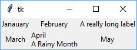
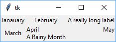

# Graphical User Interface (GUI)

## Intro
Typically, we think of computer programs as being sequential:  moving
from one block to another, each block transforming inputs to outputs, with
continuous "action".

GUIs are typically "reactive" or event driven.  After the initial display of
the GUI, the program generally waits for some sort
of user input.  That input triggers some code to take an action leading to 
modified output in the GUI.  Then, the program waits for more user input.

Another example of event-driven interactions is the server-client relationship.
Once a server is started, it essentially waits for a request from a client.
The client request triggers specific server code to act on that request.

__What are GUI events?__  Clicking on a button, entering text in a field,
dragging a scroll bar, making a choice from a menu, etc.

In sum, the user causes an event to happen, and the program responds to these 
events.


Discuss how you might want to map out your interface, understand how it can
be gridded, before getting started.


## Principles for GUI Interface Design
* __Make things cancelable or reversible__  
Give the user the option to cancel an action at
any step of the process.  There is nothing more frustrating than clicking on
something, realizing you don't want to do it, and having no option but to
move forward with something you didn't want to do.  Also, a more forgiving
interface will encourage a user to do more exploration.

* __Provide frequent feedback__  
Tell users when an action is complete and what
was done or completed during that action.

* __Create cues about what should be done next__  
   + Use checklists or label steps
   + Put the  next action or input near to the previous action or input
  
* __Be consistent in how interface works__
  
* __Avoid jargon__  
  Make sure that actions or input required are understood.

## GUIs for Python
There are a very large number of GUI packages for use in Python. 
[See a list here.](https://wiki.python.org/moin/GuiProgramming)

Most are a set of Python bindings to an underlying graphics package that often
provides support for multiple platforms.  Two such packages are:
* [Tkinter](https://docs.python.org/3/library/tk.html): a package bundled with 
default Python distribution that binds to the open-source, cross-platform 
GUI toolkit [Tk](https://en.wikipedia.org/wiki/Tk_(software)).
* [PyQt](https://www.riverbankcomputing.com/software/pyqt/intro): 
a Python binding to the [Qt](https://www.qt.io/) framework, a popular 
cross-platform GUI framework written in C++.

A lot goes into deciding the best GUI package to use:  the needed 
functionality, licensing considerations, easy of use, and personal preferences.

In class, we will be discussing the use of the `tkinter` package as it is
relatively easy to use and is part of the Python install.

## Tk Info
### Importing `tkinter`
```
import tkinter as tk        # Standard binding to Tk (tk-inter(face))
from tkinter import ttk     # Binding to newer "themed widgets"
```
**Note:** Occasionally, the Tk package may not be installed during the Python 
installation.  If, upon running the code above, an error of 
`ModuleNotFoundError: No module named 'tkinter'` is seen, the following can
be entered at the command line on macOS or Linux to install Tk:
```
sudo-apt sudo apt-get install python3-tk
```
### Widgets
The building blocks for making a GUI in `tkinter` (as well as many GUI 
packages) are widgets.  Pretty much every part of the GUI is considered a
widget:  the window, buttons, checkboxes, radial buttons, labels.  You
construct the GUI by adding widgets to your interface.

The starting point for your GUI is the main window.  It is created as follows:
```
root = tk.Tk()  # Defines the top (root) window.
```
To this root window, we now add widgets.

When adding a widget, you must always specify the parent of the widget when 
defining the widget.  The parent is the widget in which you want to place the 
new widget.
For example:
```
root = tk.Tk() # Defines the top, or root, window, so doesn't have a parent
content = ttk.Frame(root)  # The content Frame is placed in root
ok_btn= ttk.Button(content)  # The ok_btn button is placed in the content Frame
```
  
Details about the widgets, such as its text, size, actions are configured when 
the widget is first created by adding parameters after the
parent parameter.  Example:
```
>>> button = ttk.Button(root, text="Hello", command="buttonpressed", width=50)
```
Later, if you need to see what the configuration values are, you can then see 
the values of the configurations as follows:
```
>>> button['text']
'Hello'
```
We can change the value of certain configurations as follows:
```
>>> button['text'] = 'goodbye'
# Or another way is
>>> button.configure(text='goodbye')
>>> button['text']
'goodbye'
```
Note, this does not work for every configuration item.

We can get more information about a particular configuration as follows:
```
>>> button.configure('text')
('text', 'text', 'Text', '', 'goodbye')
```
Or, a list of all of the configuration options:
```
>>> button.configure()
{'command': ('command', 'command', 'Command', '', 'buttonpressed'),
 'default': ('default', 'default', 'Default', <index object: 'normal'>, <index object: 'normal'>),
 'takefocus': ('takefocus', 'takeFocus', 'TakeFocus', 'ttk::takefocus', 'ttk::takefocus'),
 'text': ('text', 'text', 'Text', '', 'goodbye'),
 'textvariable': ('textvariable', 'textVariable', 'Variable', '', ''),
 'underline': ('underline', 'underline', 'Underline', -1, -1),
 'width': ('width', 'width', 'Width', '', ''),
 'image': ('image', 'image', 'Image', '', ''),
 'compound': ('compound', 'compound', 'Compound', <index object: 'none'>, <index object: 'none'>),
 'padding': ('padding', 'padding', 'Pad', '', ''),
 'state': ('state', 'state', 'State', <index object: 'normal'>, <index object: 'normal'>),
 'cursor': ('cursor', 'cursor', 'Cursor', '', ''),
 'style': ('style', 'style', 'Style', '', ''),
 'class': ('class', '', '', '', '')}
```

### Geometry Management:  Laying out the GUI
The code above defines and creates widgets.  But, none of the code above will 
actually display any of the widgets because it does not define where any of the
added widget should be on the parent widget.  Specifying the relative
positions of the different widgets on a parent is called Geometry Management.  

The `grid` command is the most versatile geometry management function.  It is 
most easily explained by way of example.
```
root = tk.Tk()
mainframe = ttk.Frame(root).grid(column=0, row=0)
ttk.Label(mainframe, text="Janauary").grid(column=0, row=0)
ttk.Label(mainframe, text="February").grid(column=1, row=0)
ttk.Label(mainframe, text="A really long label").grid(column=2, row=0)
ttk.Label(mainframe, text="March").grid(column=0, row=1)
ttk.Label(mainframe, text="April\nA Rainy Month").grid(column=1, row=1)
ttk.Label(mainframe, text="May").grid(column=2, row=1)
```


The code above first creates a root window, and then adds a Frame widget, 
called `mainframe` to the window.  (We'll come back to that command in a 
minute).  Then,a series Label widgets are added to this Frame.  They are 
created with the `ttk.Label` command and are sent two parameters:  the parent, 
which is the `mainframe` Frame, and the text to be displayed as the label.

Then, the `.gird()` function is added to the Label declaration.  This function
tells the interface how to add the widget to the "grid" layout of the parent,
which is the `mainframe` Frame in this case.  The "grid" layout has columns and
rows, where the first column and row has an index of 0 (zero).  When the
window is drawn, the needed amount of space is created for each column and row,
as you can see in the example window.  

The default is that the widget will be centered in its grid space.  But, this
can be modified with the `sticky` parameter.  Using the compass points of N,
S, E, and W, you can tell the interface to re-align the widget within its
grid space.  For example, May is centered both horizontally and vertically.
It can be moved to the upper right of its grid space with the following
modification:
```
ttk.Label(mainframe, text="May").grid(column=2, row=1, sticky="NE")
```


Additional parameters are available 
to further modify the appearance, and will be discussed below or can be
found in the documentation.

We have been discussing how the Labels were added to the grid layout of the
Frame.  When the Frame was added to the root window, we also needed to assign
where the Frame was going to be in the root window.  So, the Frame declaration
also has a `.grid(column=0, row=0)` function.  Note, if the widget is not 
added to the grid, it is not shown in the window.

The `.grid()` function can be used separately from the definition of the 
widget if the widget is saved in a variable.  Example:
```
may_label = ttk.Label(mainframe, text="May")
may_label.grid(column=2, row=1, sticky="NE")
```

### Activating GUI / Starting Root Window
Once the window is fully defined with all of its widgets, the GUI can be
activated and displayed by the following command:
```
root.mainloop()
```
This will display the window and the program will wait until some sort of 
user interaction with the GUI causes additional code to be run.


### Widgets of Interest
* Frame  
    + `frame = ttk.Frame(parent)`
    + Normally, it will size based on widgets put in it.  But, if you want
    empty frame, or define its size, use `width` and `height`.  When specifying
    sizes, `350` means 350 pixels, `350c` means 350 centimeters, `350i` means
    350 inches, and `350p` means 350 printer's points (1/72 inch).
    + `frame['padding'] = (5, 10)` requests extra space around inside of frame.
    A single number is for all sides, two numbers are horiz/vertical, four
    numbers specify left, top, right, bottom.
    + frame['borderwidth'] = 0` where 0 (default) is no border, or positive
    number is width of border.
    + `frame['relief'] = 'sunken'` sets frame style with options `flat`
    (default), `raised`, `sunken`, `solid`, `ridge`, or `groove`.
* Label
    + `label = ttk.Label(parent, text='text for label')`
    + To attach a variable text string to a label:
    ````
    resultsContents = StringVar()
    label['textvariable'] = resultsContents
    resultsContents.set('New value to display')
    ````
* Button
    + `button = ttk.Button(parent, text='Okay', command=submitForm)`
    + `button.state(['disabled'])`  # disables button
    + `button.state(['!disabled'])`  # enables button
    + `button.instate[['disabled' | '!disabled']]`  # returns true if the
    specified flag is the current state.
    + `button.instate(['!disabled'], cmd)`  # runs cmd if button state enabled
* Checkbutton
    + ```
      measureSystem = tk.StringVar()
      check = ttk.Checkbutton(parent, text='Use Metric',
                  command=metricChanged, variable=measureSystem,
                  onvalue='metric', offvalue='imperial')
      ```
    + `check['variable']` returns value of checkbox.  Default of 1 if checked,
    0 if not.  But, these values of 1 and 0 are changed by `onvalue` and 
    `offvalue`
* Radiobutton
    + ```
      phone = tk.StringVar()
      home = ttk.Radiobutton(parent, text='Home', variable=phone, value='home')
      office = ttk.Radiobutton(parent, text='Office', variable=phone, value='office')
      cell = ttk.Radiobutton(parent, text='Mobile', variable=phone, value='cell')
      ```
* Entry
    + ```
      username = tk.StringVar()
      name = ttk.Entry(parent, textvariable=username)
      ```
    + `width` option specifies number of characters wide for field.
    + `name.get()` returns current value in field
    + `name.delete(0, 'end')` deletes between the two indices
    + `name.insert(0, 'your name')` inserts new text at given index
    + `show='*'` configuration can be used for password entry
* Combobox
    + ```
      countryvar = tk.StringVar()
      country = ttk.Combobox(parent, textvariable=countryvar)
      ```
    + `get` and `set` methods are used to set value
    + `country.bind('<<ComboboxSelected>>', function)` will call function 
    whenever value of combobox changes.
    + `country['values'] = ('USA', 'Canada', 'Mexico')` will populate list of 
    values users can choose from.  `readonly` state flag will force choice
    from this list.
    + `current()` method determines which item in predefined values list is 
    selected.
    + `postcommand=` parameter links a function that will be called before any
    values are displayed in the Combobox.

### Changing Attributes of Widgets

In the examples above, attributes of widgets are set in two different ways:
1. By named parameter when the widget is first created.  Here, the `text`
   attribute is set by named parameter in the `Label` creator call:   
   `label = ttk.Label(root, text="This is a label.")`
2. By indexing of the widget variable using the attribute name.  Here, the 
   `text` attribute is changed:  
   `label["text"] = "This is the updated text for the label."`

There is a third way of changing the value of the attribute, and that is to use
the `.configure()` method of the widget and use a named parameter.  Example:
3.  `label.configure(text="Another way to change label text")`

### Getting Current Attribute
There are two methods for obtaining the current value of an attribute.
1. Use the `.cget()` attribute that takes a string containing the name of the
   attribute to query.  Example:  
   `label_text = label.cget("text")`
2. Indexing the widget variable using the attribute name.  Example:  
   `label_text = label["text"]`

### Activate / Deactivate Widget with State
A widget can be "turned on or off" by changing its state.  To deactivate a
widget so that the user cannot interact with it, change its state to 
`tk.DISABLED` as follows:

  `widget_name.configure(state=tk.DISABLED)`

To reactivate the widget, use the `tk.NORMAL` state:

`widget_name.configure(state=tk.NORMAL)`

    
### Adding Images to Interface
See [tkinter_images.md](../Resources/tkinter_images.md) in the Resources folder
for information on adding images to your interface.

## References
<https://tkdocs.com/tutorial/>  -  An excellent tutorial for using Tk.  You can
specify that you want to learn in Python and it will show the code using 
`tkinter`.  It also has some links to good documentation.

<https://anzeljg.github.io/rin2/book2/2405/docs/tkinter/index.html> - 
Comprehensive documentation for `tkinter`.  A few years old and written for 
Python 2.7, so some
syntax may be slightly different, but has good description of all of the
options and configurations for many of the `tkinter` widgets.

<https://docs.python.org/3/library/tkinter.ttk.html> - Official Python
documentation on the `ttk` themed widgets.

<https://www.kite.com/python/docs/tkinter> - A not-terribly user friendly
reference guide for `tkinter`, but does seem to have good lists of all
methods, arguments, and keywords for all the widgets.

<https://www.riverbankcomputing.com/static/Docs/PyQt5/index.html> - 
documentation for PyQt5

<http://zetcode.com/gui/pyqt5/introduction/> - a tutorial for using PyQt5

<https://pythonspot.com/pyqt5/> - another tutorial for using PyQt5
