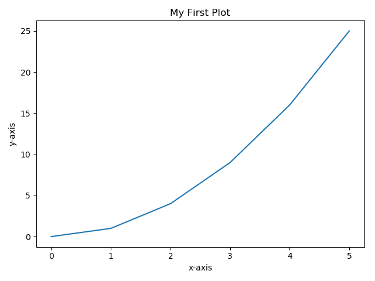
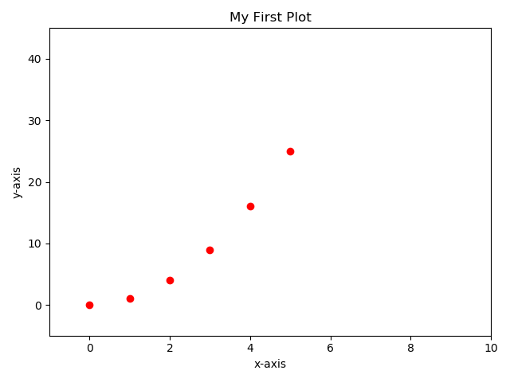
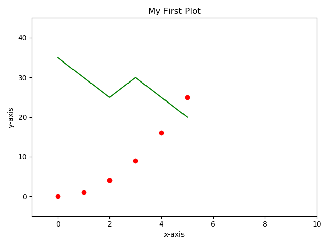

# Matplotlib
Matplotlib is a Python 2D plotting library to make customizable, high-quality
figures in a variety of formats.  The `pyplot` module of Matplotlib provides
a MATLAB-like interface.  

## Importing Matplotlib
The `matplotlib` package must be installed in your virtual environment.

Then, the `pyplot` module can be imported as follows:
```
import matplotlib.pyplot as plt
```
## Basic Plot Commands
Here is some code to make a simply x-y scatter plot.
```
x = [0, 1, 2, 3, 4, 5]
y = [0, 1, 4, 9, 16, 25]
plt.plot(x, y)
plt.xlabel("x-axis")
plt.ylabel("y-axis")
plt.title("My First Plot")
plt.show()
```


We can control how the data is plotted by adding a third argument to the 
`.plot()` function.  When this third argument is not given, the default of 
`"b-"` is used which is a blue line as shown in the plot above.  If the code
is changed as shown below to include a third argument of `"ro"`, it plots
red dots (see below).  Also, the `.axis()` sets the scale of
the x and y axes.
```
plt.plot(x, y, "ro")
plt.axis([-1, 10, -5, 45])
```

  

To add a second data series to the plot, add these lines to the code:
```
z = [35, 30, 25, 30, 25, 20]
plt.plot(x, z, "g-")
```


## References
* General Matplotlib website:  https://matplotlib.org/
* Intro to using `pyplot` module:  https://matplotlib.org/tutorials/introductory/pyplot.html#sphx-glr-tutorials-introductory-pyplot-py
