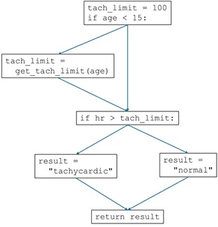
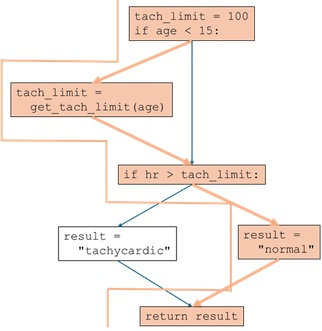
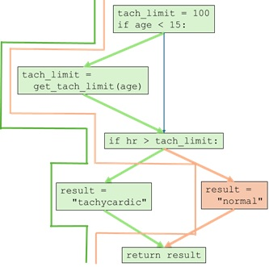
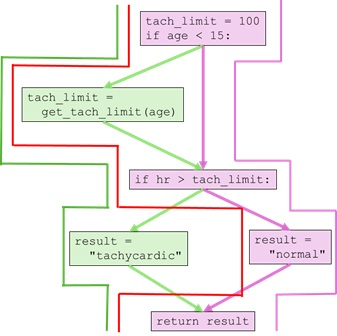
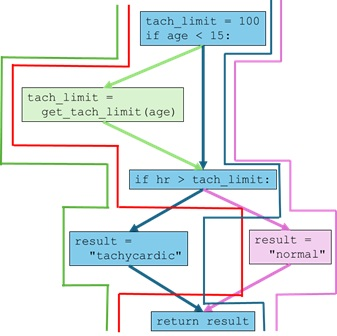

# Robust and Comprehensive Unit Testing

Expanding on the basic idea of testing units of code from last class, we 
should take some time to consider common ways to write robust unit tests. 
Generally, tests should cover a wide variety of inputs your "unit" will 
receive including "bad" inputs (for example, if you were expecting an integer, 
what happens when someone passes your code a float?). Code written with tests 
that only test expected use cases will usually fail in unexpected ways in 
production.

## Examples of Bad Input
Here is a basic example.  Let's say you have a function that checks if two
fruits are the same:
```
def is_same_fruit(a, b):
    return a == b
```
What happens when someone types in `" apple"` and you try and compare that to
`"apple"` in your code?  The above procedure would return `False`.  But, in
actual use, we would want this function to return `True`.  So, we should write
a test to ensure `is_same_fruit` returns `True` when given these two
inputs.  Then, we need to make sure our code passes that unit test.

Another typical example of bad input is receiving the wrong type of input.
For example, you may have a function that expects a list of numbers.  But,
what if the function receives `[1, 2, "3", 4, "Hello", 5]`.  What would
happen?  Write a test with this  type of input and then ensure your function
handles it gracefully.

## Functional and Structural Testing

### Functional Testing

**Functional** testing is when unit test cases are developed by simply selecting
different possible inputs to the function paired with the expected outcome based
on the input.  No knowledge of the inner workings of the actual function are
required.  

For example, let's say we are writing unit test cases for a function
that calculates the tangent of an angle, with the angle given in degrees.  From
our knowledge of how tangent should function, and what possible ranges of values
might be given, we could develop the following test cases:
* For number inputs, have cases for positive, zero, and negative numbers
  * input = 45, output = 1
  * input = 0, output = 0
  * input = -45, output = -1
* Test cases around transition points.  Tangent has transition points at 0 deg
  (going from positive to negative values) and at 90 deg (asymptotes to infinity).
  * input = 90, output = infinity
  * input = 89.5, output = 114.6
  * input = 0.1, output = 0.00174
  * input = -0.1, output = -0.00174
  * input = -89.5, output = -114.6
  * input = 90.5, output = 114.6

### Structural Testing

** Structural** testing is when unit test cases are developed based on a knowledge
of the structural or internal workings of the function to be tested.  We look at
the different possible outcomes from the function and design test cases to test
each one.

As an example, consider the following function:
```python
def tachycardia_analysis(hr, age):
    tach_limit = 100
    if age < 15:
        tach_limit = get_tach_limit(age)
    if hr > tach_limit:
        result = "tachycardic"
    else:
        result = "normal"
    return result
```
If we want to see how many different outcomes there might be from this 
function, we can chart out the flow of the function as follows:  


We can see that one outcome could be that the patient age was less than 15 and
they have a normal heart rate.  So, the first test case could be the `age`
input is 10 and the `hr` input is 110.  The flow for this case would be as 
follows:  


We see that every line of code was executed except the `result = "tachycardic"`
line.  So, our second case should the result be tachycardic.  Inputs for this
case could be `age` being 10 and `hr` being 180.  That yields the following
flow in green:  


Now, between both of these cases, every line of code has been executed at least
once.  This condition is known as **Statement** coverage.  Every statement
has some sort of coverage by unit tests.  However, not every choice that the
function can make has been tested.  For example, in both test cases, the
`if age < 15:` statement evaluated as `True`.  The `False` result has not
yet been checked.  So, a third test case can be added where `age` is 20 and `hr`
is 90.  That yields the following flow in purple:  


Now, between the three cases, all of the possible decision have been covered.
This state is known as **Decision** or **Branch** coverage.  Every decision that
the code might make has been tested at least once.

But, there is one more type of coverage that isn't yet met.  That is called
**Path** coverage.  Not every single possible path through the code has
been tested.  For example, an age that is not less than 15 and has a 
"tachycardic" result has not been tested.  So, a fourth test could be an `age`
input of 20 and an `hr` input of 135.  that yields the blue path below:  


Now, every possible pathway has been covered and **Path** coverage is considered
complete.

In sum,
* **Statement** coverage:  test every line
* ** Decision** or **Branch** coverage:  test every conditional outcome
* **Path** coverage:  Test every combination of possible decisions and outcomes

Tools exist to measure and report code coverage achieved by unit tests.  See
<a href="Resources/coverage.md">Code Coverage</a> for more information.


## Practical Tips for Testing
* When testing user supplied inputs, consider the possibility of:
  * misinterpreted requirements.  The user may think to enter a numeric string
    (`"10"`) instead of a number (`10`).  Or, they may not put a space where
    one is required (`10kg` vs. `10 kg`)
  * the variety of characters that could be entered:
    * Upper vs. lower case
    * Letters vs. numbers
    * Symbols, spaces, or other special characters
  * differing length of sequences.  If you are expecting a list of three items,
    you should also test an empty list, a list with fewer than three, and a list
    with more then three.
* For this class, **EVERY** function should have a unit test with the 
  appropriate number of test cases, UNLESS the only thing the function does is
  input and/or output.
* If Function A has a suite of unit tests, and Function A makes a call to 
  Function B, Function B also needs unit tests.  While its functionality is 
  indirectly tested by the Function A tests, specific tests for Function B 
  can help pinpoint any bugs.  
* In the case above, if Function B has a large number of tests for its 
  functionality, the tests for Function A should focus mostly on the 
  decisions that Function A makes, and only needs enough variety related to 
  Function B to ensure that its responses allows testing of different 
  Function A paths.
* It is possible to test functions that do output if desired.  One of the 
  easiest ways is to, in addition to printing the the screen, also return what
  is printed, as shown in the example below.  
  ```python
  def screen_output(x):
      out_string = "The value is {:.1f}".format(x)
      print(out_string)
      return out_string
  ```
  In this way, you have a `return` value that could be checked by a unit 
  test.  _Note_: `pytest` also has the ability to capture screen output and 
  check it, if you prefer that route.

## Test Development in the Git Feature Branch Workflow
In the Git Feature Branch Workflow, new code or changes to existing code are 
always done on a feature branch.  Anytime code is merged from a feature branch
into the main branch, that code should be validated by unit tests.  
Therefore, when code is written on a feature branch, unit test functions for 
that code should be written on the same feature branch.  This way, tests can 
be run to validate code before adding to the main code base.  You can always 
create a new branch in the future to expand the testing.  But, there should 
at least be some amount of testing of the code before the first merge.

## Testing Multiple Cases Using Parametrized Testing
It is often helpful to run a test over many different input and expected 
output combinations. `pytest` provides a tool to streamline that process
--a decorator called `parametrize`. We will talk more about 
[decorators](https://www.python-course.eu/python3_decorators.php) later in 
this class, but they allow your python functions to be augmented (or 
"decorated") with some additional functionality. The `parametrize` decorator 
lets us run a test function many times with different inputs and outputs.

A simple example is as follows.  Suppose we want to test this basic function:
```py
def add(a, b):
    return a + b
```

Here's a test that tests against many input and expected output combinations:
```py
@pytest.mark.parametrize("a, b, expected", [
    (1, 2, 3),
    (2, 3, 5),
    (5, 5, 10),
])
def test_add_parametrize(a, b, expected):
    answer = add(a, b)
    assert answer == expected
```

We can break this down further:
```py
@pytest.mark.parametrize("a, b, expected", [
    (1, 2, 3),
    (2, 3, 5),
    (5, 5, 10),
])
```
This part of the code is the "decorator." When the python interpreter runs 
this, it knows to augment the function below it in a certain way--in this case, 
it knows to essentially copy the test function below the decorator 3 times and 
call it 3 times with each set of inputs defined in the list.

Notice the decorator function takes two arguments. A string `"a, b, expected"` 
and a list of tuples `[(1, 2, 3), (2, 3, 5), ...]`. 

The string must match the named input parameters of your function, which you 
can see in the function definition (`def test_add_parametrize(a, b, expected):`).

The list of tuples is the list of input & expected output arguments to call 
the test function with. Each set of arguments is treated as a separate test 
case by `pytest` when you run `pytest`.


__Note__:  By adding the decorator described above, we now have a specific 
reference to `pytest` in our code file.  For the decorator to be recognized, 
we must import pytest in the module (```import pytest```) for the decorator to 
work. 

## Approximations
Floating point values can have numerical round-off error.
```python
a = 0.1 + 0.2
print(a == 0.3)
False
print(0.3 - a)
-5.551115123125783e-17
```
This round-off error a common way
for direct-equality assertions to fail.  `pytest` has a way to deal
with this called `approx`.
```python
import pytest
print(a == pytest.approx(0.3))
True
```

#### Approx references:
* https://docs.pytest.org/en/latest/reference.html#pytest-approx
* https://docs.scipy.org/doc/numpy/reference/generated/numpy.testing.assert_approx_equal.html

<!---
# In Class Exercise
* Write a function to subtract two numbers.
* Write a function to find the minimum and maximum of a list.
* Write unit tests for these functions.  Write at least one test that
checks for failure (i.e., gives bad input and expects False)
* Push to a GitHub repository
* Activate GitHub Actions and implement automated testing.
--->