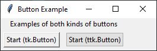

# Tkinter

## Contents
* <a href="#widget-reference">Using `tkinter` package</a>
  * <a href="#importing-tkinter-into-your-code">Importing `tkinter` into your code</a>
  * <a href="#widgets">Widgets</a>
  * <a href="#geometry-managers">Geometry Managers</a>
  * <a href="#root-window">Root Window</a>
  * <a href="#adding-a-widget">Adding A Widget</a>
  * <a href="#placingdisplaying-widget-in-parent">Placing/Displaying a Widget in Parent</a>
  * <a href="#activating-gui--starting-root-window">Activating GUI / Starting Root Window</a>
* <a href="#widget-reference">Widget Reference</a>
  * <a href="#general">General</a>
  * <a href="#tk-vs-ttk-widgets">`tk` vs `ttk` Widgets</a>
  * <a href="#options-common-to-many-widgets">Options common to many widgets</a>
  * <a href="#common-widgets">Common Widgets</a>
    * <a href="#window">Window</a>
    * <a href="#frame">Frame</a>
    * <a href="#label">Label</a>
    * <a href="#button">Button</a>
    * <a href="#checkbutton">Checkbutton</a>
    * <a href="#radiobutton">Radiobutton</a>
    * <a href="#entry">Entry</a>
    * <a href="#combobox">Combobox</a>

## Using `tkinter` package

### Importing `tkinter` into your code
```
import tkinter as tk        # Standard binding to Tk (tk-inter(face))
from tkinter import ttk     # Binding to newer "themed widgets"
```
**Note:** Occasionally, the Tk package may not be installed during the Python 
installation.  If, upon running the code above, an error of 
`ModuleNotFoundError: No module named 'tkinter'` is seen, the following can
be entered at the command line on macOS or Linux to install Tk:
```
sudo-apt sudo apt-get install python3-tk
```
### Widgets
The building blocks for making a GUI in `tkinter` (as well as many GUI 
packages) are widgets.  Pretty much every part of the GUI is considered a
widget:  the window, buttons, checkboxes, radial buttons, labels.  You
construct the GUI by adding widgets to your interface.

Every widget is added to a parent widget.  This parent widget could be a 
window or a frame.  The widget being added is sometimes called the child 
widget.

Each parent has a geometry manager.  This manager dictates how child widgets
are arranged and sized in the parent widget.  When adding a child widget to a parent 
widget, you provide information to the parent widget's geometry manager on how 
or where to place that new widget.

### Geometry Managers
There are three geometry managers in `tkinter`.  
* `grid`: arranges widgets on a grid pattern
* `pack`: arranges widgets around the edges and in relationship to other 
   widgets
* `place`: places widgets using either a) exact locations and sizes, or b)
   size and location relative to the size of the parent widget

I greatly prefer the `grid` manager as it provides the most control over where
widgets are placed as well as providing features for widget resizing and
movement with changes in the parent size.  For this documentation, the `grid`
manager will be the primary manager used.

### Root Window
The GUI needs an initial parent to which we can start adding widgets.  This
starting point for is the main window, sometimes called the root window.  It 
is created as follows:
```
root = tk.Tk()  # Defines the top (root) window.
```
To this root window, we now add widgets.

### Adding a Widget
When adding a widget to your GUI, you must always specify the parent widget 
into which to place the child.  This specification of the parent widget is 
always done as the first parameter in the call to create a widget.

For example:
```
root = tk.Tk()               # Defines the top, or root, window, so doesn't have a parent
content = ttk.Frame(root)    # The content Frame is placed in the root window
ok_btn= ttk.Button(content)  # The ok_btn button is placed in the content Frame
```
  
Details about the widgets, such as its text, size, actions are configured when 
the widget is first created by setting options via named parameters after the
parent parameter.  Example:
```
button = ttk.Button(root, text="Hello", command="buttonpressed", width=50)
```
These configurations can be accessed and modified, as will be discussed below.

### Placing/Displaying Widget in Parent
The code examples above define and create widgets.  But, none of the code above will 
actually display any of the widgets because it does not define where any of the
added widget should be on the parent widget.  As discussed above, specifying 
the relative positions of the different widgets on a parent is called Geometry 
Management.  

To display the widget and provide information on where the widget should be
placed in the parent widget, we call one of three methods belonging to the
child widget:  `.grid()`, `.pack()`, or `.place()`.

For example:
```
ok_btn = ttk.Button(root, text="Ok")
ok_btn.grid(column=0, row=0)
```
The `.grid(column=0, row=0)` method call tells the widget to place itself on 
the grid manager of the parent widget into the first column and the first row.

More information on the grid manager is shared below.

### Activating GUI / Starting Root Window
Once the window is fully defined with all of its widgets, the GUI can be
activated and displayed by the following command:
```
root.mainloop()
```
This will display the window and start the background GUI loop.  Your Python
code will be put on hold at this command while the `tkinter` code is running
in the background, displaying the windows, and listening for various GUI events
to which to respond.  You will write Python code to tell `tkinter` how to 
respond to different events.

When the root window is closed, your Python code will pick up with whatever
commands are found after the `root.mainloop()` call.

## Widget Reference
### General
The generic code for creating and displaying a widget is as follows:
```
widget_variable = WidgetClass(parent, **options)
widget_variable.grid(column=<col>, row=<row>)
```
In the documentation below, "options" and "methods" of with widgets are 
described.  

"Options" define the look, content, and operation of the widget.
The options are set by using named parameters when defining the instance
of the widget or by the `.configure()` method after the widget is defined.

"Methods" are the methods or functions that the widget can perform.  These are
usually used to change or obtain information about the widget.

### `tk` vs `ttk` Widgets
Tkinter comes with two different types of widgets, what I will call `tk` and 
`ttk` widgets.  The `tk` widgets are the standard widgets that were initially
developed for Tk.  As operating systems changed, and a more modern user 
interface was developed, the `tk` widgets no longer match the look and feel of
the new operating systems.  So, the `ttk` widgets were designed to provide a
better match with the native look and feel of the underlying operating system.

In general, the `tk` widgets are more easily customizable, but won't necessary
look like your typical operating system equivalents.  The `ttk` widgets will
have a more modern look and feel, but since they are intended to mimic the
underlying operating system looks, customizing their appearance is much harder
to do.

Both provide very similar functionality, although `ttk` offers some additional
widgets that `tk` does not.

### Options common to many widgets

Here are definitions of the many options available for the widgets.  Not all
options are available for all widgets.  The available options for specific
widgets are listed in the Widgets of Interest section below.

* `background`
  * Specifies the background color of the widget.
  * Value can be a hexadecimal number specifying the RGB or a string containing
    a common color.  Examples:  'white', 'black', 'red', 'green', 'blue', 
    'cyan', 'yellow', 'magenta' and possibly others.
* `borderwidth`
  * Specifies width of any border for the widget
  * Value is an integer in units of pixels
  * Default is 0 meaning no border
* `command` 
  * Specifies a Python function should to execute when the widget is
    activated.  Do not include the `()` after the function name.
* `font`
  * Specifies the font of any text that is displayed by the widget
  * Value is a tuple with two or three items.
    * The first item is a string with the font family (examples:  "Helvetica",
      "Times", "Arial", "Courier")
    * The second item is an integer with the font size in points (if specified
      as a negative integer, size is in pixels)
    * The optional third item is a string containing one or more of the 
      style modifiers ("bold", "italic", "underline", "overstrike") separated
      by a space if more than one.
* `foreground`
  * Specifies the foreground color or text color of a widget
  * See `background` for information on acceptable values
* `height`
  * Specifies the height (y-dimension) of the widget
  * Value is an integer in pixels
  * Usually, the size of a widget is defined by the geometry manager in order
    to fit whatever contents are in the widget.  A preferred size for the 
    widget can be specified with this option.  There may be circumstances
    where this specified height may be overridden by the geometry manager.
* `image` 
  * Specifies the image to display in a widget.  
  * The value is a variable containing a tk_image.  See 
    [Resources/tkinter_images.md](../Resources/tkinter_images.md) page for details.
* `justify`
  * For widgets with text, specifies how multiple lines of text should be
    displayed.
  * Values are `tk` constants and include `tk.LEFT`, `tk.CENTER`, and `tk.RIGHT`
* `padx`, `pady` (for `tk` widgets only)
  * Specifies the amount of space to add between the contents of the widget
    and its border, in the x- and y-directions, respectively.
  * Value is an integer in pixels
* `padding` (for `ttk` widgets only)
  * Specifies the amount of space to add between the contents of the widget and
    its border.
  * Value is either:
    * a single integer which specifies amount of space on all four sides in pixels
    * a tuple with two integers with the first specifying the amount of space
      to add on the left and right side in pixels and the second specifying the 
      amount of space to add on the upper and lower sides in pixels
    * a tuple with four integers specifying the amount of space in pixels to 
      be added on the left, upper, right, and lower sides, respectively.
* `relief`
  * Specifies the simulated 3-D effect around the outside of the widget
  * Only has effect if `borderwdith` is set to a non-zero number 
  * Values are `tk` variables `tk.FLAT` (default), `tk.RAISED`, `tk.SUNKEN`, 
    `tk.GROVE`, `tk.RIDGE`, or `tk.SOLID`.
* `state` 
  * Specifies whether the widget is active or not.  
  * The value is specified as a `tk` constant:
    * `tk.DISABLED` causes the widget to be disabled (greyed out)
    * `tk.NORMAL` causes the widget to be enabled (active)  
    * Widgets are enabled by default.
* `text` 
  * Specifies the text to display on the widget.
  * Value is a string.
* `textvariable` 
  * Specifies a widget variable that can be used to hold the text to display.
  * See section on Widget Variables for more information.
* `width`
  * For _Text Containing Widgets_ (Labels, Buttons, etc.)
    * Specifies the width of the widget in number of characters
    * Value is an integer in number of characters
  * For _Non-Text Containing Widgets_ (Windows, Frames, Canvases)
    * Specifies the width (x-dimension) of the widget
    * Value is an integer in pixels
    * Refer to `height` for information on the relationship with the geometry
      manager.
* `wraplength` 
  * For widgets with text, specifies a limit to the number of characters on a 
    line. 
  * Value is an integer.  Default is 0, meaning no limit or one line of text.


### Common Widgets
#### Window  

+ `tk.Tk()`  
  `tk.toplevel()`
+ Creates a window.  Use `tk.Tk()` to define the base/root window and use 
  `tk.toplevel()` for any additional windows.
+ Options most used:
  + `background` sets the window background color
+ Options:
  + `background`, `borderwidth`, `height`, `padx`, `pady`, `relief`, `width`
+ Common Methods Specific to Window:
  + `.geometry()` 
    + returns a string containing the current size and location of
      the window.  The string will be formatted as `"WxH+X+Y"`.  `W` and `H` are the
      width and height of the window, in pixels, and are separated by the `x` 
      character.  `X` is the distance, in pixels, between the top of the screen
      and the top of the window. `Y` is the distance, in pixels, between the
      left side of the screen and the left side of the window.  Both `X` and `Y`
      are generally preceded by the `+` character.  If one of the `+` is replaced
      by a `-`, then the following distance is related to the opposite side of
      the screen.  So `"WxH-X-Y"` means that `X` is now the distance between the
      right side of the screen the the right side of the window, and `Y` is the
      difference between the bottom of the screen and the bottom of the window.
  + `.geometry("WxH+X+Y")` 
    + sets the initial geometry of the window.  The
      definition of the input string is the same as described above.  To set the
      size only, the string can contain only `"WxH"`.  To specify the location
      only, the string can contain only `"+X+Y"`.
  + `.mainloop()` 
    + only applies to `tk.Tk()` 
    + displays the GUI and starts the
      background loop waiting for any GUI user events.
  + `.minsize(width, height)`
    + sets the minimum size of the window.
  + `.maxsize(width, height)` 
    + sets the maximum size of the window.
  + `.title(string)` 
    + sets the title of the window as found in the window bar.
+ Example Code:
  ```python
  root = tk.Tk()
  root.title("Root Window")
  root.geometry("400x100")
  root.mainloop()
  ```

#### Frame   
  
  * `tk.Frame(parent, **options)`
  * `ttk.Frame(parent, **options)`
  * Can be used to organize a GUI.  Creates a rectangular container inside 
    the parent widget.  The frame then has its own grid manager in which to 
    arrange its own child widgets while the frame is managed by its parents
    grid manager.
  * Options:
    * `tk`: `background`, `borderwidth`, `height`, `padx`, `pady`, `relief`,
      `width`
    * `ttk`: `borderwidth`, `height`, `padding`, `relief`, `width`
  * Example code:
    ```python
    frame = ttk.Frame(root, borderwidth=10, relief=tk.GROOVE)
    frame.grid(column=1, row=0)
    label1 = ttk.Label(frame, text="Inside of Frame", width=8, wraplength=50,
                       justify=tk.CENTER)
    label1.grid(column=0, row=0)
    label2 = ttk.Label(frame, text="Put more widgets here")
    label2.grid(column=0, row=1)
    ```

#### LabelFrame   


  * `tk.LabelFrame(parent, **options)`
  * `ttk.LabelFrame(parent, **options)`
  * Same as `Frame` but includes text as part of the frame border
  * Options:
    * `tk`: `background`, `borderwidth`, `foreground`, `height`, `padx`, `pady`, 
      `relief`, `text`, `width`
    * `ttk`: `borderwidth`, `height`, `padding`, `relief`, `text`, `width`
  * Example code:
    ```python
    frame = ttk.LabelFrame(root, text="My Frame", borderwidth=10, relief=tk.GROOVE)
    frame.grid(column=1, row=0)
    label1 = ttk.Label(frame, text="Inside of Frame", width=8, wraplength=50,
                       justify=tk.CENTER)
    label1.grid(column=0, row=0)
    label2 = ttk.Label(frame, text="Put more widgets here")
    label2.grid(column=0, row=1)
    ```

#### Label

  + `tk.Label(parent, **options)`
  + `ttk.Label(parent, **options)`
  + Creates a label for display of text or image
  + Options most used:
    + `text` takes a string containing the text to show in the label
    + `image` takes a variable containing an image in tk_image format to
      display in the label
  + Options:
    + `tk`: `anchor`, `background`, `borderwidth`, `font`, `foreground`,
      `height`, `image`, `justify`, `padx`, `pady`, `relief`, `state`, 
      `text`, `textvariable`, `width`, `wraplength`
    + `ttk`: `anchor`, `background`, `borderwidth`, `font`, `foreground`,
      `image`, `justify`, `padding`, `relief`, `text`, `textvariable`,
      `width`, `wraplength`
  + Example Code:
    ```python
    label_1 = ttk.Label(root, text="Label One", foreground="blue")
    label_1.grid(column=0, row=0)
    label_2 = ttk.Label(root, text="Label Two", font=("Times", 18))
    label_2.grid(column=0, row=1)
    ```

#### Button

  + `tk.Button(parent, **options)`
  + `ttk.Button(parent, **options)`
  + Creates a clickable button
  + Options most used:
      + `text` takes a string containing the text to show in the button
      + `image` takes a variable containing an image in tk_image format to
        display in the button
      + `command` takes a function name that should be executed when the
        button is clicked
      + `state` that defines whether the button is active or not
  + Options:
    + `tk`: `anchor`, `background`, `borderwidth`, `command`, `font`, `foreground`,
      `height`, `image`, `justify`, `padx`, `pady`, `relief`, `state`, 
      `text`, `textvariable`, `width`, `wraplength`
    + `ttk`: `command`, `image`, `state`, `text`, `textvariable`, `width`
  + Common Method Specific to Button
    + `.invoke()` 
      + calls the button's `command` function and returns what that function
        returns.  Does nothing if the button is disabled or there is no
        function assigned to `command`.
  + Example Code:
    ```python
    button = ttk.Button(root, text="Start", command=start_btn_cmd,
                          state=tk.DISABLED)
    button.grid(column=0, row=0)
    ```

#### Checkbutton


  + `tk.Checkbutton(parent, **options)`
  + `ttk.Checkbutton(parent, **options)` 
  + Creates a check box in which the user can either select (on) or deselect
    (off) the box.  If the initial value of the widget variable to which the
    checkbutton is attached is not given an initial value, the checkbutton
    widget will initially show an unselected state (neither on nor off).
  + Options most used:
    + `text` takes a string containing the text to show next to the checkbutton
    + `variable` takes a Widget Variable that will contain the value that
      is defined for when the checkbutton is on or off.
    + `onvalue` sets what the Widget Variable will contain if the checkbutton
      is selected (on).  Default is 1.
    + `offvalue` sets what the Widget Variable will contain if the checkbutton
      is deselected (off)  Default is 0.
    + `command` takes a function name that should be executed when the
      checkbutton is either selected or deselected
  + Options:
    + `tk`: `anchor`, `background`, `borderwidth`, `command`, `font`,
      `foreground`, `height`, `image`, `justify`, `offvalue`, `onvalue`,
      `padx`, `pady`, `relief`, `state`, `text`, `variable`, `width`,
      `wraplength`
    + `ttk`: `command`, `image`, `offvalue`, `onvalue`, `state`, `text`, 
      `variable`, `width`
  + Common Methods Specific to Checkbutton (both `tk` and `ttk` versions)
    + `.invoke()`
      + calls any `command` function associated with the checkbutton
  + Common Methods Specific to Checkbutton (`tk` version ONLY)
    + `.deselect()`
      + clears (turns off) the checkbutton
    + `.select()`
      + sets (turns on) the checkbutton
    + `.toggle()`
      + Toggles the state of the checkbutton (turns on if off or off if on)
  + Example Code:
    ```python
    check_status = tk.StringVar()
    check_status.set("+")
    checkbutton = ttk.Checkbutton(root, text="rH positive",
                                  variable=check_status, onvalue="+",
                                  offvalue="-", command=check_box_changed)
    checkbutton.grid(column=0, row=0, padx=10, pady=10)
    ```

#### Radiobutton


  + `tk.Radiobutton(parent, **options)`
  + `ttk.Radiobutton(parent, **options)`
  + Create one or more radiobuttons to allow the user to make a choice from
    among one or more alternatives.
  + When radiobuttons use linked to the same Widget Variable, they represent
    a group of which only one of them can be selected at any time.
  + Options most used:
    + `text` takes a string containing the text to show next to the radiobutton
    + `variable` takes a Widget Variable that will be assigned the value of
      this radiobutton when it is selected
    + `value` sets what the `variable` Widget Variable will contain when this
      radiobutton is selected
    + `command` takes a function name that should be executed when the state
      of this radiobutton is changed
  + Options:
    + `tk`: `anchor`, `background`, `borderwidth`, `command`, `font`,
      `foreground`, `height`, `justify`, `padx`, `pady`, `relief`, `state`
      `text`, `value`, `variable`, `width`, `wraplength`
    + `ttk`: `command`, `state`, `text`, `value`, `variable`, `width`
 + Common Methods Specific to Radiobutton (both `tk` and `ttk` versions)
    + `.invoke()`
      + calls any `command` function associated with the radiobutton
  + Common Methods Specific to Radiobutton (`tk` version ONLY)
    + `.deselect()`
      + Clears (turns off) the radiobutton
    + `.select()`
      + Sets (turns on) the radiobutton
  + Example Code:
    ```python
    # Two radiobuttons grouped by the `am_pm` StringVar
    am_pm = tk.StringVar()
    am_pm.set("AM")
    rb_1 = ttk.Radiobutton(root, text="AM", variable=am_pm, value="AM")
    rb_1.grid(column=0, row=0, padx=10)
    rb_2 = ttk.Radiobutton(root, text="PM", variable=am_pm, value="PM")
    rb_2.grid(column=0, row=1, padx=10)

    # Two radiobuttons grouped by the `time_tpe` StringVar
    time_type = tk.StringVar()
    time_type.set("am pm")
    rb_3 = ttk.Radiobutton(root, text="24 hour clock", variable=time_type, value="24 hr")
    rb_3.grid(column=1, row=0, padx=10)
    rb_4 = ttk.Radiobutton(root, text="AM/PM clock", variable=time_type, value="am pm")
    rb_4.grid(column=1, row=1, padx=10)
    ```

#### Entry


  + `tk.Entry(parent, **options)`
  + `ttk.Entry(parent, **options)`
  + Provides a text entry box to receive user input from the keyboard
  + Options most used:
    + `width` specifies the width of the entry box in number of characters
    + `textvariable` specifies a Widget Variable that will hold the contents
      of the entry box
    + `show` takes a character and will display this character in place of
      the actual character entered.  For example, `show="*"` could be used
      for password entry so that the user only sees "*" when entering.
  + Options:
    + `tk`: `background`, `borderwidth`, `foreground`, `font`, `justify`,
      `relief`, `show`, `state`, `textvariable`, `width`
    + `ttk`: `font`, `justify`, `show`, `state`, `textvariable`, `width`
  + Example Code:
    ```python
    ttk.Label(root, text="Name:").grid(column=0, row=0, sticky=tk.E)
    name_variable = tk.StringVar()
    name_entry = ttk.Entry(root, textvariable=name_variable, width=30)
    name_entry.grid(column=1, row=0, pady=5)
    
    ttk.Label(root, text="Phone Number:").grid(column=0, row=1, sticky=tk.E)
    phone_variable = tk.StringVar()
    phone_entry = ttk.Entry(root, textvariable=phone_variable, width=15)
    phone_entry.grid(column=1, row=1, sticky=tk.W, pady=5)
    ```

#### Combobox

  + `ttk.Combobox(parent, **options)`
  + Creates a combination of entry box and drop-down menu to allow for the
    user to make an input based on pre-defined options or their own entry
  + Only available as a `ttk` widget
  + Options most used:
    + `values` takes a tuple containing strings which are the options that 
      will be displayed in and picked from the dropdown option.
    + `width` specifies the width of the entry box in number of characters
    + `height` takes an integer and defines the number of rows that will
      appear in the dropdown menu.  If there are more values than this
      number, a vertical scroll bar will appear.  Default is 20.  
    + `postcommand` receives a function name that will execute when the
      user clicks on the drop-down arrow.  This function can be used to 
      define or change the `values` in the drop down to keep them updated.
    + `textvariable` specifies the Widget Variable that will contain the 
      value that is shown in the Combobox.
  + Options:
    + `ttk`: `height`, `justify`, `postcommand`, `state`, `textvariable`, 
      `values`, `width`
  + Common Methods:
    + `.get()` returns the current value in the Combobox
    + `.set(value)` sets the current text in the widget to `value`
    + `.bind('<<ComboboxSelected>>', function)` will call `function` 
       whenever the value of the combobox changes.
    + `.state('readonly')` disbles the users ability to enter a new value
      as text into the combobox and forces them to select from the predefined
      values
    + `.current()` method determines which item in predefined values list is 
      selected.  Returns -1 if the current combobox entry does not match one
      of the pre-defined values.
    + `.current([i])` selects the `i`th item in the pre-defined values list.


### Changing Attributes of Widgets

In the examples above, attributes of widgets are set in two different ways:
1. By named parameter when the widget is first created.  Here, the `text`
   attribute is set by named parameter in the `Label` creator call:   
   `label = ttk.Label(root, text="This is a label.")`
2. By indexing of the widget variable using the attribute name.  Here, the 
   `text` attribute is changed:  
   `label["text"] = "This is the updated text for the label."`

There is a third way of changing the value of the attribute, and that is to use
the `.configure()` method of the widget and use a named parameter.  Example:
3.  `label.configure(text="Another way to change label text")`

### Getting Current Attribute
There are two methods for obtaining the current value of an attribute.
1. Use the `.cget()` attribute that takes a string containing the name of the
   attribute to query.  Example:  
   `label_text = label.cget("text")`
2. Indexing the widget variable using the attribute name.  Example:  
   `label_text = label["text"]`

### Activate / Deactivate Widget with State
A widget can be "turned on or off" by changing its state.  To deactivate a
widget so that the user cannot interact with it, change its state to 
`tk.DISABLED` as follows:

  `widget_name.configure(state=tk.DISABLED)`

To reactivate the widget, use the `tk.NORMAL` state:

`widget_name.configure(state=tk.NORMAL)`

    
### Adding Images to Interface
See [tkinter_images.md](../Resources/tkinter_images.md) in the Resources folder
for information on adding images to your interface.

## References
<https://tkdocs.com/tutorial/>  -  An excellent tutorial for using Tk.  You can
specify that you want to learn in Python and it will show the code using 
`tkinter`.  It also has some links to good documentation.

<https://anzeljg.github.io/rin2/book2/2405/docs/tkinter/index.html> - 
Comprehensive documentation for `tkinter`.  A few years old and written for 
Python 2.7, so some
syntax may be slightly different, but has good description of all of the
options and configurations for many of the `tkinter` widgets.

<https://docs.python.org/3/library/tkinter.ttk.html> - Official Python
documentation on the `ttk` themed widgets.

<https://www.kite.com/python/docs/tkinter> - A not-terribly user friendly
reference guide for `tkinter`, but does seem to have good lists of all
methods, arguments, and keywords for all the widgets.

<https://www.riverbankcomputing.com/static/Docs/PyQt5/index.html> - 
documentation for PyQt5

<http://zetcode.com/gui/pyqt5/introduction/> - a tutorial for using PyQt5

<https://pythonspot.com/pyqt5/> - another tutorial for using PyQt5


Later, if you need to see what the configuration values are, you can then see 
the values of the configurations as follows:
```
>>> button['text']
'Hello'
```
We can change the value of certain configurations as follows:
```
>>> button['text'] = 'goodbye'
# Or another way is
>>> button.configure(text='goodbye')
>>> button['text']
'goodbye'
```
Note, this does not work for every configuration item.

We can get more information about a particular configuration as follows:
```
>>> button.configure('text')
('text', 'text', 'Text', '', 'goodbye')
```
Or, a list of all of the configuration options:
```
>>> button.configure()
{'command': ('command', 'command', 'Command', '', 'buttonpressed'),
 'default': ('default', 'default', 'Default', <index object: 'normal'>, <index object: 'normal'>),
 'takefocus': ('takefocus', 'takeFocus', 'TakeFocus', 'ttk::takefocus', 'ttk::takefocus'),
 'text': ('text', 'text', 'Text', '', 'goodbye'),
 'textvariable': ('textvariable', 'textVariable', 'Variable', '', ''),
 'underline': ('underline', 'underline', 'Underline', -1, -1),
 'width': ('width', 'width', 'Width', '', ''),
 'image': ('image', 'image', 'Image', '', ''),
 'compound': ('compound', 'compound', 'Compound', <index object: 'none'>, <index object: 'none'>),
 'padding': ('padding', 'padding', 'Pad', '', ''),
 'state': ('state', 'state', 'State', <index object: 'normal'>, <index object: 'normal'>),
 'cursor': ('cursor', 'cursor', 'Cursor', '', ''),
 'style': ('style', 'style', 'Style', '', ''),
 'class': ('class', '', '', '', '')}
```

### Grid 
The `grid` command is the most versatile geometry management function.  It is 
most easily explained by way of example.
```
root = tk.Tk()
mainframe = ttk.Frame(root).grid(column=0, row=0)
ttk.Label(mainframe, text="Janauary").grid(column=0, row=0)
ttk.Label(mainframe, text="February").grid(column=1, row=0)
ttk.Label(mainframe, text="A really long label").grid(column=2, row=0)
ttk.Label(mainframe, text="March").grid(column=0, row=1)
ttk.Label(mainframe, text="April\nA Rainy Month").grid(column=1, row=1)
ttk.Label(mainframe, text="May").grid(column=2, row=1)
```


The code above first creates a root window, and then adds a Frame widget, 
called `mainframe` to the window.  (We'll come back to that command in a 
minute).  Then,a series Label widgets are added to this Frame.  They are 
created with the `ttk.Label` command and are sent two parameters:  the parent, 
which is the `mainframe` Frame, and the text to be displayed as the label.

Then, the `.gird()` function is added to the Label declaration.  This function
tells the interface how to add the widget to the "grid" layout of the parent,
which is the `mainframe` Frame in this case.  The "grid" layout has columns and
rows, where the first column and row has an index of 0 (zero).  When the
window is drawn, the needed amount of space is created for each column and row,
as you can see in the example window.  

The default is that the widget will be centered in its grid space.  But, this
can be modified with the `sticky` parameter.  Using the compass points of N,
S, E, and W, you can tell the interface to re-align the widget within its
grid space.  For example, May is centered both horizontally and vertically.
It can be moved to the upper right of its grid space with the following
modification:
```
ttk.Label(mainframe, text="May").grid(column=2, row=1, sticky="NE")
```


Additional parameters are available 
to further modify the appearance, and will be discussed below or can be
found in the documentation.

We have been discussing how the Labels were added to the grid layout of the
Frame.  When the Frame was added to the root window, we also needed to assign
where the Frame was going to be in the root window.  So, the Frame declaration
also has a `.grid(column=0, row=0)` function.  Note, if the widget is not 
added to the grid, it is not shown in the window.

The `.grid()` function can be used separately from the definition of the 
widget if the widget is saved in a variable.  Example:
```
may_label = ttk.Label(mainframe, text="May")
may_label.grid(column=2, row=1, sticky="NE")
```

# ToDo
Add info on Widget Variables
Add info on linking functions with command
Make a ToC at the top of the page
Add methods common to all widgets