# Creating a GUI in `tkinter`
This page will go through all of the steps for how to code a GUI in Python
using `tkinter`.  This is simply one approach of many and can be used for
one-window interfaces and allows for easy testing of any logic code that
supports the interface.

## Contents
* <a href="#sketch-out-the-gui">Using `tkinter` package</a>
* <a href="#create-root-window">Create Root Window</a>
* <a href="#add-widgets">Add Widgets</a>
  * <a href="#add-widgets-to-root-window">Add Widgets to Root Window</a>
  * <a href="#add-widgets-to-temperature-frame">Add Widgets To Temperature Frame</a>
    * <a href="#label">Label</a>
    * <a href="#radiobuttons">Radiobuttons</a>
    * <a href="#entry-box-and-answer-labels-for-temperature-frame">Entry box and answer labels for Temperature Frame</a>
  * <a href="#add-widgets-to-weight-frame">Add Widgets to Weight Frame</a>
    * <a href="#comboboxes">Comboboxes</a>
    * <a href="#entry-box-and-answer-labels-for-weight-frame">Entry box and answer labels for Weight frame</a>
  * <a href="#gui-layout-and-formatting">GUI Layout and Formatting</a>
    * <a href="#columnspan">Columnspan</a>
    * <a href="#justification-and-sticky">Justification and Sticky</a>
    * <a href="#fonts">Fonts</a>
    * <a href="#padding">Padding</a>
* <a href="#gui-functionality">GUI Functionality</a>
  * <a href="#button-click">Button click</a>
  * <a href="#radiobutton-click">Radiobutton click</a>
  * <a href="#entry-box-changes">Entry box changes</a>
    * <a href="#use-a-button-to-start-the-processing-of-entry-box-contents">
      Use a Button to start the processing of Entry box contents</a>
    * <a href="#use-an-entry-box-gui-event-to-start-processing-the-entry-box-contents">
      Use an Entry box GUI event to start processing the Entry box contents</a>
  * <a href="#combobox-selection-and-binding">Combobox selection and Binding</a>
  * <a href="#other-gui-changes">Other GUI Changes</a>
* <a href="#general-code-layout">General Code Layout</a> 

## Sketch Out The GUI
Sketch out what you want your GUI to look like.

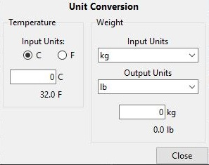

This GUI has a title label, two frames with children widgets, and a close 
button.

With this sketch, place a grid on it to understand how to layout the widgets.
For the root window grid, consider each frame as a single widget.

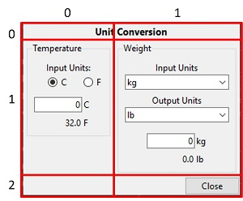

Then, similar grids need to be made for each frame.

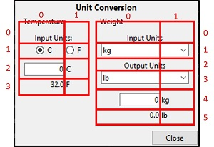

## Create Root Window
There are two common ways for how to arrange your Python code when making a
root window and creating a GUI.  One is to create the GUI within in a custom 
class.  The other is to do it within a function.

This example will create the GUI within a function.  Here is the basic code
for creating and displaying the root window.

```python
# Import statements
import tkinter as tk
from tkinter import ttk


def main_window():
    # *** Define root window ***
    root = tk.Tk()
    root.title("Converter")

    # *** Display Root Window and Start GUI ***
    root.mainloop()

if __name__ == "__main__":
    main_window()
```
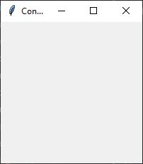

## Add Widgets
### Add Widgets to Root Window
Specific widgets are then added as children to the parent widget, in this case
the root window.  The code for creating and adding these widgets is put
in the `main_window` function after the creation of the root window and
before the call to `root.mainloop()` which starts the GUI.

In the GUI sketched above, the root window has 4 children widgets.  Let's
put them on.  First, the title label.
```python
    # *** Add Widgets ***
    # Title
    title_label = ttk.Label(root, text="Unit Conversion")
    title_label.grid(column=0, row=0)

```
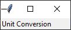

The first command above creates the widget, indicates which parent widget in
which to add this new widget, and assigns it the necessary properties.  This
command on its own will not display the new widget.  It must be first added to
the grid manager of the root window.  This is done with the second command
above.

Notice how the resulting window is now much smaller.  By default, the grid
manager sets the size of each column and row to be the size necessary to fit
whatever widgets exist within it.  So, the window size shrinks to fit the
dimensions of this one widget.

Next, let's add the two frames and the button to the root window.

```python
    # Frame for Temperature Conversion
    temp_frame = ttk.LabelFrame(root, text="Temperature", borderwidth=10)
    temp_frame.grid(column=0, row=1)  

    # Frame for Weight Conversion
    wt_frame = ttk.LabelFrame(root, text="Weight", borderwidth=10)
    wt_frame.grid(column=1, row=1)  

    # Close button
    close_button = ttk.Button(root, text="Close")
    close_button.grid(column=1, row=2)  
```
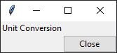

Note two things about the resulting window.  First, the frames are not shown.
This is because the frames do not have any children widgets of their own and
so will not display.  Second, the window size has increased to accommodate
the extra columns and rows which have sized to exactly fit their contents.

### Add Widgets to Temperature Frame
#### Label
First, let's add the "Input Units:" label.
```python
    ttk.Label(temp_frame, text="Input Units:").grid(column=0, row=0)
```
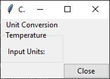

Some things to note.
1. The parent widget for this label was specified as `temp_frame` which is the
variable for the temperature frame and not the `root` window.  
2. Since this child widget is being added to the frame, the `.grid()` method
will be using the frame grid manager and so the column and row specification
are for the frame grid and not the root window grid.
3. The frame now appears in the window since it has a child widget.
4. The statement above to add this label does not assign the resulting label
to a variable.  If you are confident that you will not need to modify the 
options of a widget in the future, it is not required to place it in a variable
for future reference and the `.grid()` method can be used right away.    
**NOTE**:  It is NOT possible to use a variable and a `.grid()` command in the
same statement.  For example,
`my_label = ttk.Label(root, text="Hi").grid(column=0, row=0)` will NOT work.
The widget may be created and shown on the GUI, but the `my_label` variable
will be `None` because the `.grid()` method returns `None` and that is what
was stored in the variable, not the widget.

#### Radiobuttons
Now, let's add the radiobuttons.
```python
    temp_choice = tk.StringVar()
    temp_choice.set("C")
    c_btn = ttk.Radiobutton(temp_frame, text="C", variable=temp_choice,
                            value="C")  
    c_btn.grid(column=0, row=1)
    f_btn = ttk.Radiobutton(temp_frame, text="F", variable=temp_choice,
                            value="F")
    f_btn.grid(column=1, row=1)
```
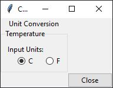

First, a `tk.StringVar()` is created to hold a string determined by which 
radiobutton is selected.  Then, the initial value of this variable is set to
be "C".  Next, two radiobuttons are created and stored in the `c_btn` and 
`f_btn` variables.  The text to display next to the buttons is specified using 
the `text` parameter.  These two radiobuttons are linked by setting both of
their `variable` parameters to be the `StringVar` created for them.  With this
linking, only one of the two can be selected at any time.  Finally, the value
that should be put in the `StringVar` when the radiobutton is selected is
indicated by the `value` parameter.

#### Entry box and answer labels for Temperature frame
Let's finish the Temperature frame by adding the entry box in which the user
will enter a temperature and a label for displaying the result.

```python
    # Entry and output temperatures
    temp_value = tk.IntVar()
    temp_entry = ttk.Entry(temp_frame, width=10, textvariable=temp_value) 
    temp_entry.grid(column=0, row=2)
    in_unit_label_t = ttk.Label(temp_frame, text="C")
    in_unit_label_t.grid(column=1, row=2)
    answer_label_t = ttk.Label(temp_frame, text="###")
    answer_label_t.grid(column=0, row=3)
    out_unit_label_t = ttk.Label(temp_frame, text="F")
    out_unit_label_t.grid(column=1, row=3)
```
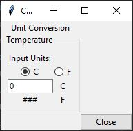

First, a `tk.IntVar()` is created to hold the user entered temperature.  Its
initial value is, by default, zero.  Then, an `Entry` widget is created is
connected to the `IntVar`.  Its `width` is set as 10 as we don't need more
digits than that for entry.  A label is created to display the result while
two additional labels are created to show the units of the input and output.

While some of the widget layout isn't exactly the way it should be, let's 
create the Weight frame widgets and come back to fix formatting.

### Add Widgets to Weight Frame
#### Comboboxes
First, add code to create the input label and combobox in the weight frame.
```python
    # Input Units
    ttk.Label(wt_frame, text="Input Units").grid(column=0, row=0)
    wt_choice_in = tk.StringVar()
    wt_choice_in.set("kg")
    wt_selector_in = ttk.Combobox(wt_frame, values=WT_UNITS,
                                  textvariable=wt_choice_in,
                                  state=["readonly"])
    wt_selector_in.grid(column=0, row=1)
```
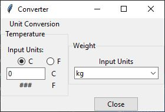

A `tk.StringVar()` is created to hold the selected input unit and an initial
value of `"kg"` is set.  Then, a `ttk.Combobox` is created and given the
`wt_frame` as its parent.  The values which can be selected in the Combobox
are set using the `values` parameter.  In this case, it refers to a global
variable that contains the values to use.  It is often standard that constants,
particularly those that will be needed globally, are specified at the top
of the module.  So, the following line is added after the import statements.
```python
WT_UNITS = ["g", "kg", "lb", "oz"]
```
Whatever value is chosen from the Combobox will be stored in the `StringVar`
linked using the `textvariable` parameter.  And the `state` is set as 
`readonly` so that the user can only select from the predefined values.

The Output unit selection widgets are added in a similar way:
```python
    # Output Units
    ttk.Label(wt_frame, text="Output Units").grid(column=0, row=2)
    wt_choice_out = tk.StringVar()
    wt_choice_out.set("lb")
    wt_selector_out = ttk.Combobox(wt_frame, values=WT_UNITS,
                                   textvariable=wt_choice_out,
                                   state=["readonly"])
    wt_selector_out.grid(column=0, row=3)
```
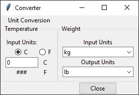

#### Entry box and answer labels for Weight frame
The user entry box and output label are created.
```python
    # Entry and output weights
    wt_value = tk.IntVar()
    wt_entry = ttk.Entry(wt_frame, width=10, textvariable=wt_value)
    wt_entry.grid(column=0, row=4)  
    in_unit_label_wt = ttk.Label(wt_frame, textvariable=wt_choice_in)
    in_unit_label_wt.grid(column=1, row=4) 

    answer_label_wt = ttk.Label(wt_frame, text="###")
    answer_label_wt.grid(column=0, row=5)  
    out_unit_label_wt = ttk.Label(wt_frame, textvariable=wt_choice_out)
    out_unit_label_wt.grid(column=1, row=5)
```
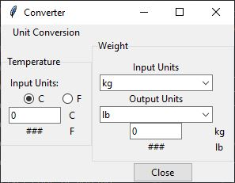

This code for the weight frame differs in one significant aspect from the 
similar code in the temperature frame 
(see <a href="#entry-box-and-answer-labels-for-temperature-frame">
Entry box and answer labels for Temperature frame</a>).  Instead of the unit
labels having their text set using the `text` parameter, the `textvariable`
parameter is used instead.  Now, when the user selects a unit from the Combobox,
and that Combobox updates the appropriate `StringVar`, that `StringVar` will
change the unit label since the label is linked to that same `StringVar`.

### GUI Layout and Formatting
All of the widgets are now added to the GUI, but the layout and format of
the widgets does not match our original sketch.

#### Columnspan
For example, the title label "Unit Conversion" was placed into column 0 and
row 0.  But, the original sketch has this label centered across both columns
0 and 1.  We can cause this widget to span across both columns using the 
`columnspan` parameter of the `.grid()` method.  Modify that method as follows:
```python
    title_label.grid(column=0, row=0, columnspan=2)
```
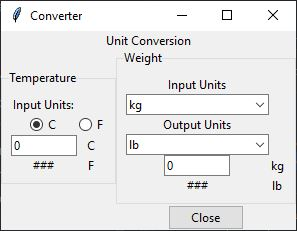

The "Unit Conversion" label is now centered in the combined space of columns 0
and 1.  We want to do something similar for the "Input Units:" label in the
Temperature frame and the "Input Units", "Output Units", and two comboboxes
in the Weight frame.  The `.grid()` methods for all of those are modified
to include the `columnspan=2` parameter.

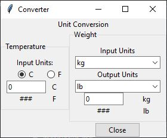

Now, you can see that "Input Units" spans across both columns in the 
Temperature frame and that the "kg" and "lb" labels are now underneath the 
comboboxes which span both Weight frame columns.

#### Justification and Sticky
The temperature entry and output should be right justified and the numbers
and units should be closer together.  Right now, the unit labels are being
centered in their columns.  Let's move these labels to the left side of their
columns by using the `sticky` parameter of the `.grid()` method.  To move
those labels to the left, we want to move them to the "West" in their grid
space.  For example:
```python
    in_unit_label_t.grid(column=1, row=2, sticky=tk.W)
```
Then, if we move the entry and label widgets for the temperatures by moving
them to the "East" as such:
```python
    temp_entry.grid(column=0, row=2, sticky=tk.E)
```
we will get the following layout:

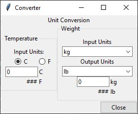

`sticky=tk.E` was also used for the button to move it into the corner.

In the entry boxes, the input value is still on the left side of the entry
box.  We can change that by using the `justify` parameter.
```python
    temp_entry = ttk.Entry(temp_frame, width=10, textvariable=temp_value,
                           justify="right")
```
If `justify="right"` is added to both the `temp_entry` widget (as above) and 
the `wt_entry` widget, the interface will look as follows:

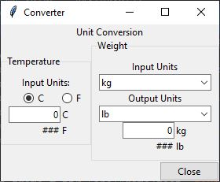

The two frames are both in row 1.  Since the "Weight" frame is the tallest,
its height sets the row height.  Since by default widgets are centered in their
grid space, the smaller "Temperature" frame is centered vertically.  To have
both frames justified at their tops, the "Temperature" frame can be moved "N"
in its grid space:
```python
    temp_frame.grid(column=0, row=1, sticky=tk.N)
```
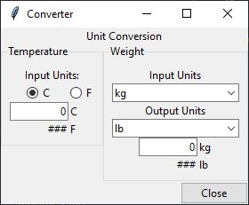

#### Fonts
The `font` parameter of a widget allows for changes in the font family, size,
and style.  The title label creation is changed as follows:
```python
     title_label = ttk.Label(root, text="Unit Conversion",
                                font=("Segoe UI", 10, "bold"))
```
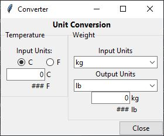

#### Padding
Currently, each widget in a grid space is directly adjacent to a neighboring
widget.  Readability can be increased by adding space or "padding" between
widgets.  This can be done by using the `padx` and `pady` parameters of the 
`grid()` method.  For example, `padx=5` will put 5 pixels of space between
the edge of the widget and the edge of its containing grid space on each of the
left and right sides.  If you want more space on one side rather than the
other, you can assign it a tuple (`padx=(10, 2)` will put 10 pixes on the left
and 2 on the right).  `pady` does the same thing on the upper and lower side
of the widget.

In looking at the interface, padding should be added around the frames to 
better separate them.
```python
    temp_frame.grid(column=0, row=1, sticky=tk.N, padx=5, pady=5)
    wt_frame.grid(column=1, row=1, sticky=tk.N, padx=5, pady=5)
```
Vertical space can be added around the temperature values 
```python
    temp_entry.grid(column=0, row=2, sticky=tk.E, pady=(10, 5))
    in_unit_label_t.grid(column=1, row=2, sticky=tk.W, pady=(10, 5))
```
as well as the weight values.
```python
    ttk.Label(wt_frame, text="Output Units").grid(column=0, row=2,
                                                  columnspan=2,
                                                  pady=(5, 0))
    wt_entry.grid(column=0, row=4, sticky=tk.E, pady=(15, 5))
    in_unit_label_wt.grid(column=1, row=4, sticky=tk.W, pady=(15, 5))
```

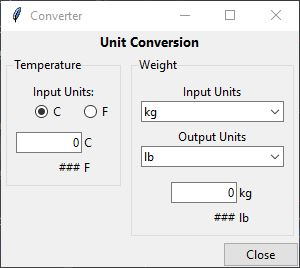

This completes the layout of the widgets on the GUI.  Next, we need to add
functionality to the GUI.

## GUI Functionality

Once a GUI is displayed to a user, the user will start interacting with the
GUI.  When the user interacts with the GUI, the user causes "events" which the
GUI can respond to.  These event can include:
* clicking a button
* clicking in an entry box
* entering text in an entry box
* moving the mouse
* selecting a radiobutton
* many more...

Functionality is added to the GUI by writing code that is activated when one
of these events occurs.  Generally, an event related to a certain widget is
assigned a function to activate upon that event occurring.  This function is
often called a "callback" function.  I sometimes refer to them as "command"
functions because they are often linked to a widget through the `command`
parameter.

These callback functions should generally do three tasks.
1. Obtain information from the GUI needed to complete its task.
2. Call an outside function that does whatever required computations are 
needed.  This outside function receives the needed GUI data as parameters and
returns whatever information is needed to update the GUI.  Since this outside
function does not directly interact with the GUI, it can be unit tested.
3. Receive return information from the outside function and then update the
GUI as necessary.

### Button click
Let's add functionality to the "Close" button.  Clicking this button should 
close the GUI.  The `command` parameter of the Button widget sets the callback
function that should be executed when the button is clicked.
```python
    close_button = ttk.Button(root, text="Close", command=close_btn_cmd)
```
Note that `()` is not included after the function name.  That is because we
do not want the function to actually run at this point.  We just want to store
a link to it in the Button.

Next, we define the callback function itself.  Since the callback function will
need access to the variables created for the GUI, it needs to be written in
such a way that it has access to the variables that are scoped to the 
`main_window` function.  One way to do this is to write the callback function
as a "sub-function" of the `main_window` function.  This is done by writing
the callback function indented in the scope of the `main_window`.
```python
def main_window():
    
    def close_btn_cmd():
        root.destroy()

    # *** Define root window ***
    root = tk.Tk()
    root.title("Converter")
    
    # Additional code...
```
Since `close_btn_cmd` is now within the `main_window` scope, it will have 
access to the variables created within the `main_window` function.  The
reverse is not true.  Any variables created inside the sub-function are local
to that sub-function and will disappear as soon as the sub-function is 
completed.

The `close_btn_cmd` function only has a single job:  to close the GUI by
using the `.destroy()` method of the root window.

### Radiobutton click
When the F or C radiobuttons are clicked, the labels for the input and output
temperatures should change appropriately.  As with the Button widget, the
Radiobutton widget has a `command` parameter that registers what callback
function should be executed when a Radiobutton is clicked.
```python
    c_btn = ttk.Radiobutton(temp_frame, text="C", variable=temp_choice,
                            value="C", command=t_radio_change_cmd)
    f_btn = ttk.Radiobutton(temp_frame, text="F", variable=temp_choice,
                            value="F", command=t_radio_change_cmd)
```
The same callback function will be called when either radiobutton is clicked,
but that does not always have to be the case.  Each radiobutton in the same
group could have different `command` functions if needed.
```python
    def t_radio_change_cmd():
        new_temp = temp_choice.get()
        if new_temp == "C":
            in_unit_label_t.configure(text="C")
            out_unit_label_t.configure(text="F")
        else:
            in_unit_label_t.configure(text="F")
            out_unit_label_t.configure(text="C")
```
The function gets the needed info from the GUI, in this case, what the current
selection is for the temperature input units.  It then modifies the GUI
based on that information: specifically changing the text of the unit labels.
There function does no real calculation and so does not have a call to an
external, testable function.

### Entry box changes
In the GUI being designed here, the user input entered into either the 
temperature or weight entry boxes should be converted from the input units to 
the output units.  

There are two general methods for how to handle the processing of user provided
input in an Entry Box.

#### Use a Button to start the processing of Entry box contents
The easier method is to define a button that, when the user clicks it, calls a
function that gets the entry box text and performs the needed operations 
based on that input.  As an example (unrelated to the GUI being designed on
the rest of this page), assume you have a Label and Entry widget on your GUI
as defined by:
```python
    result_label = ttk.Label(root, text="Result goes here")
    user_text = tk.StringVar()
    user_entry = ttk.Entry(root, textvariable=user_text)
```
You would then define a Button as follows:
```python
    process_button = ttk.Button(root, text="Process Entry", 
                                command=process_btn_cmd)
```
which calls the following sub-function when clicked.
```python
    def process_btn_cmd():
        user_input = user_text.get()
        result = call_external_function_to_process_input(user_input)
        result_label.configure(text=result)
```
This function a) gets the required information from the GUI, b) calls an
external function to do the work, and c) updates the GUI based on those 
results.

#### Use an Entry box GUI event to start processing the Entry box contents
A more complicated method, but one that provides increased UI responsiveness,
is to use an Entry box GUI event to automatically start the processing.

The Entry widget has option parameters called `validate` and `validatecommand`.
These options provide functionality to validate any user input into the Entry
box before the entry is accepted or displayed.  While primarily meant to be
used to ensure that only correctly typed or formatted entry is put into the 
Entry box, it can also be used as an event to get the Entry box text and act
on it.  The `validate` option indicates when the validation should occur.
This example sets `validate='key'` so that validation occurs whenever a 
keystroke changes the widget's content.  (Other `validate` options can be 
seen at https://www.tcl.tk/man/tcl8.6/TkCmd/entry.html#M16).  The
`validatecommand` option sets the callback function to call when the `validate`
circumstance occurs.  Now, since this validation call is made before the
actual contents of the Entry box changes, we cannot use the Entry box contents
itself.  Rather, we need to get what the new value of Entry box would be if the
keyed change occurred.  To do this, we need to add a few steps.

First, we need to define the callback function.  Here is such a function for
use in the GUI for the temperature Entry box.  It is defined as a sub-function
of the `main_window`.
```python
    def temp_entry_cmd(new_value):
        valid_entry = validate_entry_is_float(new_value)
        if valid_entry:
            starting_unit = temp_choice.get()
            starting_temperature = float(new_value)
            answer = make_temp_conversion(starting_unit, starting_temperature)
            answer_label_t.configure(text=answer)
        return valid_entry
```
This function receives a parameter which will be the contents of the Entry box
if the change made by the user is validated.  This `new_value` is sent to an
external function to validate that the new entry is a float that can be used to
do a temperature conversion.  The result of this function, a boolean, is 
eventually returned to the Entry box widget.  If it is `True`, the change is 
allowed to occur in the Entry box.  If it is `False`, the change is reject.  In
the function above, if the validation is `True`, then the function a) gets the
needed info from the GUI (the choice of starting temperature unit) and the
starting temperature (as sent by the parameter to this function), b) calls
an external function to do the conversion itself, and c) updates the GUI based
on the results.

The two external functions called (along with two support functions) are shown 
here.  These are defined outside of the `main_window` function so they can be
tested independently of the GUI.
```python
def validate_entry_is_float(new_value):
    try:
        in_temp = float(new_value)
    except ValueError:
        return False
    else:
        return True

def C_to_F(celsius):
    fahrenheit = celsius * 9 / 5 + 32
    return fahrenheit


def F_to_C(fahrenheit):
    celsius = (fahrenheit - 32) * 5 / 9
    return celsius


def make_temp_conversion(starting_unit, temperature):
    if starting_unit == "C":
        f = C_to_F(temperature)
        answer = "{}".format(round(f, 2))
    else:
        c = F_to_C(temperature)
        answer = "{}".format(round(c, 2))
    return answer
```
Now that the callback function has been written, it can be assigned to an event
of the Entry box.  First, since this callback function receives a parameter, it
needs to be registered with the GUI.  This is done as a command before the
definition of the Entry box.  Then, creation of the Entry widget can be 
modified to include this registered function as the `validatecommand` option.
```python
    callback_t = root.register(temp_entry_cmd)
    temp_entry = ttk.Entry(temp_frame, width=10, textvariable=temp_value,
                       justify="right", validate='key',
                       validatecommand=(callback_t, "%P"))
```
The registered callback function is stored in a new variable called `callback_t`
and it is this variable that is used with the `validatecommand` function.  And,
since the proposed changed value of the Entry widget needs to be sent as a 
parameter to the callback function, a tuple is used with the `validatecommand`
option with the second item of the tuple being a string that tells the GUI to
send the value of the entry box if the validation is accepted.  Note that the
`validate` option is also given.

Similar changes can be made for the weight conversion as shown here.
```python
# Additions to module level code outside of `main_window`

CONV_TO_KG = [0.001, 1.0, (1.0 / 2.20462), (1 / (16.0 * 2.20462))]
CONV_FROM_KG = [1000.0, 1.0, 2.20462, (2.20462 * 16.0)]

def make_wt_conversion(starting_unit, ending_unit, weight):
    try:
        wt = float(weight)
    except ValueError:
        return "Error"
    # Convert weight from starting unit to "kg"
    kg = weight * CONV_TO_KG[WT_UNITS.index(starting_unit)]
    # Convert weight from "kg" to ending unit
    answer = kg * CONV_FROM_KG[WT_UNITS.index(ending_unit)]
    return answer

## Defined sub-function in `main_window`
    def wt_entry_cmd(new_value):
        valid_entry = validate_entry_is_float(new_value)
        if valid_entry:
            starting_unit = wt_choice_in.get()
            starting_wt = float(new_value)
            ending_unit = wt_choice_out.get()
            answer = make_wt_conversion(starting_unit, ending_unit, starting_wt)
            answer_label_wt.configure(text=answer)
        return valid_entry

## Added/modified widget code in `main_window`
    callback_wt = root.register(wt_entry_cmd)
    wt_entry = ttk.Entry(wt_frame, width=10, textvariable=wt_value,
                     justify="right", validate='key',
                     validatecommand=(callback_wt, "%P"))
```

### Combobox selection and Binding
As the GUI is now currently written, if different weight units are selected
for the weight conversion, the displayed input and output weights are likely
no longer correct for the newly changed units.  So, when the weight units are
changed by a change in the Combobox selection, the weight conversion function
should also be activated.

Responding to the GUI event of a new item being selected in a Combobox is 
handled differently than the above examples in which a widget option was
available to handle the event.  There is not a widget parameter similar to 
`command` for this event.  Rather, we need to "bind" our callback function
to the combobox selection event.  This is done as follows:
```python
    wt_selector_in.bind("<<ComboboxSelected>>", wt_units_change)
    wt_selector_out.bind("<<ComboboxSelected>>", wt_units_change)
```
The `.bind` function tells tkinter that when a certain event happens to the
widget in question, run the specified callback function.  As an example, the
first statement above says that when an item is selected in the 
`wt_selector_in` combobox, the function `wt_units_change` should activate.

The `wt_units_change` function is defined as a sub-function in `main_window`.
```python
    def wt_units_change(e):
        wt_entry_cmd(wt_value.get())
```
Callbacks that are attached to a widget using the `bind` method often receive
what is called an event info parameter that tkinter creates to provide 
information about the GUI event.  This callback function does not use that
information, but there still needs to be a variable to receive it.  All this
function does is call the already existing sub-function for calculating the
weight change and it needs to be sent a weight value which is obtained from
the GUI.

Now, when the units are changed, the weight conversion is also updated based on
the new units.

### Other GUI Changes
The temperature conversion nees to have a similar change made such that when
a radiobutton is selected for a new input temperature unit, the displayed
conversion is updated.  A callback function for clicking on a radiobutton
already exists, so a single line can be added to that existing callback
to activate the temperature conversion.  
```python
    # Added to end of `t_radio_change_cmd` sub-function
    temp_entry_cmd(temp_value.get())
```

Also, instead of having the initial interface show blank results, an initial
call to the conversion functions can also put in some updated answers.
```python
    # Added to `main_window` after widget definitions and before `root.mainloop()`
    # Run initial conversions
    temp_entry_cmd(temp_value.get())
    wt_entry_cmd(wt_value.get())
```

The final code for this GUI can be seen at 
[gui_walkthrough_example.py](lecture_code/gui_walkthrough_example.py).

## General Code Layout
A suggest layout for your GUI code, as was used in the 
[gui_walkthrough_example.py](lecture_code/gui_walkthrough_example.py) above, is
shown in this code sample below, along with some explanation.
```python
# Import Statements
import tkinter as tk
from tkinter import ttk

"""
************* LOGIC FUNCTIONS ************************************************
Define here any functions that are needed to do the "logic" or algorithmic
work for your GUI.  These functions should include the things that will
need unit testing.

If preferred, these functions can be in a separate module and then
imported into this module.

The input parameters to these functions should contain whatever information was
entered into the GUI and needed for the work

The functions should return whatever information is needed by the GUI to
update.
"""
def example_logic_function(input):
    result = do_work_on_input(input)
    return result

"""
************* END LOGIC FUNCTIONS ********************************************

************* MAIN WINDOW CREATION *******************************************
Define here a "main_window" function that will create the root window, add all 
of the necessary widgets to the window, and contain the command functions that 
provide functionality to the widgets.
"""
def main_window():
    
    """
    ***************** Command/Callback Functions ***********************
    Define here any sub-functions in the "main_window" function that are
    needed as "command" functions for the various widgets.  For example,
    one command function will likely be linked to a button that when the
    user clicks on it causes the GUI to take some sort of action.

    These command functions should generally only do three things:
    1) Get the needed information from the GUI
    2) Call outside functions that do the actual work, sending the needed
       GUI data to those functions as parameters, and receiving results 
       from those functions
    3) Update the GUI based on the results

    These sub-functions cannot be tested and so should not contain any
    algorithmic work that is not directly GUI related.

    """
    def example_command_function():
        name = user_name_variable.get()
        answer = example_logic_function(name)
        output_label.configure(text="Got an answer")

    """
    ***************** END Command Functions ****************************
    
    ***************** Define GUI & Widgets *****************************
    Here in the main body of the "main_window" function, create the 
    root window and add the necessary widgets to the window
    """
    
    # Define root window
    root = tk.Tk()
    root.title("My GUI")
    
    # Add widgets
    name_label = ttk.Label(root, text="Name:")
    name_label.grid(column=0, row=0)
    
    user_name_variable = tk.StringVar()
    user_name_entry = ttk.Entry(root, textvariable=user_name_variable)
    user_name_entry.grid(column=1, row=0)
    
    output_label = ttk.Label(root, text="Output")
    output_label.grid(column=0, row=1, columnspan=2)
    
    ok_button = ttk.Button(root, text="Ok", command=example_command_function)
    ok_button.grid(column=2, row=1)
    
    """
    ***************** END Define GUI & WIDGETS *************************
    
    ***************** Start GUI ****************************************
    The last thing that should be done in the "main_window" function is to 
    start the GUI using the ".mainloop" method of the root window.  Any code
    that is entered after this command will only happen after the GUI is closed
    when the root window is closed.
    """
    root.mainloop()
    print("Program is done")
    

"""
************* END MAIN WINDOW CREATION****************************************

************* START PROGRAM **************************************************
The program is started here.  You could add calls to other set-up functions,
like connecting to a database here:
"""
if __name__ == "__main__":
    call_other_setup_functions()
    main_window()
```