# Provision Free MongoDB Database on mongoDB.com

MongoDB Atlas is an online service that lets you quickly spin up a MongoDB 
database server on a virtual machine that they own. Once you've spun up a MongoDB 
instance on their virtual machine, you can connect to and interact with it 
from Python code and use it so save and retrieve data. 

## Setup
Note: The MongoDB website interface for new accounts changes frequently.
The instructions here are accurate as of March 2026, but may change.  So, if
your experience varies from below, modify as needed.

1. Visit [mongodb.com](https://www.mongodb.com/). Click on "Get Started".      
   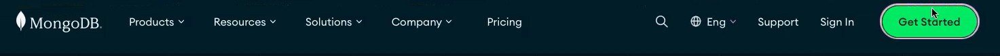
2. On the Sign up page (shown below), enter your e-mail, first and last names, 
   and select a 
   password.  Agree to the terms and conditions by selecting the checkbox.   
    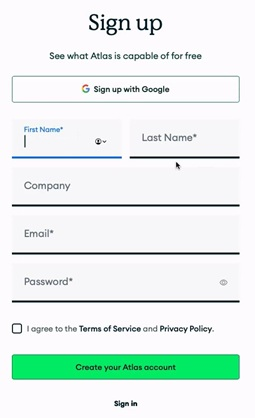  
    Then, click "Create your Atlas account".  
   (NOTE:  your e-mail and password
   you enter here are for accessing the MongoDB website.  It is not what you
   will use for your Python code to access the database, that information is
   created below.)
3. You will then receive an email from MongoDB to verify your e-mail.  Click
   "Verify Email" in that email.  It will open up a new webpage.
4. On the "Enable Multi-factor Authentication for your account" page (see 
   below), set up
   your preferred MFA method.  Then, click "Continue" once it turns green.  
    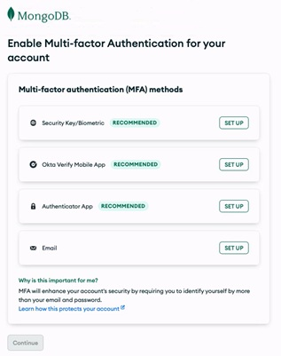  
5. Answer the questions on the "Welcome to Atlas!" page (shown below) and click 
   "Finish", or click on the "Skip personalization" link.  
    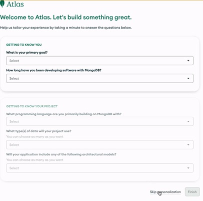
6. On the "Deploy your cluster" page:  
    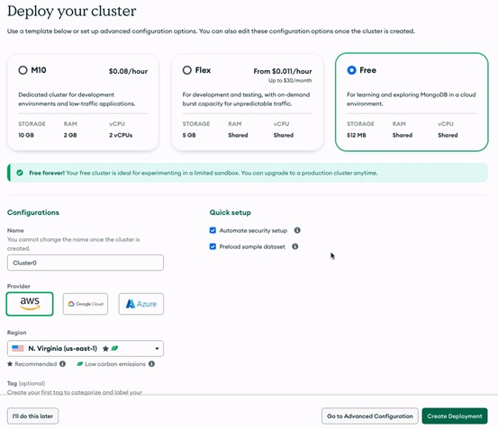
   1. Select the "FREE" option.
   2. Change the cluster name, or accept the default.
   3. Choose any provider under Provider (I use aws).
   4. Make sure the "Automate security setup" checkbox is selected.
   5. It is optional whether you preload sample data.
   6. Click the green "Create Deployment" button.
7. A "Connect to <cluster_name>" window will open.  <cluster_name> will either
   be "Cluster0" or the name you entered for the cluster.  Here, you will create
   a username and password that your Python code will use to access your
   database.
    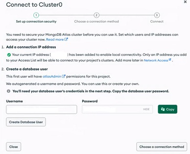  
   1. Under "2. Create a database user", an autogenerated username and
      password are provided.   Modify these as desired.  Make sure to copy the
      password into a safe place as you may not be able to see it again.  Click 
      on the "Create Database User".  The "Choose a connection method" 
      button will turn green.
   2. Click on the green "Choose a connection method" button.  The following 
      will appear:  
        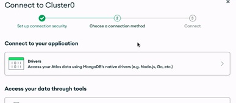
   3. Under "Connect to your application", click on "Drivers".  This will 
      appear:  
        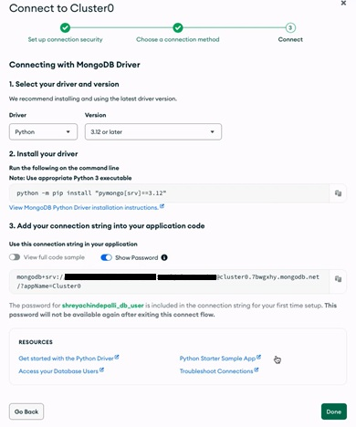
   4. Under "1. Select your driver and version", select "Python" and "3.12 or 
      later" from the dropdown boxes.
   5. Under "3. Add your connection string into your application code", copy
      the string in the box.  This is your connection string, and it contains
      the database username and password you created above.  Save this in a 
      safe place.
   6. Click the green "Done" button.
8. Next, we need to add IP addresses allowed to access the database.  
   1. Under "Network Access" in the left-hand menu, click on "IP Access List".  
        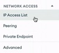
   2. On the IP Access List page, Click on the green "+ Add IP Address" 
      button.  
        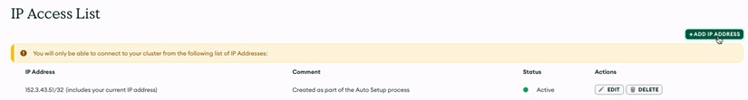
   3. In the "Add IP Access List Entry" box, in the "Access List Entry" text
      box, enter `0.0.0.0`.  
        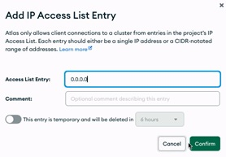
   4. Click "Confirm".

Cool, you're done setting up the database server!

Once you have data added to your database server, you can see it through the 
MongoDB website.  Under "Database" on the left-hand side, select "Data 
Explorer".  
    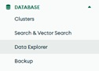

You can then navigate through your cluster to see your different databases 
and collections.

### Adding Database User       
If, for some reason, the window described in Step 7 did not display, you can
    click on the "Database & Network Access" option on the left-hand menu.  
        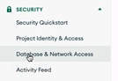  
On the "Database Users" page, you can click on the green "+ Add New Database 
    User" button  
         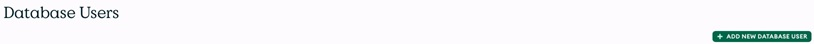  
    Then follow these steps

1. Under "Authentication Method", select "Password".
2. Enter a username (this user name will be used by your Python program
   to access the database and is different from the user name/email you
   use to access the MongoDB website)
3. Select a password.  Copy this password down somewhere safe as you will
         not see it again.
4. Under "Built-in Role", select "Atlas admin".
5. Click the green "Add User" button.
 
### Getting Connection String
 
If you did not get the connection string in the instructions above, follow 
these steps:
1. Click on "Database" in the left-hand list.
2. Click on the "Connect" button.
3. Click "Drivers" under the "Connect to your application" heading.
4. Under "1. Select your driver and version", select "Python" for the Driver 
      and "3.12 or later" for the version.
5. Copy the string that is shown under "3. Add your connection string into 
    your application code" section.  Make sure the slider "view full code
    sample" is slid to the left (off).  Replace the `<db_username>` and 
  `<db_password>` placeholders with the name and password you created above.
6. Save this string for use in class and projects.  

### Granting Another User Access to Your MongoDB Web Interface
When working as a team, you will likely be using just a single MongoDB
database.  As the entire team may need to see that database on the MongoDB
website, the owner of the database in use can grant other MongoDB accounts
access to the web interface of the database.

1. Log into your MongoDB Atlas database server account.
2. Click on "Project Identity & Access" under "Security" on the left-hand 
   side.
3. Click on the "Invite to Project" button.  
4. Enter the e-mail address associated with the MongoDB account you wish to
   provide access.  
5. Select the appropriate permission level to give.
6. Click the "Invite to Project" button.
