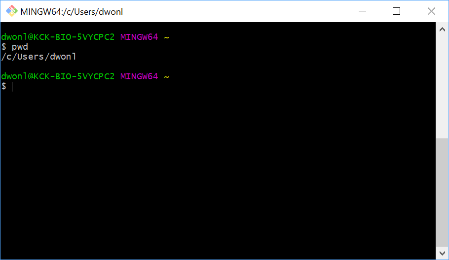
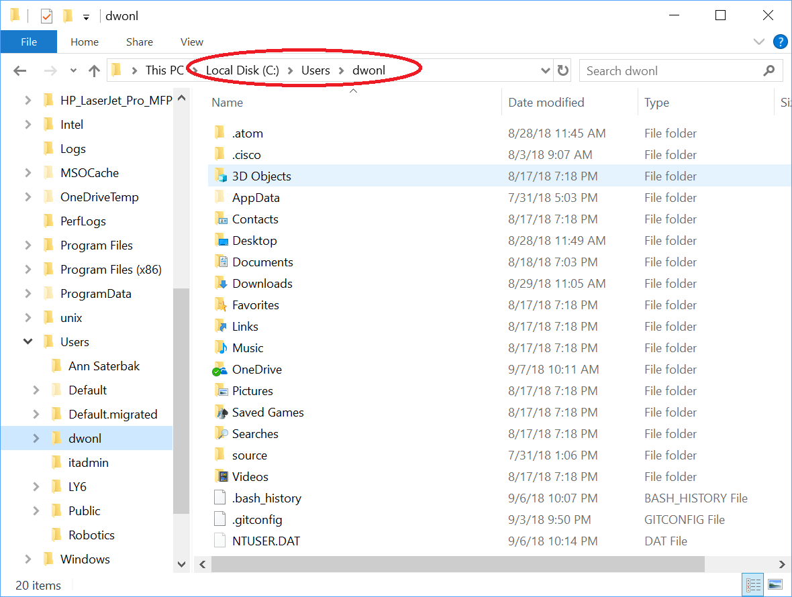
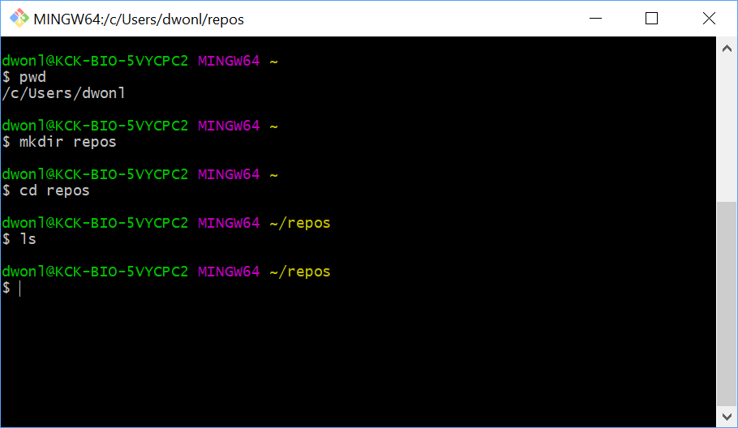
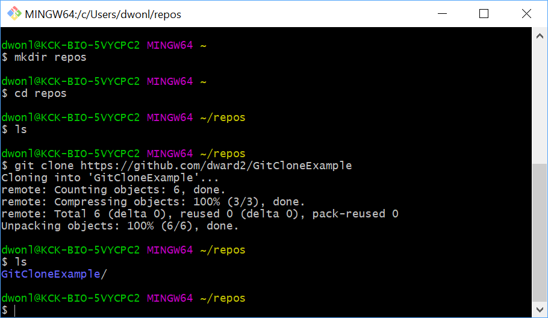
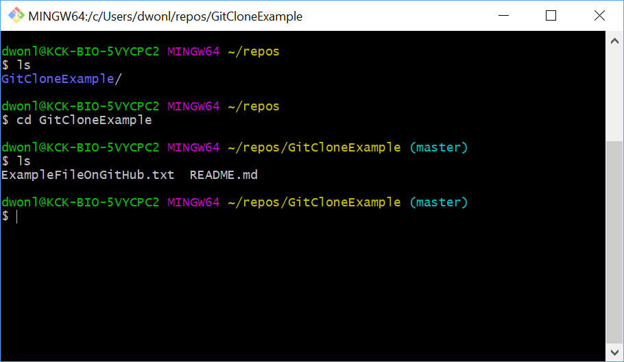
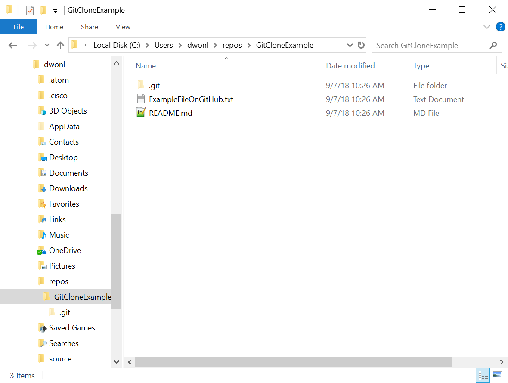

# Git Bash Directories
When running Git Bash for Windows, the default or start folder is `C:\Users\$USER` where `$USER` is the name of the local user account on the computer.  For example:  `C:\Users\dwonl`.

_On Macs when running from the terminal, I believe the default path is something similar._

To verify your default folder in Git Bash, type `pwd` at the command prompt right after starting Git Bash.

ex:

You can find this folder within Windows Explorer, as seen below:

ex:

Note that there are already a lot of subfolders here, many of which are operating system related.  Trying to create repositories in this folder can get confusing and could cause problems.

I would suggest making a subfolder here called "repos" in order to keep all of your repositories.  You can either create the subfolder in Windows Explorer or in Git Bash by typing `mkdir repos`.  You can replace `repos` with whatever name you would like.  Then, in Git Bash, enter this new subfolder by typing `cd repos` or `cd` followed by whatever folder name you used.

ex:
Initially this folder will be empty, as seen above by the fact that `ls` doesn't list anything.  

Next, assuming that we have an existing GitHub repository we want to clone onto our local computer, in Git Bash, type `git clone $URL` where `$URL` is the link to the GitHub repository you obtained from GitHub.  This clone command will automatically make a new subfolder, so you do not need to create your own subfolder.

ex:

You can see from above that a new folder was created with the name of the GitHub repository.  _Note that if you want the local subfolder to have a different name, you can use the following syntax:  `git clone $URL $LOCALNAME` where `$LOCALNAME` is the name you would like for your local subdirectory._

The `git clone` command has made a local repository in the new subfolder it created.  To enter that repository, we must switch into that folder.  In Git Bash, type `cd $REPONAME` where `$REPONAME` is the name of the subfolder created by `git clone`.

ex:

Notice that the command line prompt now says `(main)` at the end, indicating that we are now in a git repository.  The folder contains whatever files were in the GitHub repository that was cloned.  These files can also be seen in Windows Explorer.

ex:

Now, you can start adding files into this folder and use git commands to store them in the respository and push them to GitHub.
