# Branching

Here is the standard workflow for using feature branches in `git` and GitHub.

#### Initial Commit
First, a new repository is created on GitHub with a README.md file and then  
cloned to the local computer.  The repository has a single commit on the main 
branch:


_GitHub Commit History_: 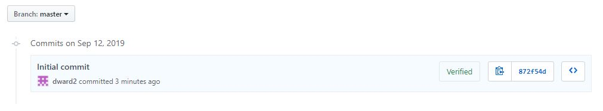

_git local commit history_:
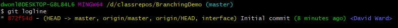


#### First Feature Branch
The first feature branch, in this case called `interface`, is created in `git`  
and checked out with the following commands:
```
git branch interface
git checkout interface
```
On the interface branch, the desired code is added committed.

The local `git` commit history now looks like this:

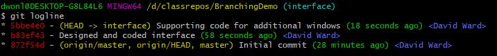

Note:  For information on how to implement this single-line commit log,
go <a href="https://github.com/dward2/BME547/blob/master/Resources/Git/GitCommands.md#git-log-options">here</a>.

Next, this feature branch is pushed to GitHub.  As this branch does not
currently exist on GitHub, the following command is used:
```
git push --set-upstream origin interface
```
The repository on GitHub now shows the `interface` branch and its commit 
history:

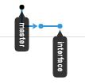
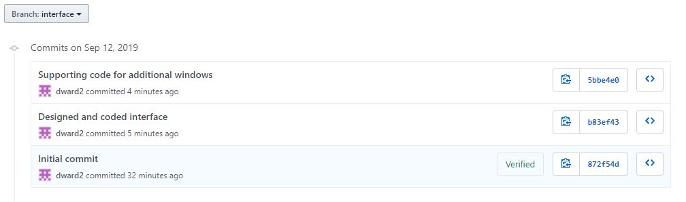

On GitHub, a pull request is opened to merge `interface` into `main` and the
merge is completed.  The repository branch network now looks like this:

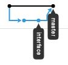

and the main branch now has the commit history:

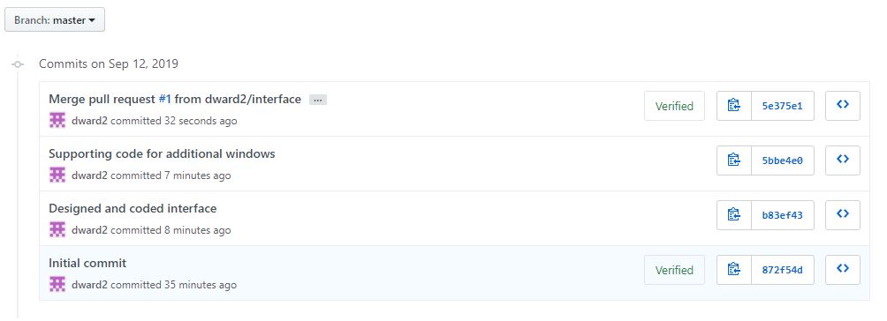

Note that the commits from the `interface` branch have been added to the 
`main` branch.

As this merge was done on GitHub, the local repository has no knowledge of this
merge.  So, back in the local repository, the local repository is updated to 
the same status as GitHub by using the following `git` commands.First, the
main branch is checked out.
```
git checkout main
```
Then, `fetch` is used to get the latest status from GitHub and `pull` is used
to pull the latest `main` branch updates into the local repository:
```
git fetch
git pull
```
`git` knows to pull the `main` branch because that is the currently active
branch.  The local git commit history for the local main branch is now:

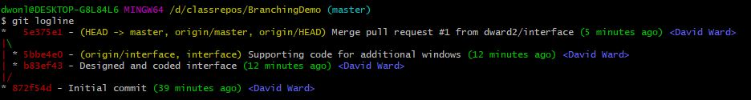

#### Second Feature Branch
A second feature branch, called `calculations` is now made from the `main` 
branch.  Make sure that the `main` branch is currently checked out.  
Then, a new branch is made:
```
git checkout main
git branch calculations
git checkout calculations
```
The git commit history for this new branch is as follows:

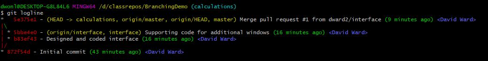

Note that it is exactly the same as `main`.  When a new branch is made, it
retains the commit history of the branch from which it was made.

Now, code and commits are made on this new branch, leading to the following
local git commit history:

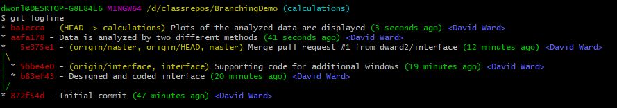

This new branch is pushed up to GitHub:
```
git push --set-upstream origin calculations
```

So, the GitHub repository now looks like:

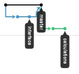

and the `calculations` GitHub commit history is:

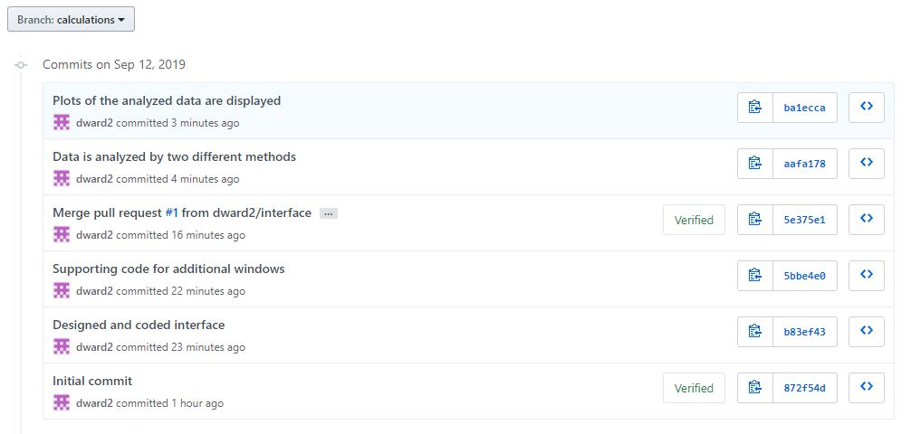

Again, a pull request and merge is done on GitHub.

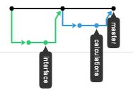
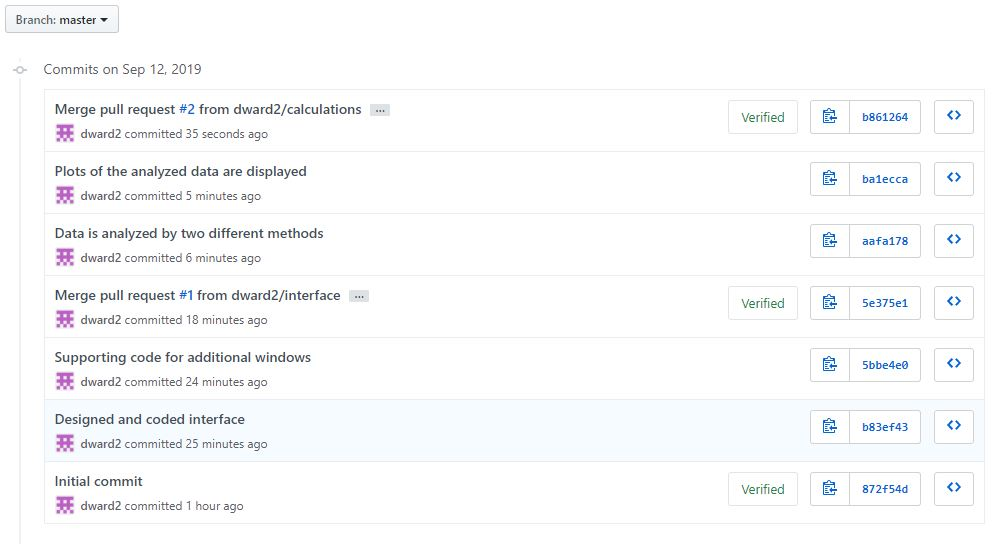

And, as before, these changes on GitHub need to be pull back into the local
repository using:
```
git checkout main
git fetch
git pull
```
So that the local git commit history for `main` now looks like:

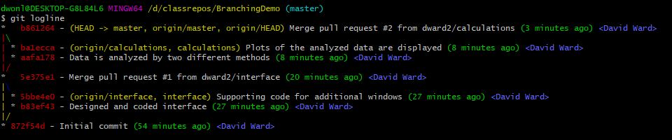

#### Adding to existing branch
Lets say that you added some code to a feature branch and pushed it to GitHub
so that other users can see what you are doing.  You can still make further
additions to that feature branch locally and then push it up to GitHub again,
simply using the `git push` command when the feature branch is active.  Since
GitHub already has the branch defined, you do not need to use the 
`--set-upstream` flag.

#### Best Practice:  Make new feature branches from `main` branch
Whenever you are making a new feature branch, generally create this branch from
the `main` branch.  In this way, if others collaborators have made changes
to the `main` branch, you will be working from the most recent copy.  There
may be times when you want to try a different approach to a feature, and in
that case, it may be okay to branch off of a feature branch.

Or, shown graphically:

__Good:__

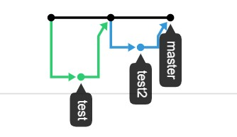

__Bad:__

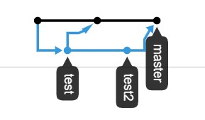

