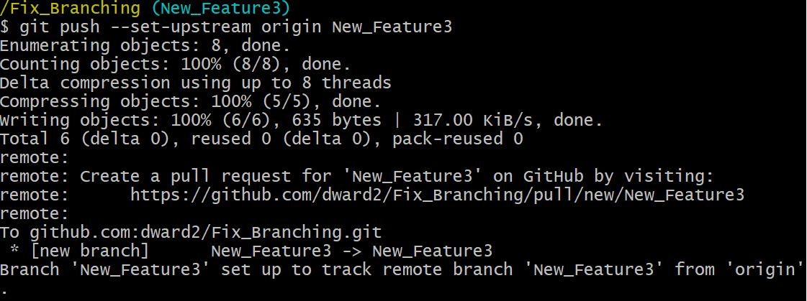

# Fixing When a Feature Branch Was Made From Another Feature Branch

It is not an uncommon occurrence that, after someone merges a feature branch 
into the `main` branch on GitHub, that person forgets locally to checkout the 
`main` branch and pull down the merged changes.  Instead, they remain on the 
last feature branch and make another branch from there.  If they then merge
this new feature branch after making some commits, their repository network
graph might look like this:

And, the local repository log would look like this.

There is nothing strictly wrong with this, especially if you are working alone.
But, if you are working with others on a repository, this is bad practice.
Everytime we start a feature branch, we want it to start from the main branch
so we get the most recent code that others may have contributed since you
started your last feature branch.

That is why, in this class, I discourage and sometimes remove points when
branching is done like this.  

If you are working on a repository where you are the only user, the following
approach can "fix" this to follow the expected feature branch work flow.  Do
NOT follow this procedure if you work on the repository with others.  This
procedure edits the commit history of a repository and it would no longer be
compatible with the cloned repositories of other users.

The steps below will move the commits made on the `Feature3` branch to a new
feature branch that is created from the `main` branch and then this new feature
branch is merged into the `main` branch.

## Steps
### Reset the `main` branch back to the previous merge
We would like the main branch to go back to the merge with `Feature2`.  This
merge happened at commit `8e87d4e` on the `main` branch.  First, make sure that
the `main` branch is currently checked out.  Then, to reset the `main` branch
to the earlier commit, use the git `reset` command along with the target
commit ID.

The `--hard` flag removes all changes made to the main branch after the 
given commit id.

Next, push this changed local `main` branch up to GitHub.

The `--force` flag must be used because GitHub does not like it when git
histories are rewritten in this way, and so the use of `--force` tells
GitHub to do it anyway.

The network graph of the repository now looks like this:

### Create a new feature branch off of `main`
Next, we want to create a new feature branch off of the `main` branch like we
should have done originally.  Make sure the `main` branch is checked out.
Then, create a new branch and check it out.

### Move the commits from the old feature branch to the new feature branch
We next want to move the commits made on the old `Feature3` branch to the new
`New_Feature3` branch.  The git command `cherry-pick` makes a copy of a commit
onto the active branch.  Make sure that the new `New_Feature3` branch is 
checked out.  Then, enter the command `git cherry-pick <commitID>` for each
commit that needs to be moved from the old to the new branch.  Make sure you
start with the oldest commit and move to the newest.  If we look at the local
log at the top of this page, we see that the two commits on the `Feature3`
branch we want to move have ids of `117027b` (the oldest) and `30263cd` (the
newest).  So, enter the following commands:

Push this new branch up to GitHub.

The GitHub repo network graph now looks like this:

### Remove old feature branch
Finally, we can remove the old feature branch from both the local repository
and GitHub.  Use the commands below, which include checking out the `main` 
branch.

The GitHub repository now looks like this:

### Continue
Now, either continued development could be done on the `New_Feature3` branch,
or it could be merged into `main` following the usual procedure.  

