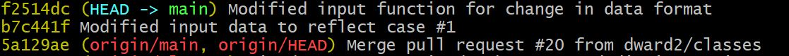
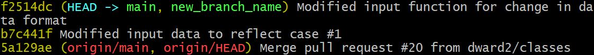
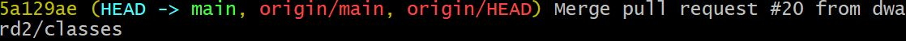
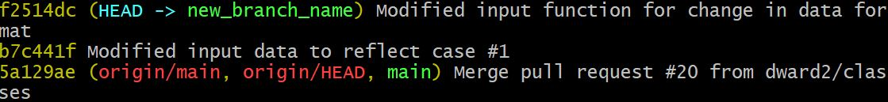
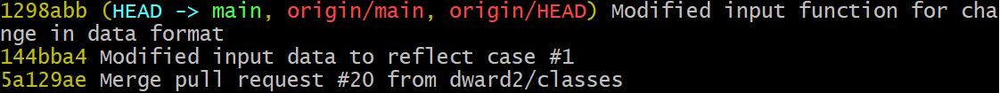
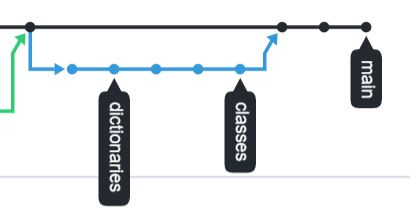

# Moving Commits From Main To Feature Branch

Assume the following situation.  Your repository has the `main` branch checked
out.  You intend to start a new feature, but forget to create a new branch.
You inadvertently make some commits to the `main` branch and then realize your
error.  How do you "fix" the problem and move these commits to a feature
branch.   

## Mistaken commits not pushed to GitHub

The following approach can be taken __ONLY if you have not yet pushed the
mistaken commits on the `main` branch to GitHub__.  If you have pushed these
commits to GitHub, skip down to the section below called __What If The Mistaken 
Commits On Main Were Pushed To GitHub__.

The `git log --oneline` of your local repository would look something like 
this:

A new branch should have been made after commit `5a129ae`, but was not done so.


First, create a new branch at the most recent commit.  On the `main` branch,
enter:
```bash
$ git branch new_branch_name
```
Replace `new_branch_name` with your desired branch name.

The local `git log --oneline` will now look like this:


Next, the `HEAD` of the `main` branch will be moved back to where it should
have been if a feature branch had been correctly made.  Make sure that the
`main` branch is still checked out.  Then, enter this command:
```bash
$ git reset --hard 5a129ae
```
Replace the commit ID with the appropriate commit ID in your case.

The `git log --oneline` for the `main` branch will now look like this:


And, if the `new_branch_name` is checked out, the `git log --oneline` will now
look like this:


You can now continue work as normal.

## What If The Mistaken Commits On Main Were Pushed To GitHub

The use of the `git reset` command in the approach above rewrites the git
repository commit history.  This is a problem if you are working with a shared
repository.  Your rewrite of the git commit history will then conflict with
the git commit history of other collaborators local repositories and this will
lead to serious problems.  

So, if you are working with other collaborators, the appropriate fix is not to
`reset` the main branch but rather to `revert` the mistaken commits.  This does
not rewrite the commit history but adds new commits.  See the repo page at
<a href="./undo_commits.md">Resources/Git/undo_commits.md</a> for more 
information.

Assume that the `git log --oneline` looks like this:

And, the GitHub network graph looks like this:


In the local `main` branch, revert the two mistaken commits as follows:
```bash
$ git revert 1298abb
$ git revert 144bba4
```
Git will open the default editor and ask you for
a commit message.  It will suggest a good commit message for you to use.

It is safest to revert the commits in the reverse order from which they were
made.  So, revert the most recent commit first, then move backwards.

The `git log --oneline` will now look like this:

You can now push the updated `main` branch up to GitHub.  Then, make a new
feature branch and reenter the code changes you intend to make on the branch.

If you prefer, you could make the reverts on a branch so that you are not
working directly on the main branch.  That would look something like this:
```bash
$ git branch remove_bad_commits
$ git checkout remove_bad_commits
$ git revert 1298abb
$ git revert 144bba4
$ git push --set-upstream origin remove_bad_commits
```
Then, on GitHub, you would open a pull request to merge the 
`remove_bad_commits` into main.

### What if you are the only collaborator on a repository
If you have pushed the mistaken commits on `main` to GitHub, and you are
100% sure that no one else is working on your repository, you can
follow the first method above.  Follow all of the same steps in your local
repository.  Then, at the end, once the `main` branch has been reset back to
where you want it, check out the `main` branch and enter the following command:

```bash
$ git push --force
```
This will cause GitHub to reset the `origin/HEAD` and `origin/main` to the same
commit as the local repository.  However, this is rewriting the git commit
history and should be used with extreme care.

