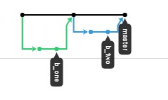
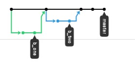
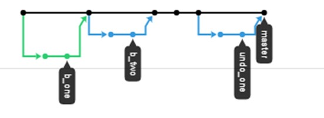

# Undoing An Earlier Commit Once Pushed To GitHub

As seen in the [git_concepts.md](https://github.com/dward2/BME547/blob/main/Resources/Git/git_concepts.md#reverting-to-earlier-commits)
page, the `git reset` command can be used to reset the current branch to an
earlier commit.  This works well when working with the local repository on
a single branch.  However, once you push a branch to GitHub and then merge it
into the `main` branch, using the `git reset` command locally can lead
to many problems.  The `git reset` command essentially re-writes the history
of the repository, and its history will no longer match that of GitHub.

The preferred way to "go backwards" once commits are on GitHub is to use the
`git revert` command.  This command creates a new commit that "undoes" the 
actions of an earlier commit.  Here is an example:

Assume a repository with a commit/branch history as follows:



On a local computer, the first branch named `b_one` was created.  Two commits
were made and then pushed up to GitHub, where it was merged into the `main`
branch.  On the local computer, the updated `main` branch was pulled down
and a new branch named `b_two` was created.  Two commits were made to that
branch and it was then pushed up to GitHub.  `b_two` was also merged into the
`main` branch.  The new merged main is then pulled down to the local
computer.

## Removing a whole branch in GitHub
In the example above, it is possible to undo a branch merge that was performed
in GitHub.  Instructions can be found at
https://help.github.com/en/github/collaborating-with-issues-and-pull-requests/reverting-a-pull-request.
This will create a new "revert" branch that will do the reverse edits of the 
merged branch to be removed.  This new branch is then merged into main.  The
updated main will then need to be pull down to the local repository.


## Removing a branch (or individual commits) locally
If you prefer to use the command line, while there is not an easy way to undo
a merge made on GitHub, you can "revert" the individual commits made on the
undesired branch.  For example, the `git log` of the repository above is as
follows:
```
$ git logline
*   fed7361 - (HEAD -> main, origin/main, origin/HEAD) Merge pull request #2 from dward2/b_two (4 minutes ago) <David Ward>
|\
| * 1fa2327 - (origin/b_two, b_two) modifications to file_one on b_two branch (5 minutes ago) <David Ward>
| * 5b7b378 - first commit to branch b_two (5 minutes ago) <David Ward>
|/
*   5d755e9 - Merge pull request #1 from dward2/b_one (7 minutes ago) <David Ward>
|\
| * 03a653c - (origin/b_one, b_one) second commit on b_one branch (7 minutes ago) <David Ward>
| * fc9bb4b - commit one of file_one to b_one branch (8 minutes ago) <David Ward>
|/
* fcc7483 - Initial commit (9 minutes ago) <David Ward>

```
To remove the unwanted branch, we need to undo the commits associated with that
branch.  So, to remove the `b_two` branch, we could use the following commands
while on the main branch.

```
git revert 1fa2327
git revert 5b7b378
```
The `git revert` command is sent the commit ID of the commit to be removed.  A
new commit is added that reverses these changes.  When entering the `git revert`
command, an editor window will open for you to enter a message.  Enter the
message and close the window and the commit will be made.  After the above two
reverts are done, the repository looks as follows:

```
$ git logline
* 46e381d - (HEAD -> main) Revert "first commit to branch b_two" (5 minutes ago) <David Ward>
* c6e3626 - Revert "modifications to file_one on b_two branch" (5 minutes ago) <David Ward>
*   fed7361 - (origin/main, origin/HEAD) Merge pull request #2 from dward2/b_two (26 minutes ago) <David Ward>
|\
| * 1fa2327 - (origin/b_two, b_two) modifications to file_one on b_two branch (27 minutes ago) <David Ward>
| * 5b7b378 - first commit to branch b_two (27 minutes ago) <David Ward>
|/
*   5d755e9 - Merge pull request #1 from dward2/b_one (29 minutes ago) <David Ward>
|\
| * 03a653c - (origin/b_one, b_one) second commit on b_one branch (29 minutes ago) <David Ward>
| * fc9bb4b - commit one of file_one to b_one branch (30 minutes ago) <David Ward>
|/
* fcc7483 - Initial commit (31 minutes ago) <David Ward>
```
When the main branch is then pushed to GitHub, the commit/branch network will
look as follows:


And, a comparison of the final commit and the commit after the first branch
merge, done with the `git diff 46e381d 5d755e9` shows no difference.  The 
`b_two` branch was successfully merged.  

This "removal" could also be done
on a branch so you are not doing work on the `main` branch.  For example,
below are the commands that could be used to remove the `b_one` branch:

```
git branch undo_one
git checkout undo_one
git revert 03a653c
git revert fc9bb4b
git push --set-upstream origin undo_one
```
These commands make and checkout a new branch, undo the `b_one` commits on this
branch, and then push this new `undo_one` branch up to GitHub.  If the branch
is then merged on GitHub, you will get back to the original state of the 
repository.

