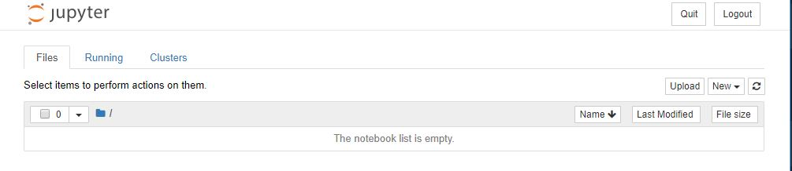
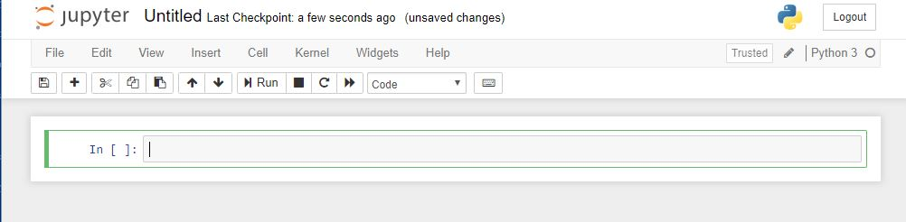

# Using a Juypter Notebook

## Setup a Virtual Environment

#### First, make a new folder for your repository and then enter that repository.
Linux / Mac / GitBash:
```
dward@DESKTOP-G8L84L6:/mnt/d/ClassRepos$ mkdir jupytertest
dward@DESKTOP-G8L84L6:/mnt/d/ClassRepos$ cd jupytertest
```
Windows / Conda:
```
(base) D:\ClassRepos>mkdir jupytertest

(base) D:\ClassRepos>cd jupytertest
```

#### Then, make a new virtual environment.
Linux / Mac / GitBash:
```
dward@DESKTOP-G8L84L6:/mnt/d/ClassRepos/jupytertest$ python -m venv venvjup
```
Windows / Conda:
```
(base) D:\ClassRepos\jupytertest>conda create --name JupyterEnv
```

#### Then, activate the virtual environment.
Linux / Mac / GitBash:
```
dward@DESKTOP-G8L84L6:/mnt/d/ClassRepos/jupytertest$ source venvjup/bin/activate
(venvjup) dward@DESKTOP-G8L84L6:/mnt/d/ClassRepos/jupytertest$
```
Windows / Conda:
```
(base) D:\ClassRepos\jupytertest>activate JupyterEnv

(JupyterEnv) D:\ClassRepos\jupytertest>
```

#### In this environment, install the `jupyter` package.
Linux / Mac / GitBash:
```
(venvjup) dward@DESKTOP-G8L84L6:/mnt/d/ClassRepos/jupytertest$ pip install jupyter
```
Windows / Conda:
```
(JupyterEnv) D:\ClassRepos\jupytertest>conda install jupyter
```
A number of packages will be downloaded and installed.

Note that, instead of directly installing `jupyter` by the commands above, it
could be done by using the `enviornment.yml` file in conda or `requirements.txt`
file in Linux/Mac/GitBash.  See 
[virtual_environments.md](../../Lectures/virtual_environments.md) for more info.

## Starting  Jupyter Notebook
To start a new Jupyter Notebook, type
```
jupyter notebook
```
This will ideally open a browser window.  If not, a URL should be given in your
terminal window that you can open with a browser.

To start a new Jupyter Notebook, click on the "New" button and choose
"Python 3" from the dropdown menu.  A new browser window should open.

You can now explore the notebook.  You can add new cells by clicking on the
"+" button.  You can change the type of cell (whether it contains code or 
markdown) by clicking on the drop down that says "Code" in the picture above.
You can change the order of the different cells using the arrow buttons.

Enter code into a cell.  To execute the cell, type `Shift+Enter`.

**NOTE**: On Windows with Python 3.8, the Python Kernel did not start in
the Jupyter Notebook.  One possible fix can be found 
[here](../Resources/Jupyter/notebook_python38_fix.md).

When you are ready to save the notebook, choose the "Save As..." option under 
the File menu.

When you are finished, you can click "Logout".  Go back to the command prompt.
If there is not a prompt available for you to type, the jupyter server may
still be running.  Click Ctrl-C to exit the server.  Then, you can see that
a new jupyter notebook has been created in your directory with the file
extension `.ipynb`.

## Opening an existing Jupyter Notebook
```
jupyter notebook <notebookname>.ipynb
```
