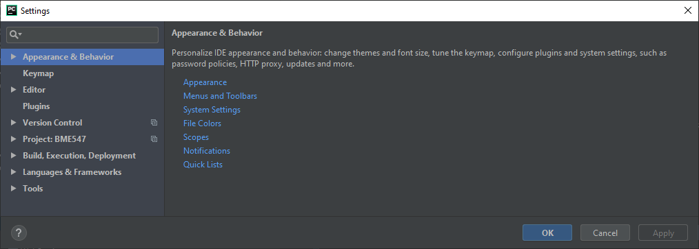
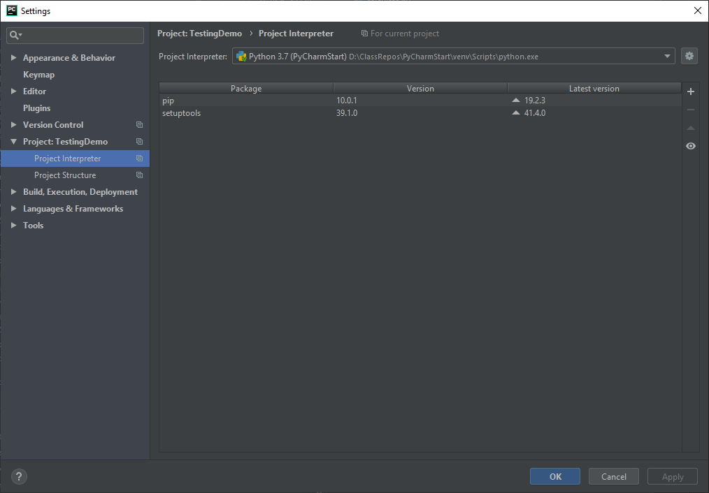
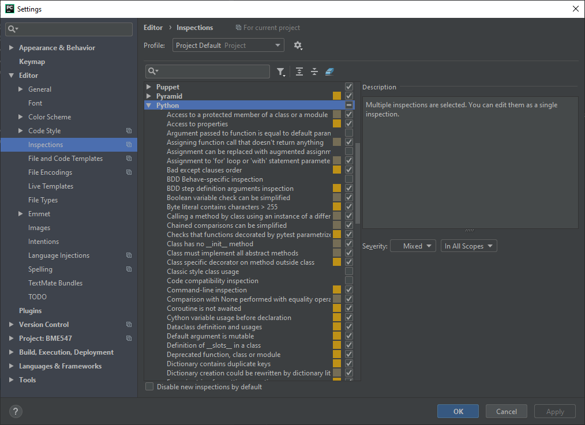
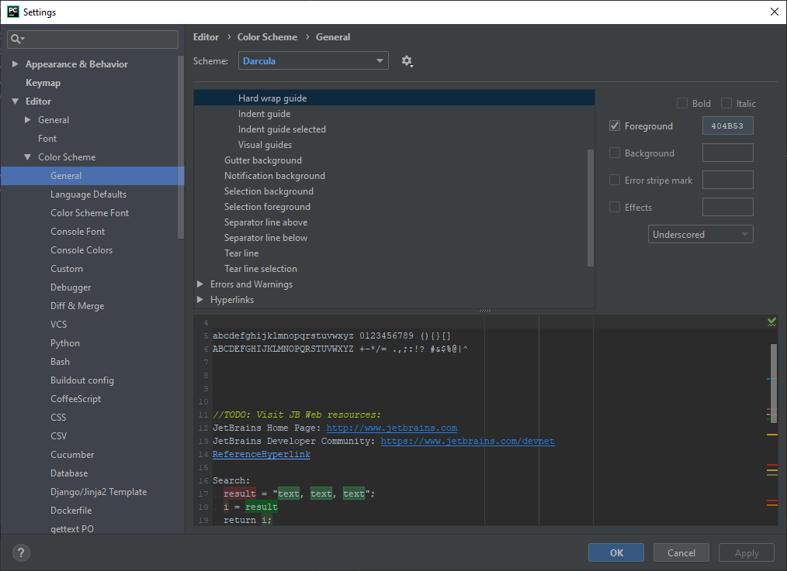

# Useful Settings for PyCharm

### Accessing the Settings Window
* Windows:  File/Settings...
* Mac:  Look for Preferences menu item

### Tools / Python Integrated Tools
* Can set the "Default test runner" to `pytest`
* Can set Docstring format to your preference
* Can set the Package requirements file name:  enter `requirements.txt` if not
 already in this field.  Or, if you prefer to use a different
file than requirements.txt, enter a different file name.

### Project / Project Interpreter
* Displays and controls virtual environment
* "+" allows you to add packages

 
### Editor / Inspections
* Controls what the editor will display in terms of errors, warnings, etc.
* PyCharn can show PEP8 coding style violations.  To turn this on, open the
Python option in the right side of the window (see below) and scroll down
until you see the item "PEP8 coding style violation".  Make sure that is 
checked.  
* NOTE:  `pytest --pycodestyle` will have the final word on whether PEP-8 style 
is achieved.  So, do not rely only on PyCharm to check for this.

### Editor / Code Style / Python
* Allows users to change settings in how the editor formats python code and 
gives some errors.  
  + Be careful if you change any of these settings.  For this class, the 
  `pytest --pycodestyle` program will be the final word on whether PEP-8 style is 
  achieved.
  
### Line length guide
* A line in the editor can be shown that indicates the line length maximum.
* To turn on and off, go to "Editor /Color Scheme / General" (see below).  
In the right hand portion, select "Hard wrap guide" under "Editor / Guides".  
  Turn "Foreground" on or off.  When turning on, you can vary the 
  color/intensity of the line by clicking on the number code next to 
  Foreground.

  
### Editor / Code Style
* Can set line length using "Hard wrap at"

