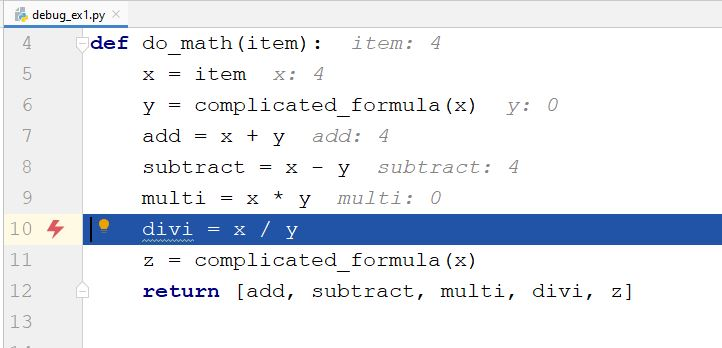
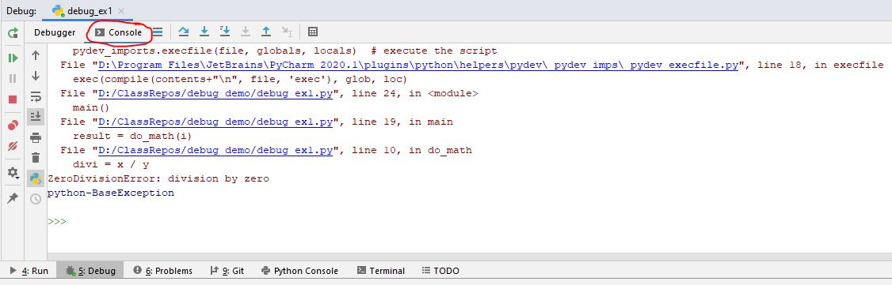
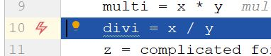
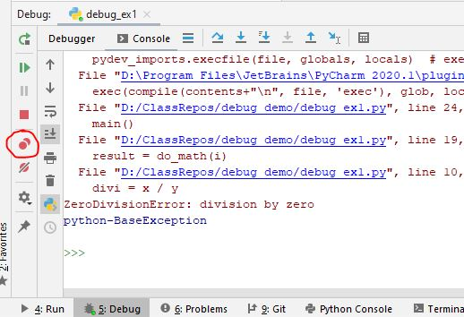
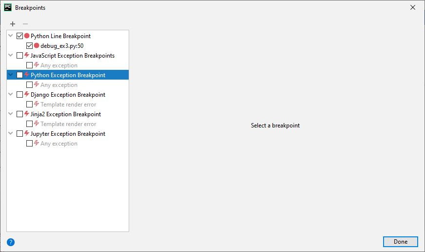

# Exception Breakpoints
With the default PyCharm settings, while running in Debug mode, the 
debugger should pause program execution when an unhandled exception occurs.
This is a useful feature because it allows you to examine the state of the
program and variable contents when the error occurred.  

When this occurs, the editor should look like this:

The red "lightning bolt" icon shows the line that caused the exception.
The specifics of the exception can be seen in the Console sub-tab of the 
Debug tab at the bottom of the PyCharm Window:

Clicking on the "lightning bolt" icon will cause it to become an outline:

This has the unfortunate effect of turning off the exception break points.
Future exception errors will not cause the debugger to pause program
execution.  

To turn this feature back on, click on the two overlapping red circles in the
Debug tab:

Or, select "View Breakpoints..." from the "Run" menu.  The following window
will appear:

Click the checkbox next to "Python Exception Breakpoint" and make sure it is
checked.  Click Done.

Now, you can try to run the debugger again, and it should pause with an
exception.