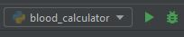

# Running Flask in PyCharm

When running a Flask server from the command line, there are two different
ways of starting the server.  What I typically demonstrate in class
is running the server code as a typical module, so entering `python server.py`
to run the code.  The second way is to actually start the Flask program and 
tell Flask in which module the server code can be found.  An example of this
can be found in the Flask documentation at
<https://flask.palletsprojects.com/en/2.2.x/quickstart/#a-minimal-application>.

However, these two ways of running the code do have some different behavior.
One difference is how they interact with the `if __name__ == "__main__":`
code block.

Let's say you had a file, `server.py`, that looked like this:
```python
from flask import Flask

app = Flask(__name__)

# Code to implement server routes here

def initialize_server():
    # Code that initializes server

if __name__ == "__main__":
    initialize_server()
    app.run()
```

When run from the command line like a standard module with the command
`python server.py`, the Python interpreter treats this like a standard Python
module.  It will scan the file and come across the `if __name__ == "__main__":`
command.  Since `server.py` was the module started on the command line, Python
considers it the `__main__` module.  So, `if __name__ == "__main__":` will be
`True` and that code block will be run.  It will call the `initialize_server()`
function and then start the server with the `app.run()` command.

However, if you run Flask first, the `server.py` file is not interpreted the
same way.  The `server.py` module will not be considered the `__main__` module
 and so the `if __name__ == "__main__":` command will evaluate as `False` and
the `initialize_server()` function will not be called.  The server will still
start, however, because calling Flask first removes the need for the 
`app.run()` command.  But, if the `initialize_server()` function is needed for
correct functioning of the server, there will be a problem.

What does this have to do with PyCharm?  

When PyCharm sees a Python module, it will automatically set-up a "Run/Debug 
Configuration" that will be used when you start the module using one the green
run arrow or the green debug bug.  Generally, it will configure this "Run/Debug
Configuration" to run the module in the standard way just it was run from the
command line.  PyCharm will generally look something like this:

  
(The above is the Select/Run Configuration box in the toolbar.)

However, if PyCharm sees that the code is for a Flask server,
it may set-up the "Run/Debug Configuration" to start Flask first.  In these
cases, the "Run/Debug Configuration" will look something like this:


When you see this, Flask will run first and any code in the 
`if __name__ == "__main__":` code block will not execute.  

If you want PyCharm to run your server code in the normal way and execute the
`if __name__ == "__main__":` code block, you will need to define a new
"Run/Debug Configuration".  

1. Open the "Run/Debug Configurations" window.  This can be done by either:
   1. clicking on the dropdown arrow next to the current Run/Debug 
      Configuration as seen in the examples above and selecting "Edit 
      Configurations..." from the dropdown menu, or
   2. selecting "Edit Configurations..." from the Run menu.
2. In the "Run/Debug Configurations" window, click on the "+" icon in the
   upper-left portion of the window and select "Python" from the dropdown list.
3. In the "Name" field on the right side, name the configuration.  I usually
   use the name of the server module plus "no flask", such as "server.py 
   (no flask)".
4. In the "Script path" field, click on the folder icon on the right and then
   navigate to and select the module of interest (e.g., `server.py`) and click
   "Ok".
5. Click "Ok" to close the "Run/Debug Configurations" window.

Now, this new configuration should be available in the Select Run/Debug
Configuration drop down at the top of the PyCharm window.  You can then run
or debug the code as normal.


