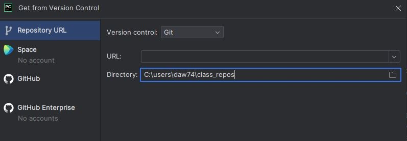
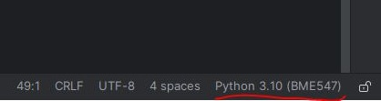
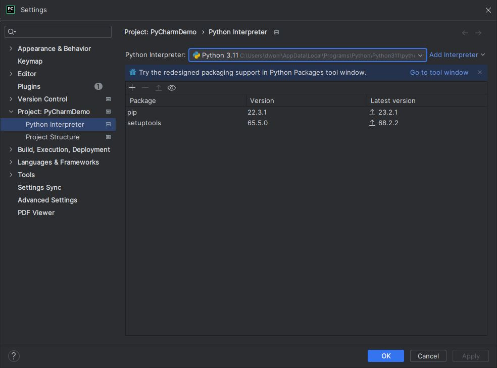
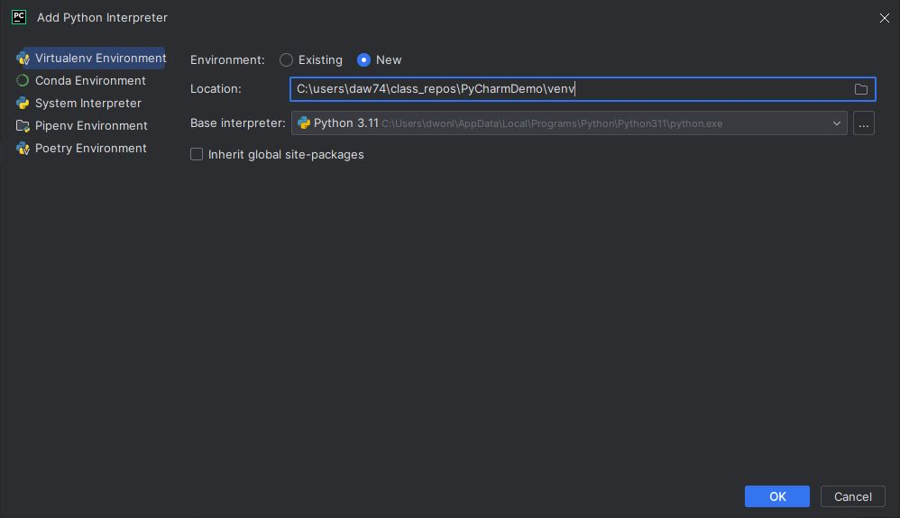
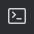
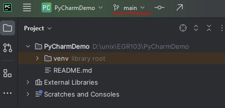
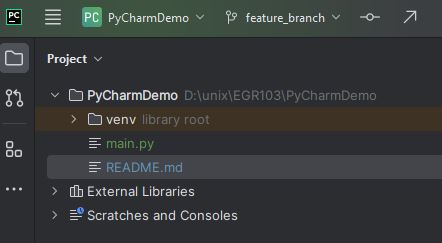
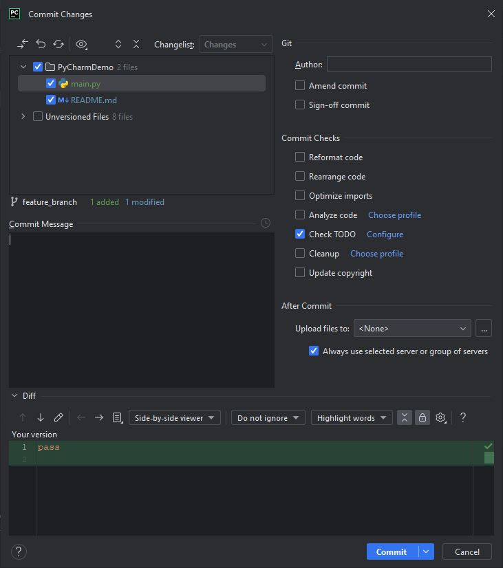
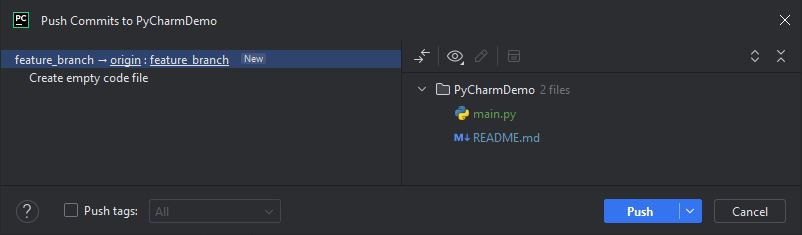
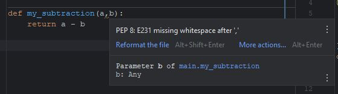

# Using PyCharm

Note: Snapshot and specific instructions shown here were taken from the Windows
version 2023.2 with the new updated UI.  Other versions, including those on 
macOS and Linux, may differ slightly.

## Installation
1. Make sure you have git and Python installed on your computer.  See
[01_tool_setup_git_intro.md](../Assignments/01_tool_setup_git_intro.md) 
for instructions.
2. Visit <https://www.jetbrains.com/community/education/#students> to apply
for a free Educational License to use PyCharm Professional.
3. Download and install PyCharm.  Specific directions can be found at
https://www.jetbrains.com/help/pycharm/installation-guide.html.  At some point,
you must log in using the credentials created with the free Educational
License.

## Menu Bar
In the updated 2023 interface, the menu bar is displayed once you click on
this icon in the upper task bar:  

## Clone a GitHub Repository
1. Upon starting PyCharm, click the "Get from VCS" button in the "Welcome
to PyCharm" opening window.  If PyCharm is already open, select `Git/Clone...` 
from the menu bar.  The following window will be displayed:  

2. In the "Get from Version Control" window that is displayed, enter in the 
"URL" entry box the
appropriate ssh string from the repo on GitHub you want to clone.  Make sure
the directory name is where you want this repo to be stored.  Sometimes,
PyCharm suggests a good place, sometimes not.  
(Example:  C:\users\daw74\class_repos\repo_name)  
3. Click the "Clone" button.
4. You may be asked whether you wish to Trust this repository.  If this is a
repository you own, click "Trust".
5. You may be asked whether to open this repository in a new window or an
existing window.  Usually, you will click on "New Window".

## Open an Existing Git Repository
1. Upon starting PyCharm in the "Welcome to PyCharm" window, you can select 
the local repository you wish to open from the list of recent repositories, 
or you can click the "Open" button and navigate to and select the folder 
containing the repository.

## Creating/Selecting a Virtual Environment
When a repository is opened/cloned for the first time, PyCharm will attempt to 
select an appropriate Python environment.  You can see the active environment 
in the bottom right-hand corner of the screen:  
  
The Python version in the environment is shown and may be followed by a name,
often the name of the repository for which the environment was created. 

PyCharm may select one of the following for the active environment:
* It may select a base Python installation (i.e., no virtual environment, just
the default Python installation).
* It may select an existing virtual environment it has used for another project.
* If a virtual environment is found in the repository folder (for example, if
you had already made one on the command line), it may activate it.
* If a `requirements.txt` file is found without an existing virtual environment,
it will prompt you to create one using that `requirements.txt` file.
* It may not select any interpreter.

### Selecting an Existing Virtual Environment
You can select an existing virtual environment in one of two ways.
1.  Click on the environment name in the bottom right corner and select from 
the list menu that is displayed.
2. Open the Settings window by selecting `File/Settings...` from the menu bar
and selecting "Python Interpreter" under the "Project: <RepoName>" heading
on the left-hand side of the Settings window.  

Then, click on the "Python Interpreter:" dropdown box and select an environment
or select "Show All..." from the list to see an even larger list of available
environments.  

### Creating a Virtual Environment
1. Open the Settings window by selecting `File/Storage...` from the menu bar
and selecting "python Interpreter" under the "Project: <RepoName>" heading on
the left-hand side of the Settings window.  See example under step 2 in
"Selecting an Existing Virtual Environment" above.
2. Click on the "Add Interpreter" link on the upper right and then select
"Add Local Interpreter..." from the drop-down that opens.  The following 
window will display:  

3. If you are creating a virtual environment from scratch:
   1. Select the "New" radio button for "Environment:".
   2. In "Location:" select the folder in which to create the virtual 
   environment.  For example, enter the path of the current repository and then
   add "venv" to that path as shown in example above.
   3. In "Base Interperter:", choose the Python version you would like to use.
4. If you want to use an existing virtual environment that is not yet
recognized by PyCharm:
   1. Select the "Existing" radio button for "Environment:".
   2. Click on the three dot icon next to the drop-down box for "Interpreter:".
   3. In the "Select Python Interpreter" window that opens, navigate to the
   folder containing the virtual environment you want to use.  Then, go into
   the "Scripts" folders ("bin" folder for macOS) and select the "python.exe"
   file and click "Ok".
5. After completing either step 3 or 4, click on "Ok".  You will be returned to
"Python Interpreter" option of the Settings window with the newly created
virtual environment selected as the Python Interpreter.  You can now click
"Ok" to close the Settings window and the new environment should be active.

## Terminal Window in PyCharm
A terminal window for using the command line (so you can enter git commands,
run Python, create environments, etc.) can be opened from the menu bar by 
clicking `View/Tool Windows/Terminal` or clicking on the 
 icon in the 
bottom-left toolbar.  Settings for the command line, including setting the
default type of command line to open, can be found in the Settings window.
Open the Settings window by selecting `File/Settings...` from the menu bar
and selecting "Terminal" under the "Tools" heading
on the left-hand side of the Settings window.  

## Git Workflow in PyCharm
The git workflow can be implemented by using command line commands in the 
terminal window opened above.  You can also access git functionality through
the PyCharm interface itself.

### Making a new branch
The current branch is shown in the upper window bar:

(Note, in the classic PyCharm UI, this was found in the lower right status bar).

Clicking on the drop down arrow next to the branch name will open a context
menu.  Select the "New Branch..." option and enter the new branch name into 
the "Create New Branch" window.  Leave the "Checkout branch" checkbox selected
to checkout this new branch and then click "Create".  The new branch name
should be shown in the upper right.

### Adding and Committing a File to Repository
The status of files in the repository are shown by their color in the "Project"
pane.  Files that are displayed in white are up-to-date files in the repository.

#### Adding files to staging area
When a new file is first added, it will display as red in the project pane.
This indicates that the file is untracked by git.  To "add" the file to the
staging area, you can right click on the filename in the Project pane and 
select "Git/Add" from the context menu.  The filename will now be green
indicating that it has been added to the staging area and awaiting a commit.
(See `main.py` in the image below.)

When an existing file in the repository is modified, its filename changes from
white to blue, indicating that it is a modified file in the staging area 
awaiting a commit.  (See `README.md` in the image below.  The default behaviour 
in PyCharm is to automatically "add" modified files into the "staging" area.
This is different behaviour than that found on the command line.

#### Making a commit
Commits are made from the menu bar by clicking `Git/Commit...` or by clicking
on the  icon in the upper left part
of the window bar.  Either method will open the "Commit Changes" window.

In the upper left pane, select the files you want to include in the commit.
Enter your commit message in the center left pane.  The bottom pane shows the
changes to be committed of the file that is currently selected in the upper
left pane.  You can modify commit options as desired on the right side.
Click "Commit" when finished.  You will then notice that the filenames will
turn white.

### Pushing Branch
The current branch can be pushed to GitHub from the menu bar by clicking 
"Git/Push..." or by clicking on the 
 icon in the upper left
part of the window bar.  This will open the "Push Commits to <RepoName>" window.

Information about the branch and commits to be pushed are shown in the window.
Click "Push" to complete the push and close this window.

### Changing Branches
To change branches:
1. Click on the drop down arrow next to the current branch name in the upper 
left portion of the window bar.
2. In the menu displayed, click on the branch you would like to check out.
3. In the context menu displayed, click on "Checkout".

### Pulling from GitHub
To pull the latest commits from GitHub into the current local branch, use the
menu bar and select `Git/Pull...` which will open the "Pull to <branch>"
window.  Verify the information in the window and click "Pull".

## Using Pytest in PyCharm
1. Install `pytest` in the virtual environment for the repository.
2. Open the test module in the editor.
3. Right click on the file name in the tab header.
4. In the context menu that opens, select "Run `Python tests in test_<name>".
5. If you do not see this option, 
   1. go to the Settings Window.  
   2. Select "Python Integrated Tools" under the "Tools" heading on the  
   left-hand side.
   3. Under the "Testing" heading on the right-hand side, select "pytest" in 
   "Default test runner" dropbox.  
   4. Try step 4 above again.
6. The results of the different unit tests can be browsed in the "Run" tab
at the bottom of the screen.

## Checking PEP-8 style in PyCharm
PyCharm can automatically check your Python code for PEP-8 style issues.  To
turn this on, open the Settings Window.  Then select "Inspections" under the
"Editor" heading on the left-hand side.  Scroll through the list of languages
on the right-hand side and open up the "Python" options.  Scroll through these
until you find "PEP 8 coding style violation".  Make sure the checkbox next to 
this entry is checked.  

Deviations from PEP-8 style will then be shown by a wavy underline.  If you 
hover the mouse over this underline, a pop-up will provide information about 
the error.  Below is an example.

If you look carefully at the image above, you should be able to see a wavy 
underline under the comma between the `a` and `b` parameters.  When the mouse
is hovered over that, the specific PEP-8 error is shown.

**IMPORTANT NOTE**: The PEP-8 check done by PyCharm can occasionally give 
different results than `pycodestyle`.  It might find PEP-8 errors that 
`pycodestyle` does not, or vice versa.  For BME 547, `pycodestyle` is the
official arbitor.  So, always make sure to run `pytest -v --pycodestyle` from
the command line to ensure PEP-8 checks pass there.

## Other Settings
Please visit [PycharmSettings.md](PycharmSettings.md) for other settings you
may want to modify.  
