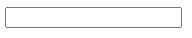
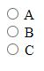
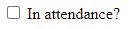
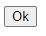

# HTML:  Accepting Input Using `form` element
A webpage can receive basic input from a user by using the `<form>` element.
Within this element, a variety of input elements can be used to design the
form and have different input elements:  text boxes, radio buttons, drop boxes,
checkboxes, etc.

## Basic `<form>` Syntax
The `<form>` element is added to the body of the HTML document.  Its basic
syntax is:
```html
<form method="get|post">
  
</form>
```
The `method` attribute should specify either `get` or `post` and indicates the
method in which the form is submitted and how it is handled by the server.
Within the `<form>` element, you then list one or more elements that define
the form.

## `<input>` Element
The `<input>` element creates an object on the web page for the user to enter
something.  There are a variety of different types of inputs, some of which
are described here.

### Text Entry
```html
<form method="post">
  <input type="text" id="first_name_id" name="first_name">
</form>
```
When the `<input>` element has the `type` attribute set to `"text"`, it
creates a text box:<br>


The `id` attribute is used to identify this particular element to the rest of
the HTML document.  The `name` attribute is used to "name" this element within
the form so that its input can be retrieved.  Since an empty text box is not
very descriptive to the user, a `<label>` can be added to identify the entry
that should be made.

```html
<form method="post">
  <label for="first_name_id">Enter First Name:</label>
  <input type="text" id="first_name_id" name="first_name">
</form>
```
  
The `<label>` element has the attribute `for` which is given the `id` of the
element that is being labelled.  This is
helpful to browsers when doing some page management and possible audio reading
of the page.  It does not indicate where on the page the label should be.  The
location of the label relative to the input text box is controlled by standard
HTML commands.  So, if you wanted the text box to be on the line below the 
label, you would include a `<br>` between the `<label>` and `<input>` elements.
Or, if you wanted the label after the text box, you would reverse their order.

The `id` and `name` attributes do not have to be different.  In the example
above, they could have both been given the value of `first_name`.  I named them
differently just to show their different functions.

#### Default Entry for Text Entry
You can define an initial entry in a form text box using the `value` attribute.
```html
  <input type="text" id="first_name_id" name="first_name" value="Enter your name here">
```

### Radio Buttons
When the `<input>` element hase the `type` attribute set to `"radio"`, it
displays a radio button.  Any number of radio buttons can be displayed by using
multiple `<input type="radio">` elements.  Only one radio button can be
selected.  As with the text entry, the radio button does not automatically
display a label, and so needs a `<label>` element to provide a description of
the choice.  
```html
<form method="post">
  <input type="radio" id="A_id" name="letter_choice" value="A">
  <label for="A_id">A</label>
  <br>
  <input type="radio" id="B_id" name="letter_choice" value="B">
  <label for="B_id">B</label>
  <br>
  <input type="radio" id="C_id" name="letter_choice" value="C">
  <label for="C_id">C</label>
</form>
```
  
As with the text box, the location of the radio buttons and labels are defined
by the html.  So, the `<br>` in the html above puts each button on a new
line.  If the `<br>`'s were removed, they would all be on the same line.  Each
button has a unique `id` attribute so labels can be associated with each.
All the buttons have the same `name` attribute so that only one of the radio
buttons can be checked and its result submitted with the form.  The specific
value submitted is defined by the `value` attribute, and each button has its
own unique `value`.  

If you want one of the radio buttons to be selected by default, you can add
the `checked` attribute, as follows:
```html
  <input type="radio" id="A_id" name="letter_choice" value="A" checked>
```

### Checkbox
The `type` attribute of `"checkbox"` creates a checkbox.
```html
<form method="post">
  <input type="checkbox" id="in_attendance" name="in_attendance" value="yes">
  <label for="in_attendance">In attendance?</label>
</form>
```


The `value` attribute specifies what value to return in the `name` result if
the checkbox is checked when the form is submitted.  Since there is no value 
for when the checkbox is not selected, how this value is obtained by the server
will be a bit different from other input element types.  


### Buttons
To create a button to submit the form, the `"submit"` value for the `type`
attribute is used.
```html
<form method="post">
  <input type="submit" value="Ok">
</form>
```
  
The `value` attribute indicates what text should be on the button.  So, this
particular version of the `<input>` element does not need a label, unless one
was desired.

## Drop-down Box
Drop-down selection boxes in forms are done using the `<select>` element.
```html
<form method="post">
  <label for="weekday">Weekday</label><br>
  <select id="weekday" name="weekday">
    <option value="Mon">Monday</option>
    <option value="Tues">Tuesday</option>
    <option value="Wed">Wednesday</option>
    <option value="Thur">Thursday</option>
    <option value="Fri">Friday</option>
  </select>
</form>
```
The `<select>` tag defines the start of a block.  Within that block, the
different options to be shown in the drop-down are define using the `<option>`
tag.  The `value` attribute of `<option>` specifies what value should be
submitted with the form if that option is selected.  What text will be shown
in the drop-down for that option is included between the `<option>` and
`</option>` tags.

## Miscellaneous
### Require an entry
Many of the input types described above can be set to require an entry before
the form can be submitted.  To do that, include the "required" attribute as
shown by this example:
```html
  <input type="text" id="first_name_id" name="first_name" required>
```

## Integration with server
To see how a form is integrated into an HTML page and used by a server,
visit the page <a href="web_interface_with_flask.md">
web_interface_with_flask.md</a>.