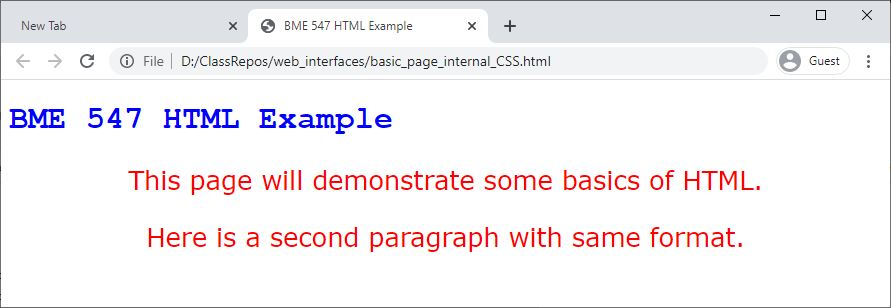

# CSS
CSS stands for Cascading Style Sheet.  In the introduction to HTML
(<a href="intro_to_html.md">intro_to_html.md</a>), the 
style attribute was introduced for setting the specific style of different
elements.  If you wanted to modify the style for every paragraph, you would
need to set the style attribute for each individual element.  That could be
tedious.

A CSS allows the default style for each element to be specified in a single 
location (the CSS) that can be referenced by multiple pages, thereby reducing 
the need for setting the style attribute in every element.  Also, multiple
CSS files can be used so that you could change the style of a webpage simply
by changing which CSS file it uses.

## Format of CSS
The CSS sheet lists each HTML element you would like to set the style for and
the specific style properties that should be set.  For example, if we wanted
to set the default style for the paragraph element to all the properties
that was shown on the introduction to HTML page 
(<a href="intro_to_html.md#Style%20Attribute">intro_to_html.md</a>), the 
corresponding CSS entry would look like this:
```css
p {
    color: red;
    font-family: verdana;
    font-size: 160%;
    text-align: center;
}
```

If you want to apply a particular style to more than one element, you can 
specify more than one element as follows:
```css
p, h1 {
    ...
}
```

If you want to apply a particular style to all elements, use the `*`:
```css
* {
    ...
}
```
For other methods of selecting elements for applying styles, visit 
<https://www.w3schools.com/css/css_selectors.asp>.


## Applying CSS
### Internal CSS
The CSS could be defined within an HTML document and that CSS would be applied
to all the elements within that file.

HTML:  
```html
<!DOCTYPE html>
<html lang="en">
<head>
  <title>BME 547 HTML Example</title>
  <style>
    h1 {
        color: blue;
        font-family: Courier;
    }
    p {
       color: red;
       font-family: verdana;
       font-size: 160%;
       text-align: center;
    }
  </style>
</head>

<body>

  <h1>BME 547 HTML Example</h1>
  <p>This page will demonstrate some basics of HTML.</p>
  <p>Here is a second paragraph with same format.</p>

</body>
</html>
```
Browser:  


### External CSS
The CSS could be defined in a separate file.  This can be helpful because the
CSS can then be used by different HTML documents.  It also helps keep
the html document a more manageable size.  

As an example, assume that a file called `mystyle.css` contains the following:
```css
 h1 {
     color: blue;
     font-family: Courier;
    }
 p {
    color: red;
    font-family: verdana;
    font-size: 160%;
    text-align: center;
}
```

This CSS can be used by an html document as follows:
```html
<!DOCTYPE html>
<html lang="en">
<head>
  <title>BME 547 HTML Example</title>
  <link rel="stylesheet" href="mystyle.css">
</head>

<body>

  <h1>BME 547 HTML Example</h1>
  <p>This page will demonstrate some basics of HTML.</p>
  <p>Here is a second paragraph with same format.</p>

</body>
</html>

```