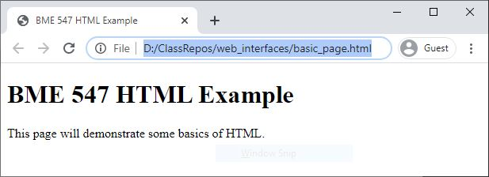
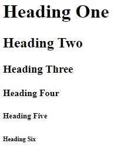
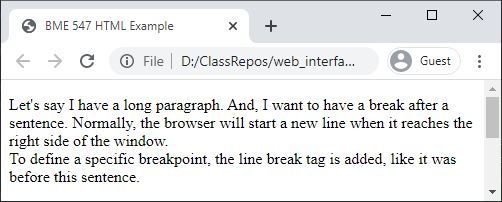
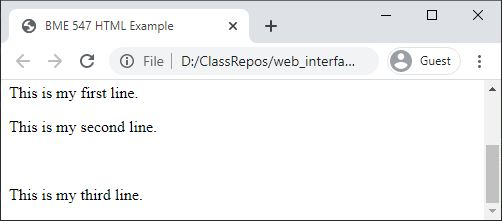

# HTML
**HTML** stands for Hyper Text Markup Language.  An HTML document defines what
a web page should look like when displayed by a web browser.  To get an idea
of what an HTML document looks like, you can ask your browser to display the
current page in HTML format.  

* __Google Chrome__ or __Microsoft Edge__: right click on the page and select 
  "View Page Source" (or press Ctrl-U).
* __Safari__: from the Develop menu select "Show Page Source" (or press
  Option+Command+U)
* __Firefox__: right click on the page and select "View Page Source" (or press
  Ctrl-U (Windows) or Cmd-U (macOS))
  
HTML documents contain a series of elements.  These elements describe different
parts of the web page and how they should be displayed.  Elements in an HTML 
document are defined by using a start tag contained within `<>`.  For example, 
`<body>` is the start tag for the body element
that contains all the visible items for the webpage.  The contents of the 
element are placed after the start tag.  The element is closed as shown by this 
example:  `</body>`.

## Basic Layout of HTML File
Here is a basic example of an HTML file:
```html
<!DOCTYPE html>
<html lang="en">
<head>
  <title>BME 547 HTML Example</title>
</head>

<body>

  <h1>BME 547 HTML Example</h1>
  <p>This page will demonstrate some basics of HTML.</p>

</body>
</html>
```
* `<!DOCTYPE html>` defines that this document is an HTML document.  Browsers
  or other programs use this to understand how to interpret the rest of the 
  document.
* `<html>` is the root element of the page.
* `<head>` is the head element that contains "meta-data" about the page.
* `<title>` is the title element that specifies the title of the page.  The
  browser will display this title in the window title.  
* `<body>`, as described above, is the body element which contains all the
  visual parts of the page.
* `<h1>` is the Header 1 element which will print the largest size of header.
* `<p>` is the paragraph element.

If you save the above HTML into a file, and load that file into a browser, the
following will display:



## Other basic elements
### Headings
In addition to `<h1>`, there are `<h2>`, `<h3>`, `<h4>`, `<h5>`, and `<h6>`.
Each one represents a smaller and smaller heading.



### Line Breaks
The `<br>` tag defines a line break.  Note it does not have a closing tag, but
stands by itself as it does not have any content of its own.

#### Example of line break within a paragraph.
HTML:
```html
  <p>
    Let's say I have a long paragraph.  And, I want to have a break after a
    sentence.  Normally, the browser will start a new line when it reaches
    the right side of the window.<br>  To define a specific breakpoint, the
    line break tag is added, like it was before this sentence.
  </p>

```
Browser:    


#### Example of line break between paragraphs.
HTML:
```html
  <p>This is my first line.</p>
  <p>This is my second line.</p>
  <br>
  <p>This is my third line.</p>
```
Browser:  


## Attributes
HTML elements have different attributes that provide additional information on
how that element should be displayed.  We have already seen one example of an
attribute in the `<html lang="en">` tag.  The `lang` attribute of the `html`
element specifies the langauge to be used on the page.  Attributes are defined
within the `<>` of the tags and consist of a name/value pair.  In this example,
the attribute name is `lang` and the value is "en".  The values are almost
always contained within quotes.  Specific attributes will be described in the
sections related to their tags and use.

### Style Attribute

The most commonly used attribute is the `style` attribute.  For text elements,
it can be used to define how the text should be displayed:  color, font,
justification, etc.

```html
<tagname style="property1:value1; property2:value2;">
```
`tagname` is replaced by the appropriate tag (i.e., `p`, `h1`, etc.).
Multiple style properties can be changed in the same style attribute, each
separated by commas.  Common style properties:
#### Text Color
```html
<p style="color:red;">
```
#### Text Font
```html
<p style="font-family: verdana;">
```
#### Text Size
```html
<p style="font-size: 160%">
```
#### Text Alignment
```html
<p style="text-align: center;">
```

## Comments
Comments can be added to HTML as needed.  Anything found between `<!---` and
`--->` will be ignored by the HTML interpreter.

## Images
Images can be shown using the `img` element.
```html

```
The `src` and `alt` attributes are required.  The `src` attribute defines the
path or URL to the image.  The `alt` attribute provides a text string to 
display if the picture cannot be found or shown for some reason.

_Note: How to exactly specify the path to a file on your computer or server
can vary based on implementation._  So, always test that is works correctly.
Specifics for how to show an image using Flask are described here: 
[web_interface_with_flask.md#images](web_interface_with_flask.md#images)

To specify a specific size for the image on the web page, use the `width` and
`height` attributes with a numeric value in pixels.
```html

```
