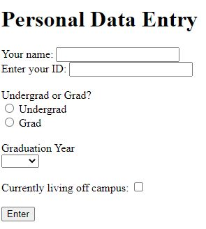

# Web Interface with Flask

Up to this point in the class, we have generally been using our server
primarily as a "back-end" system.  Our routes have received data, manipulated
that data, and then returned the data.  Any I/O was done by a client program.

Flask can also be used for "front-end" web development.  In this case, the
server creates and displays web pages that the user can interact with, enter
data to be sent to the server, and the see the results of any server
output.

## `render_template`
Flask provides the `render_template` function that, when used in conjunction
with the `return` command, will display the webpage defined by a template.

Here is a very short example.  Let's say we have an HTML document called
`index.html` that we want to display at the base route "\".  In our project
directory, we create a subfolder called `templates`.  In that folder, we
place all of our `.html` files, such as `index.html`.  The following code
serves up that web page.
```python
from flask import Flask, render_template

app = Flask(__name__)

@app.route("/index", methods=["GET"])
def index():
    return render_template("index.html")

if __name__ == '__main__':
    app.run()

```
First, the `render_template` function must be imported from `flask`.  Then, the
flask handler function should end with a call to 
`return render_template("index.html")`.  The name of the html file to display
is included as a string parameter.  Flask will look for this file in the
`templates` folder created above.

## Programmatic Changes to Web Page
The content of a webpage can be modified by the server code using Flask.  Flask
implements the Jinja2 Templating Language for allowing your code to modify
the contents of the HTML document that is eventually displayed.

### Displaying Contents of Variables
The value of a variable can be displayed in HTML by enclosing the variable
within `{{ }}`.  In this simple example, the heart rate of a patient is 
displayed.
```html
<!--- patient_heart_rate_display.html --->
<!DOCTYPE html>
<html>
<head>
  <title>Patient Data</title>
</head>
<body>
  Patient Name:  {{ patient_name }}<br>
  Patient Heart Rate:  {{ heart_rate }}
</body>
</html>
```
The value of the variables are set in the Python code by using named parameters
in the `render_template` function, as shown here:
```python
from flask import Flask, render_template

app = Flask(__name__)

@app.route("/", methods=["GET"])
def display_hr():
    patient_name = "Ann Ables"
    patient_hr = 50
    return render_template("patient_heart_rate_display.html",
                           patient_name=patient_name,
                           heart_rate=patient_hr)

if __name__ == '__main__':
    app.run()
```

### Looping
You can also loop through a variable.  Basic logic commands can be specified
in the HTML file using `` as the enclosing brackets.  In this example,
a list of dictionaries is looped through and displayed.
```html
<!--- patient_heart_rate_display.html --->
<!DOCTYPE html>
<html>
<head>
  <title>Patient Data</title>
</head>
<body>
  
    <p>
      Patient Name:  {{ patient["name"] }}<br>
      Patient Heart Rate:  {{ patient["heart_rate"] }}
    </p>
  
</body>
</html>
```
```python
from flask import Flask, render_template

app = Flask(__name__)

@app.route("/", methods=["GET"])
def display_hr():
    patients = list()
    patients.append({"name": "Ann Ables", "heart_rate": 60})
    patients.append({"name": "Bob Boyles", "heart_rate": 110})
    return render_template("patient_heart_rate_display.html",
                           patients=patients)

if __name__ == '__main__':
    app.run()
```
Indentation in the HTML file is simply for ease of reading and has not impact
on the display or coding.  The end of the "for" loop must be specifically
specified using ``.

### If statements
"If" statements can also be used as shown by the following example:
```html
<!--- patient_heart_rate_display.html --->
<!DOCTYPE html>
<html>
<head>
  <title>Patient Data</title>
</head>
<body>
  
    <p>
      Patient Name:  {{ patient["name"] }}<br>
      Patient Heart Rate:  {{ patient["heart_rate"] }}
      
        <br>Patient is Tachycardic
      
    </p>
  
</body>
</html>
```
Again, note that the "if" statement needed to be formally ended with 
``.  There are also `` and `` blocks that
can be used.

## Interacting with HTML Forms
The use of forms in HTML for receiving user input is described at
<a href="html_form.md">html_form.md</a>.  Flask can obtain the information 
entered into the form for further processing.  

As an example, the following HTML file allows the user to input some personal
information.

### id_form.html
```html
<!DOCTYPE html>
<html lang="en">
<head>
  <meta charset="UTF-8">
  <title>Personal Data Entry</title>
</head>
<body>

<h1>Personal Data Entry</h1>

<form method="post">
  <label for="name">Your name:</label>
  <input type="text" id="name" name="student_name" required>
  <br>
  <label for="id_no">Enter your ID:</label>
  <input type="text" id="id_no" name="student_id" required>
  <br><br>
  Undergrad or Grad?
  <br>
  <input type="radio" id="ugrad_radio" name="u_or_g" value="Undergrad" required>
  <label for="ugrad_radio">Undergrad</label>
  <br>
  <input type="radio" id="grad_radio" name="u_or_g" value="Grad" required>
  <label for="grad_radio">Grad</label>
  <br>
  <br>
  <label for="grad_year">Graduation Year</label>
  <br>
  <select id="grad_year" name="year" required>
    <option></option>
    <option value="2021">2021</option>
    <option value="2022">2022</option>
    <option value="2023">2023</option>
    <option value="2024">2024</option>
  </select>
  <br>
  <br>
  <label for="off_campus">Currently living off campus:</label>
  <input type="checkbox" id="off_campus" name="is_off_campus" value="yes">
  <br>
  <br>
  <input type="submit" value="Enter">
</form>

</body>
</html>
```


### Flask Server Code

To display this HTML, we would write a flask server in Python code as follows:

```python
from flask import Flask, render_template

app = Flask(__name__)

@app.route("/register", methods=["GET"])
def register():
    return render_template("id_form.html")

if __name__ == '__main__':
    app.run()
```

When a user enters the URL <server> + "/register" into their browser, a 
GET request will be made to the server and will be handled by the `register()`
function.  It will return the rendered template containing the form.

### Posting from Form
After the user enters their information in the browser, they will click the
"Enter" button.  Since the `<form>` element is defined as 
`<form method="post">`, the form will cause the existing URL in the browser
to be resubmitted using a POST request.  In the Python code above, the 
`/register` route is only programmed to accept GET requests.  So, we need to
change it so that is receives both GET and POST requests.
```python
@app.route("/register", methods=["GET", "POST"])
def register():
```
When a GET request is received to register, we only want to display the form.
When a POST request is received, we also want it to receive and process the
data from the form.  So, we first need to know what type of request was
received.  We can do this using the `request.method` variable from the `flask`
package.  First, we need to add `request` to the import from `flask`:
```python
from flask import Flask, render_template, request
```
Then, in the function, we can check whether `request.method` is GET or POST.
```python
@app.route("/register", methods=["GET", "POST"])
def register():
    if request.method == "POST":
```
If the method is POST, we want to get the data that was submitted by the form
with the POST request.  We do that by using the `request.form` variable.
```python
@app.route("/register", methods=["GET", "POST"])
def register():
    if request.method == "POST":
        name = request.form["student_name"]
        id_number = request.form["student_id"]
        level = request.form["u_or_g"]
        year = request.form["year"]
        is_off_campus = request.form.get("is_off_campus")
        if is_off_campus is None:
            is_off_campus = "no"
```
The `request.form` variable is like a dictionary.  To obtain the value of
specific entries from the form, you reference the entry element using the
string assigned to the `name` attribute in the HTML document.  For example,
in the HTML, the input box for entering the name was given the `name` attribute
of "student_name".  So, "student_name" is used with `request.form` to obtain
the text entered in the text box.  The same can be done to get the information
entered into radio buttons and drop-boxes.  

Checkboxes are handled a bit differently.  If the checkbox is unchecked, it
does not have a value, which causes `flask` to report an error.  So, the
better way of obtaining that result is using the `requests.form.get()` 
function, with the name of the checkbox sent as the parameter.  If the 
checkbox is checked, this function returns the value assigned to it.  If the
checkbox is unchecked, this function returns None.  In the code example above,
if the checkbox returns None, the variable is given a predetermined value for
when the checkbox is unchecked.  

Once the data is read-in, the server can call another function to do any data
manipulation on this entered data.  (Remember, this is done so that the data
manipulation can be tested.  Testing is hard to do on flask handler functions.)
The entire server code now looks like this:
```python
from flask import Flask, render_template, request

app = Flask(__name__)

@app.route("/register", methods=["GET", "POST"])
def register():
    if request.method == "POST":
        name = request.form["student_name"]
        id_number = request.form["student_id"]
        level = request.form["u_or_g"]
        year = request.form["year"]
        is_off_campus = request.form.get("is_off_campus")
        if is_off_campus is None:
            is_off_campus = "no"
            
        output_information(name, id_number, level, year, is_off_campus)
        # This function not shown

    return render_template("id_form.html")


if __name__ == '__main__':
    app.run()

```
If we look at the flow of this function, when it receives a GET request, the
`if` statement will evaluate as false, and the function will simply return the
rendered template.  If the function receives a POST request, it will read-in
the information from the form and call other functions to do the necessary
information.  It will then also return the rendered template so that new
information could be added.

If you want the server to display a different page after submitting a form,
include the following `return` statement at the end of the `if` statement block 
for when a POST request is received:
```python
        return redirect(url_for("function_name"))
```  
where `redirect()` and `url_for()` are functions imported from `flask` and
`function_name` is the name of a flask handler function that you want to run
upon submittal of the form.  Note that the function name needs to be inside of
a string.  This statement tells `flask` to make a GET
request to the URL that is associated with the `function_name` flask 
handler.


## Miscellaneous
### File manipulation
If we want our Flask code to be able to access and manipulate any file on a
computer, we need to know the file name and the path to the file.
Due to security reasons, there is not an `html form` method for obtaining both
the path and filename of a file to be manipulated.  However, there is an
approach where we can use the `html form` `file` object and save a copy of
the file in a known location that our Flask code can access and manipulate.

The details of this approach can be found at 
<https://flask.palletsprojects.com/en/1.1.x/patterns/fileuploads/>.  And, are
summarized here.

A folder is defined to contain copies of the files we want to create that our
code can access.  This can be done as follows:
```python
UPLOAD_FOLDER = "./upload_files"

app = Flask(__name___)
app.config['UPLOAD_FOLDER'] = UPLOAD_FOLDER
```
In this case, a folder called `upload_files` is created within the repository.
But, this folder can be anywhere (just give it the correct path) and can have
any name.

In the `html` code, use the following `form` syntax to create a button for
selecting a file and uploading it to your code.
```html
<form method="post" enctype="multipart/form-data">
  <input type="file" name="file">
  <input type="submit" value="Upload">
</form>
```

In the Python code, here is a simple function that would implement the 
endpoint that uses the `html` code above:

```python
import os
from werkzeug.utils import secure_filename

@app.route("/route_name", methods=["GET", "POST"])
def get_file():
    if request.method == "POST":
        file = request.files["file"]
        filename = secure_filename(file.filename)
        file.save(os.path.join(app.config["UPLOAD_FOLDER"], filename))
        # Other code to do whatever work is desired on the file whose location
        #    is now known.

    return render_template("html_file.html")
```
The `werkzeug` package should have been installed as a dependency for Flask.
The `secure_filename` function provides some basic security to ensure that
filenames are not used which might cause server/security issues.

This code is the bare minimum.  View the website provided earlier in this
section for more details and additional code to check for correct entries,
appropriate file upload types, etc.

### Images
Flask is designed to expect images for display on websites to be found in a
folder called `static` within the repository.  So, best practice is to put
images for display into this folder, and then they can be referenced in the
HTML document as follows:

```html

```
An alternate that sometimes works is as follows:
```html

```
This assumes that Flask is using the templates folder as the starting location
and so we need to use `..` to go back up a level to the repository directory
before going into the static directory.
