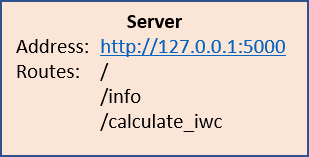
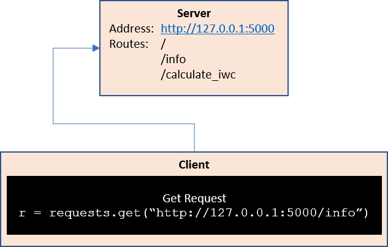
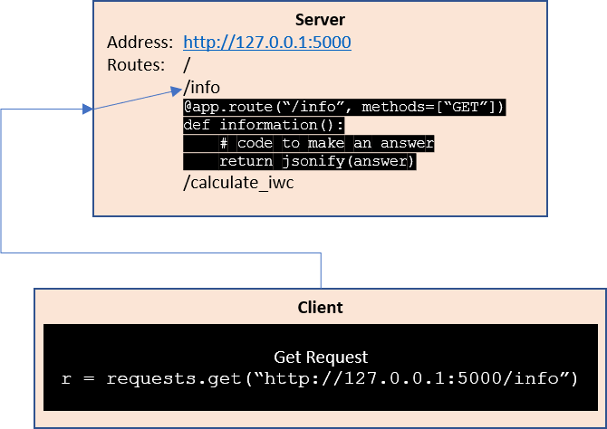
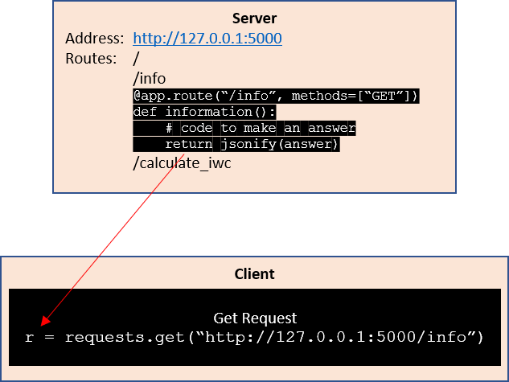
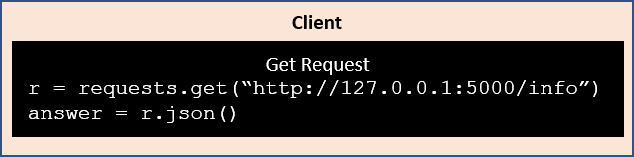
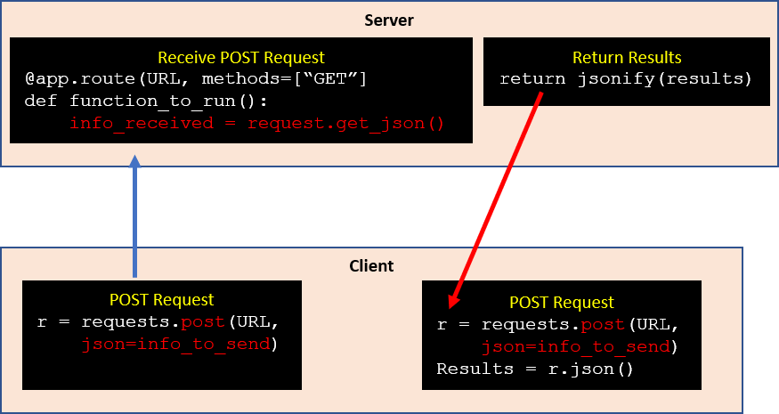

# Server - Client
An overview of how servers and clients interact in Python using `flask`.
## Server
Assume a server is running as represented by the following block.

Two main types of requests can be made to a server:
* GET request, asking for information from the server.
* POST request, sending information to the server and possibly receiving a
response.

The primary different between the two is that the POST request sends
information from the client to the server.  The server API describes
whether a GET or POST request should be made to a particular server route.

## GET Request
### Client makes a GET request to Server
A client program wants to make a request to the `/info`
route of the server.  From the server API, we know that `/info` takes GET
requests.  So, the client makes a GET request as follows:

The correct server is identified by the hostname:  `http://127.0.0.1:5000`

### Server routes request to appropriate server function
Upon receipt of the request, the server routes the request to the appropriate
route and associated function.  In this case, it is the `/info` route:

### Server returns information to Client
To return information back to the client, the server takes the answer
generated by the server, and converts it to a JSON string using the
`jsonify` function.  This JSON string is returned back to the Client.

The client can then interpret the returned JSON string using the `r.json()`
function.

This interaction can be summarized by the block diagram below:

## POST Request
The primary difference between a GET request and a POST request is that the
POST request sends information to the server.

Differences between the GET request and POST request are shown in red above.
The `requests.post` call has an additional arguement `json=` that converts
the given variable into a JSON string to be sent over the internet.

On the server side, this send information is retrieved using the 
`request.get_json()` function. 
