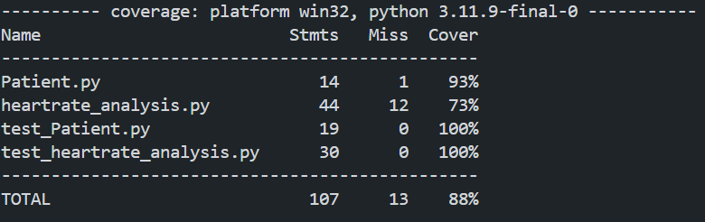
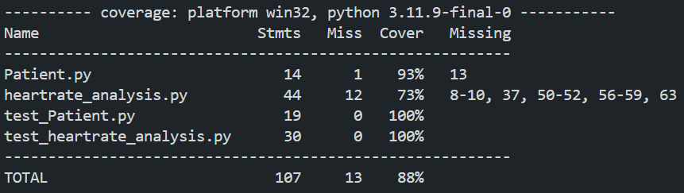
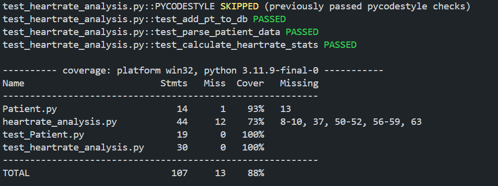
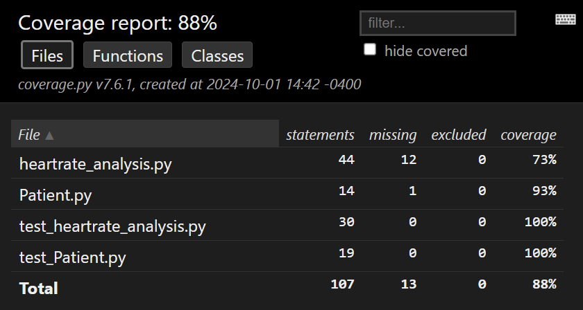
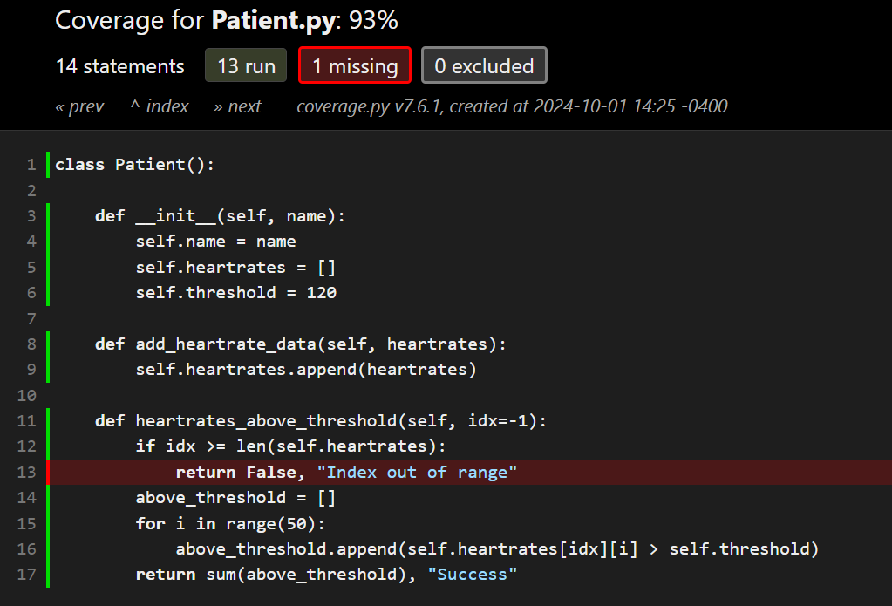
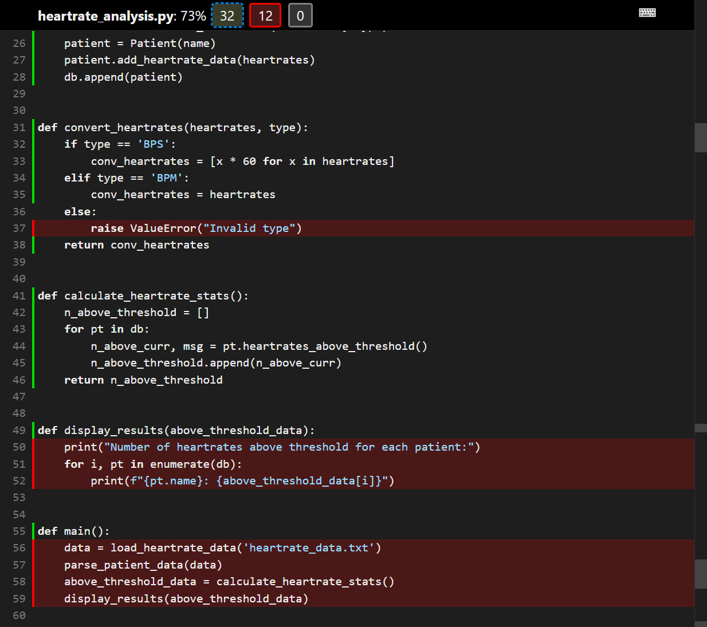
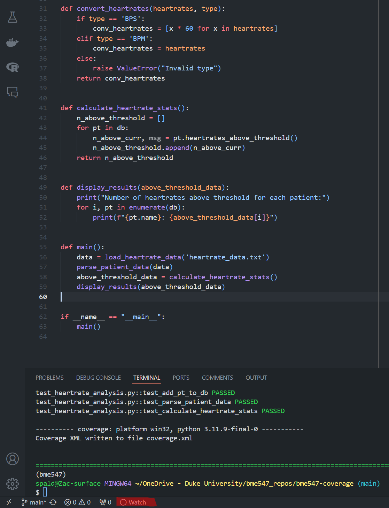
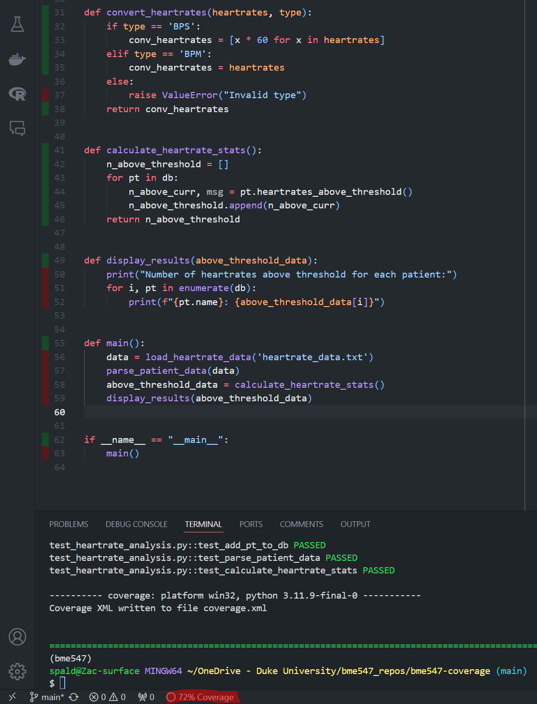
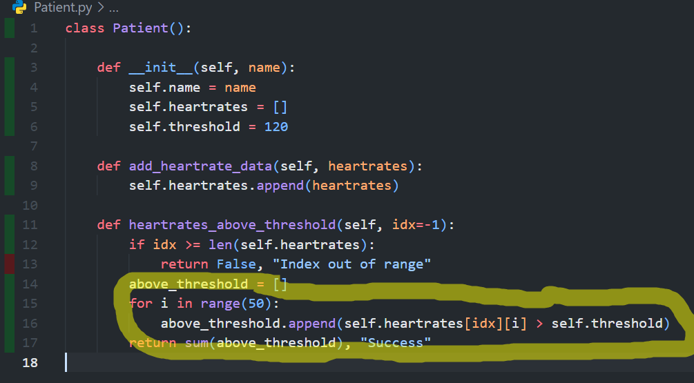

# Coverage

Coverage refers to the amount of code that is "covered" by your test cases. If
code has full _statement_ coverage, it means that tests have been written in a 
way such that every line of code has been executed at least once.  If every
decision outcome that your code needs to make has been tested at least once, 
this is known as _decision_ or _branch_ coverage.  See 
[robust_testing.md](../Lectures/robust_testing.md) for more details. 
Coverage is a
powerful tool for determining how sufficient your battery of tests is.

## Installation

You can generate coverage reports using
the [pytest-cov](https://pytest-cov.readthedocs.io/en/latest/readme.html)
package (Note: pytest-cov is a wrapper around the more
general [coverage](https://coverage.readthedocs.io/en/7.6.1/) package, but for
the purposes of this class we'll just be looking at pytest-cov since we already
use pytest). This can be installed in your current environment using
`pip install pytest-cov` or `conda install -c conda-forge pytest-cov`.

In addition to the instructions below, coverage in pytest can also be run in
Visual Studio Code and give visual results within its interface. Visit
[visual_studio_code.md](visual_studio_code.md#code-coverage-in-visual-studio-code)
for details.

## Usage

Pytest-cov is a plugin for pytest, just like pytest-pycodestyle, so we use it
very similarly. To run your tests with coverage, you can use the command
`pytest --cov=<path_to_directory_with_tests>` in the terminal. Since our tests
are usually in the main repository folder where we are running our terminal (
e.g. our terminal is running out of "C:<user_path>
\bme547_repos\bme-547-classwork-zspald", which is the same directory our tests
are in), so the path can be omitted, shortening the command to `pytest --cov`.

Running `pytest --cov` executes your tests and produces a brief coverage report
in the command line. This tells you how many lines/statements you have, how many
of those statements were executed by your tests, and the percentage of your code
that is covered by your tests (the number of total lines minus the number of
missed lines divided by the total number of lines).

This is a good start, but it doesn't help us in fixing the lines that are not
covered. Adding an additional argument helps this. If we instead run
`pytest --cov --cov-report term-missing`, we get a more detailed report that
shows us which lines were not covered by our tests. This is useful for
identifying which parts of your code are not being tested, and can help you
write more tests to cover these areas.

The coverage arguments can be added to the usual pytest arguments we run, so a
command that runs tests, coverage, and pycodestyle would look like
`pytest -v --pycodestyle --cov --cov-report term-missing`.

### Branch coverage
All of the above is looking at _statement_ coverage.  To also look at _branch_ 
coverage, you can add the `--cov-branch` flag to the `pytest` command.  In 
addition to statement coverage, it will also report branch coverage.  

## Visualizing Coverage Reports (HTML)

The report above is still a bit tedious to fix uncovered code, as you have to
find the line numbers reported in the command line, find them in your code,
write some tests, and then repeat for the uncovered lines. Pytest-cov also
offers a better method of visualization to make this process easier. We can
modify the type of coverage report generated. Running
`pytest --cov --cov-report html` will generate an HTML report for all python
files run by the tests. This report can be found in the `htmlcov` directory that
is created in the same directory as the tests. Opening the `index.html` file in
this directory will show you a more detailed report of your coverage. HTML
reports will need to be opened in a browser or other viewer capable of rendering
HTML files (VSCode can render HTML files if you right click and select "Show
Preview").

Clicking on one of the linked files in the report will show you the lines of the
file, with green highlighting on covered lines and red highlighting on uncovered
lines, making it easier to view uncovered code quickly. For example, in my
Patient class below, my tests never cover the case where I provide an invalid
index in my function that would raise an error, so I should go write a test to
cover that case.

In another file called `heartrate_analysis.py`, I have more uncovered code (see
below). However, it's fine for some of these functions to be uncovered, as we
don't write tests for every function. Specifically, you don't need the code that
loads data, displays output, or runs the main driver function to be covered by
tests as we have discussed in class. However, we can see there is an uncovered
line in a testable function. So I do need to write a test for that.

## Visualizing Coverage Reports (VSCode)

Extensions in VSCode also make it easy to view your coverage without having to
open HTML files. There may be multiple ways to do this, but the way I do this is
through the extension "Covereage Gutters".

If you have this extension installed, you can view similar information to the
HTML report directly in your code editory, displayed as green or red highlight
in the "gutters" to the left of the line numbers. This extension read coverage
information from an XML file, so you will have to run the command
`pytest --cov --cov-report xml`. Then, you can press the "Watch" button on the
bottom bar of VSCode (see below highlighted in red, next to Git information) to
load enable coverage gutters via the extension.

After pressing the "Watch" button, you will see the coverage information
displayed in the gutters of your code editor and the percentage of coverage for
the current file replacing the "Watch" button. Click this percentage of
coverage (see below highlighted in red, where the watch button was previously)
to turn off the coverage gutters. **Note: This information does not update in
real-time. Gutters will only change after generating a new XML report.**

*Note: Due to the location of the coverage gutters where breakpoints are set for
debugging, you will need to disable to coverage gutters to replace breakpoints*

## 100% Coverage DOES NOT Mean Perfect Tests

Just because all of your code is covered by your tests, it does not mean that
all of your testing is done. Testing is an art, and you need to use some
creativity and thinking from the user perspective to determine all scenarios
that need testing so that your software runs well. For example, in one of the
methods of my patient class below, the function is covered by tests, but assumes
a fixed length of heart rate data coming in. This code will either throw an
index error if a list of shorter length is processed, or will not process data
after the fixed point, which is a glaring flaw in my code. I would know this is
happening by creating tests with different lengths of heartrate data, but I
still achieve 100% coverage without such tests. Don't let coverage be your only
metric for sufficient testing!

