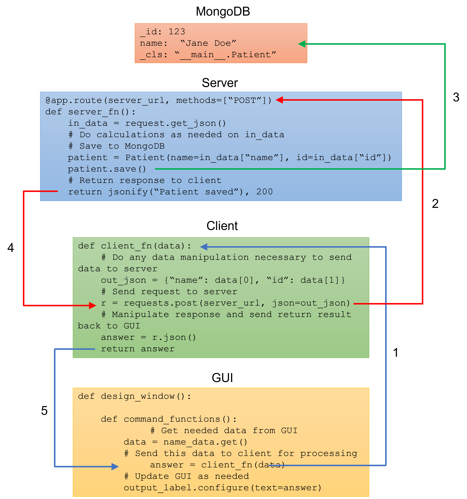
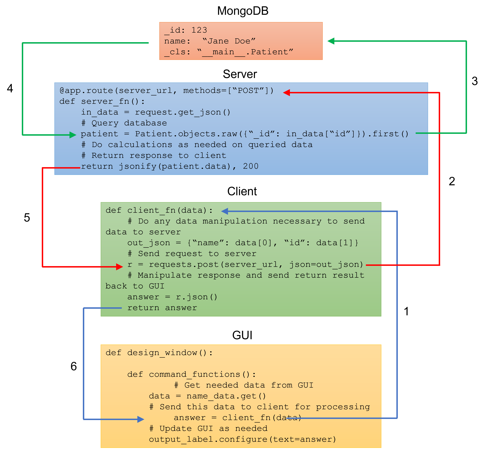

# GUI - Client - Server - Database Relationship

This document provides an overview of a typical GUI-Client-Server-Database
relationship.  The module "code" shown below should be considered "pseudo-code" 
as it is intended to show a general approach, but  will need to be modified for
specific use.  While the code shows single functions for each module, it is
likely that many different functions will be required for a variety of 
different conditions and will also call other support functions.

## Role of each module

### GUI
  * accept input from the user
  * send this input to the client module via a function call
  * receive the results of the function call to the client  
  * update the GUI based on the results from the client module

### Client
  * accept data from the GUI via parameters in a function call
  * validate and process this data as needed to send to server
  * if data is valid, send this data in a request to the server; if data is 
    not valid, return message to server indicating such
  * receive response from server
  * analyze/process response from server as needed and return result to GUI

### Server
  * receive requests from client
  * do advanced data manipulation/calculation as needed
  * data/calculation results are then stored in and/or retrieved from the
    database
  * needed data is returned to client in a response

### Database
  * stores data sent to it
  * returns data requested from it

## Flow of using a GUI to store data in database

The GUI is set up to allow the user to enter the desired information.  One or
more GUI widgets are connected to command functions.  When the user activates
one of these widgets, the connected command function will obtain the needed 
data from the GUI and make a function call to the client module sending the
data via parameter.  This function call is indicated by #1 in the figure.

The function in the client receives the GUI data via the function parameters.
Generally, the client will then do validation of the data to ensure the user
entered things correctly in the GUI.  The client may also do some preliminary
processing of the data such that it is ready to be sent to the server.  This
validation and processing will usually be done in separate client functions.
Then, the client will make a GET or POST request to a particular server URL 
and send it the needed data.  This is indicated by #2 in the figure.

The server has predefined routes that receive requests from the client.  These
requests may receive data.  The server is set up to validate the data and to
possibly do advanced calculations on the data that we want to "offload" from
our client device.  The original data and/or the results of the calculation
are then saved to the database by the server.  This step is shown by #3 in
the figure.  Then, the client returns a response to the client based on the
outcome of its calculations and database save (#4 in the figure).

The client function receives a response from the request made to the server
(#4 in the figure).  This response is then evaluated by the client if needed.
A particular answer is then sent back to the GUI via the `return` from
the client function (#5 in the figure) so that the GUI may be updated based
on the answer.

Finally, the GUI command function receives the result of the client function
call in a variable (#5 in the figure) and then updates the GUI as needed 
based on this result.

## Flow of using a GUI to retrieve data from database

In this case, the flow is very similar, but with slightly different purpose.
The user enters into the GUI the information needed to query the database.  A
command function gets this data from the GUI and makes a function call to 
the client module sending this data as a parameter (#1 in the figure).  Note,
the GUI will at times need to get data from the database that the user does
not specifically request (for example, a list of available patients to show in
a drop down).  The flow for this type of information is the same, but may not
be dependent on any user input.

The function in the client module receives the data in parameters.  It 
validates this data to ensure it is a good query, and then makes a request
to a server URL (#2 in the figure).

The server receives this request at a URL designed to handle database queries.
The appropriate server function queries the database (#3 in the figure) and
receives the appropriate documents/records from the database (#4 in the 
figure).  Any need calculations or manipulations are done on the data and then
sent back to the client as a response (#5 in the figure).

The client function receives this response in a variable (#5 in the figure).
It manipulates this data as necessary for the GUI to be able to display it
and then it returns the answer to the GUI (#6 in the figure).

The GUI command function receives the data and updates the GUI as needed.
