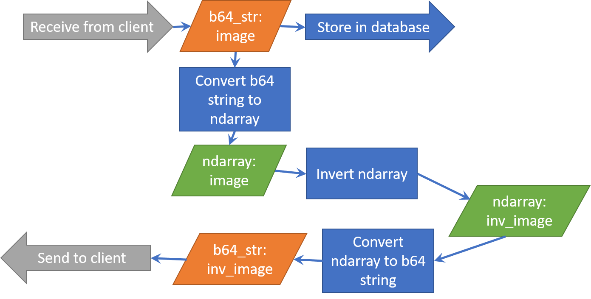
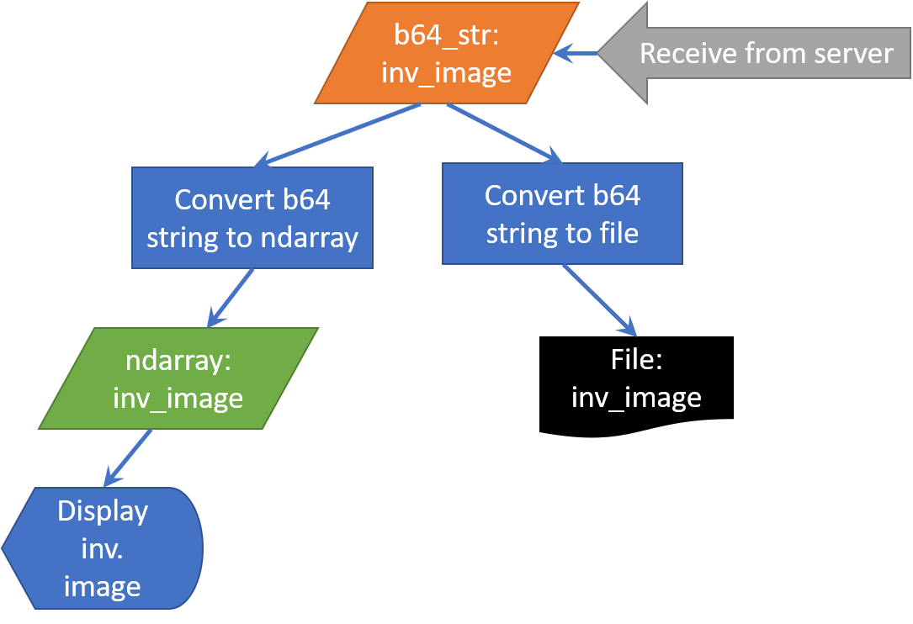

# Image Handling Toolbox

## Intro
The code snippets below provide the code needed for handling images.  They 
assume that an image exists in one of three states:

* A file on your local computer
* A string of bytes encoded as a base64 string
* An ndarray containing the image data

When transferring data between client and server, use the base64 string as
strings are easily transmitted across the web.  (The base64 string can be part 
of a dictionary that is sent as a JSON in a POST request).  The base64
string can also be used to store the image in a database.    

To display the image in `matplotlib`, or to apply any of the scikit-image 
(`skimage`) functionality on the image, make sure the image is in the ndarray 
format.

The code blocks below provide code for converting between these different 
states.  

## Example

Let's diagram how an image would be transformed along the process of being
uploaded from a file on a local computer to a server for storage in a database, 
followed by transformation of the image and downloading of transformed image 
back to the local computer.

### Client

On the client-side, the image contained in a file is transformed into a base64
string.  This string is then sent to the server.

### Server

The server receives this base64 string and sends it to the database for 
storage.  The base64 string is then converted into an ndarray that contains
the image data.  This ndarray can be processed (inverted in this case) and
converted back to a base64 string and then sent back to the client.

### Client

The client receives the base64 string with the encoded processed image.  This
base64 string is converted to an ndarray for display using `matplotlib` and
is also converted into a file for storage on the computer.

The above workflow is accomplished by converting the image between the three
formats listed above, using the base64 string for communication and storage
in a database, using the ndarray format for image processing and display, and
the file format for storage on the local computer.  All of the needed
conversions are given in the code snippets below.

Note that there are other ways to send images across the web and for converting
and displaying images.  If you prefer to use those, feel free.  

## Toolbox Code

### Imports
These imports are need for the code blocks below.
```python
import base64
import io
import matplotlib.image as mpimg
from matplotlib import pyplot as plt
from skimage.io import imsave
```

`base64` and `io` are native Python modules and do not need to be installed in
your virtual environment.  You will need to install `matplotlib` and
`scikit-image` in your virtual enviornment in order to access `matplotlib` and
`skimage.io` for import.

### Convert image file to base64 string
```python
# Input:
#    filename: string variable containing the path and name of the image file 
#                on computer

with open(filename, "rb") as image_file:
    b64_bytes = base64.b64encode(image_file.read())
b64_string = str(b64_bytes, encoding='utf-8')

# Output:
#    b64_string: string variable containing the image bytes encoded as a base64 
#                  string
```

### Convert base64 string to image file
```python
# Input:
#    b64_string: string variable containing the image bytes encoded as a base64
#                  string

image_bytes = base64.b64decode(b64_string)
with open(new_filename, "wb") as out_file:
    out_file.write(image_bytes)

# Output:
#    an image file on the local computer with the path and name contained in
#      the new_filename variable
```

### Convert base64 string to ndarray containing image data
```python
# Input:
#    b64_string: string variable containing the image bytes encoded as a base64
#                  string

image_bytes = base64.b64decode(b64_string)
image_buf = io.BytesIO(image_bytes)
img_ndarray = mpimg.imread(image_buf, format='JPG')

# Output:
#    img_ndarray: variable containing an ndarray with image data
```

### Display image in ndarray format using `matplotlib`
```python
# Input:
#    img_ndarray: variable containing an ndarray with image data

plt.imshow(img_ndarray, interpolation='nearest')
plt.show()

# Output:
#    A `matplotlib` window with an image
```

### Convert image in ndarray format to a `tk_image` variable for display in a `tkinter` Label
```python
# Input:
#    img_ndarray: variable containing an ndarray with image data

from PIL import Image, ImageTk
image_obj = Image.fromarray(img_ndarray)
tk_image = ImageTk.PhotoImage(image_obj)

# Output:
#    `tk_image`: variable containing an image to use with a Label widget
```


### Convert image in ndarray format into a base64 string
```python
# Input:
#    img_ndarray:  variable containing an ndarray with image data

f = io.BytesIO()
imsave(f, img_ndarray, plugin='pil')
y = base64.b64encode(f.getvalue())
b64_string = str(y, encoding='utf-8')

# Output:
#    b64_string: string variable containing image bytes encoded as a base64
#                  string

```

## Testing Toolbox Code
The types of image conversion done above still need to be tested.  Here is an
approach.  

#### Testing "Convert image file to base64 string"
Let's take the first snippet:  "Convert image file to base64 string"

If that was part of its own function, it might look like this:
```python
def file_to_b64_string(filename):
    with open(filename, "rb") as image_file:
        b64_bytes = base64.b64encode(image_file.read())
    b64_string = str(b64_bytes, encoding='utf-8')
    return b64_string
```
How can we test this function?  First, outside of any test module, we run this 
function on a test image.  
For example, I created a small [test_image.jpg](images/test_image.jpg) found
[here](./images).  I then send this image to the above function and get a copy
of the resulting base64 string.  To be sure this base64 string is correct, 
I use the base64 string decoder ("Convert base64 string to image file" from above)
to decode string back into an image file, and I make sure the new image file
is the same image as the original file.  Once I have confirmed that, I then
get the first 20 characters of the base64 string using code as follows:
```python
from toolbox_code import file_to_b64_string
x = file_to_b64_string("test_image.jpg")
print(x[0:20])
```
Then, I can write a test function as follows:
```python
def test_file_to_b64_string():
    from toolbox_code import file_to_b64_string
    b64str = file_to_b64_string("test_image.jpg")
    assert b64str[0:20] == "/9j/4AAQSkZJRgABAQEA"
```
The 20 characters in this test function are the 20 characters I took from the
test base64 string previously.  Note, I will have to put the test image
in the repository containing the code I am testing.

#### Testing "Convert base64 string to image file"
Let's assume that the "Convert base64 string to image file" snippet is in a 
function such as this:
```python
def b64_string_to_file(b64_string, filename):
    image_bytes = base64.b64decode(b64_string)
    with open(filename, "wb") as out_file:
        out_file.write(image_bytes)
    return None
```
I could test this by first converting the test image into a base64 string
using the `file_to_b64_string` function I created above.  Then, I could
decode this base64 string using the `b64_string_to_file` back into an image
file and compare if the original and new images are the same.  Here is a sample
test:
```python
def test_b64_string_to_file():
    from toolbox_code import file_to_b64_string
    from toolbox_code import b64_string_to_file
    import filecmp
    import os
    b64str = file_to_b64_string("test_image.jpg")
    b64_string_to_file(b64str, "test_image_output.jpg")
    answer = filecmp.cmp("test_image.jpg",
                         "test_image_output.jpg")
    os.remove("test_image_output.jpg")
    assert answer == True
```
The function `filecmp.cmp` comes from the Python standard package `filecmp` and
compares two binary files.  `filecmp` needs to be imported, but does not need
to be installed as it is part of the standard Python install.  `os` is also a
standard Python package that has the `remove` function for deleting the test
image after use.

#### Other tests
You can follow a similar approach to testing the other functions.  For example, 
to test the "base64 string to ndarray containing image data" function, first
convert the sample image to a base64 string, then convert this base64 string
to an ndarray.  Do this outside of the test function.  Copy the first five 
elements of this ndarray.  Then, write a test function that does the same thing
(converts test image into a base64 string, and then convert the base64 string
into an ndarray) and then compare the first five entries of the ndarray 
generated by the test with the first five elements copied from the original
attempt.  Note, you may need to use the `.all` modifier to compare arrays.
Example:  
```python
    answer = nd[0][0:5]
    expected = [[68, 115, 197],
                [68, 115, 197],
                [68, 115, 197],
                [68, 115, 197],
                [68, 115, 197]]
    assert (answer == expected).all
``` 

Note, it can feel like "cheating" that we run the functions, get an answer, and
then rerun the functions as part of a test and make sure we get the same 
answer.  But, this kind of test can be used to make sure that the function 
doesn't change with time.  If we use it once and verify that
it works, then if the test fails in the future, we know something changed. 