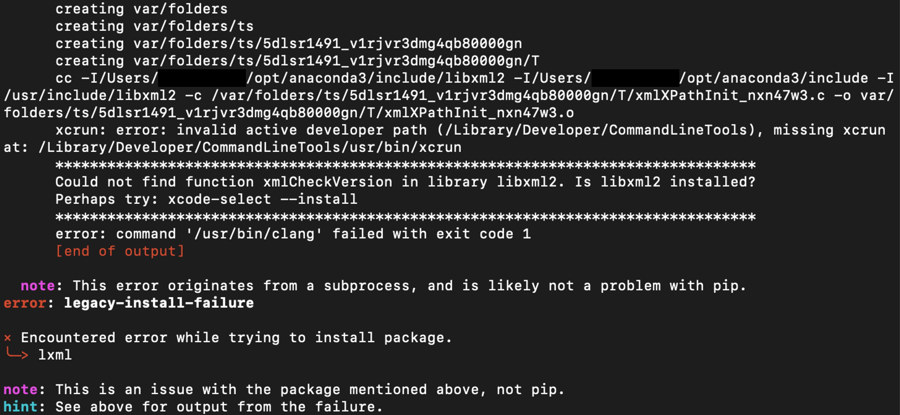

# Installation Info for macOS

## SSL or Certificate Errors
Python 3.6 and higher for Mac may not come configured to use the 
standard root certificate authorities.  So, some folks may get a ssl error, 
other error, or just not be able to reach certain web services, such as 
MongoDB. 

### Fix #1

Open a terminal window and make sure you are in your home
directory (`cd ~`), that you are not in a virtual environment, and enter the 
following command:

```
/Applications/Python\ 3.6/Install\ Certificates.command
```

If you installed Python 3.7 or 3.8, change 3.6 to 3.7 or 3.8 in the command 
above.

If you get a permission error while trying to install a package after entering
the above command, include `sudo` before the command, and be prepared to enter
your system password.


### Fix #2

If you cannot find the `Install Certificates.command`, try adding the 
following lines to either your `~/.bash_profile` or `~/.zprofile` file:

```
CERT_PATH=$(python -m certifi)
export SSL_CERT_FILE=${CERT_PATH}
export REQUESTS_CA_BUNDLE=${CERT_PATH}
```
_Note_: if you need to enter `python3` instead of `python` at the command line,
replace `python` with `python3` in the first line above.

Close your terminal window and re-open it and see if the issue is resolved.


### Fix #3
If you cannot find the `Install Certificates.command` file, the contents of
this file can be found at:
<https://github.com/python/cpython/blob/master/Mac/BuildScript/resources/install_certificates.command>.
Download this file and run it in Python and see if it fixes your problem.

### Conda

If you're getting an error like this in conda, try 
```sh
conda remove certifi
conda install certifi
```

Another link with possible solutions beyond the above might be found at this
link:
<https://stackoverflow.com/questions/40684543/how-to-make-python-use-ca-certificates-from-mac-os-truststore/42107877#42107877?newreg=819ef0d3d63740389ddd7206c106b4a0>

## Problems with Monterey macOS and installing certain packages with `pip`
Some users of macOS "Monterey" were receiving an error that looked like this
when installing certain packages in a virtual environment (`jupyter` for 
example):



Note that there is the line that says `Perhaps try: xcode-select --install`.
That points to the fix.

In your terminal window, enter the command `xcode-select --install`.  When
that command finishes, close the terminal window, open up a new terminal 
window, reactivate your virtual environment, and try installing the packages 
again.  