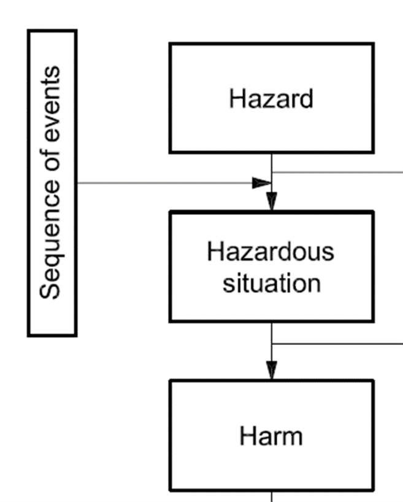
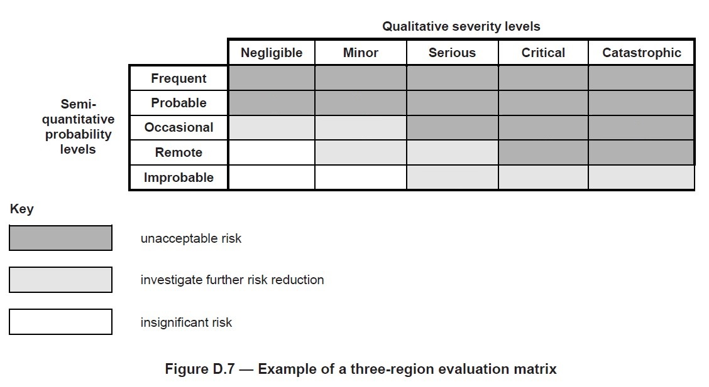

# Standards

Standards can be accessed through the Duke library at 
<https://guides.library.duke.edu/standards>.

The standard most relevant to this course is 
__IEC 62304 - Medical Device Software - Software Life Cycle Processes__.  

IEC standards can be found on the Techstreet Enterprise website which can be 
accessed from the Duke Library site above.  You will need to create a free 
account with Techstreet.

# Exercise 1
As a group:
* __Choose a medical device.__  

  The definition of a medical device is:  
  any instrument, apparatus, implement, machine, appliance, implant, in vitro reagent or
calibrator, software, material or other similar or related article, intended by the MANUFACTURER
to be used, alone or in combination, for human beings for one or more of the specific
purpose(s) of  
   + diagnosis, prevention, monitoring, treatment or alleviation of disease,  
   + diagnosis, monitoring, treatment, alleviation of or compensation for an injury,  
   + investigation, replacement, modification, or support of the anatomy or of a physiological PROCESS,  
   + supporting or sustaining life,  
   + control of conception,  
   + disinfection of MEDICAL DEVICES,  
   + providing information for medical purposes by means of in vitro examination of specimens derived from the human body,
     
  and which does not achieve its primary intended action in or on the human body by
pharmacological, immunological or metabolic means, but which may be assisted in its function
by such means

* __Name a hazard, a hazardous situation, the sequence of events that could
lead to that hazardous situation, and the possible harm.__

# Exercise 2
* __Classify the severity and probability of your harm to determine risk__

