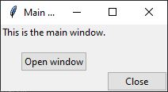
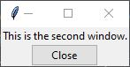
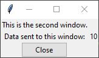
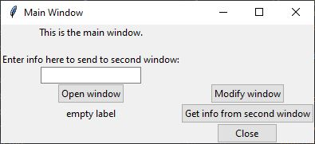
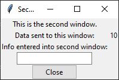
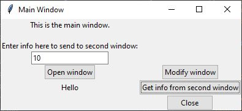

# Multiple Windows in `tkinter`
There are a variety of methods for opening and using a second window in 
`tkinter`.  The specific approach to take is determined by your purpose and,
to some degree, personal coding preference.

## Using `tkinter` built-in dialogs
`tkinter` has functionality for opening and using a variety of standard
dialog windows.  For the purpose of this page, a _dialog window_ is defined as
any window that is opened to show information to the user and then waits for
the user to provide some sort of response.  Most or all other functions of 
other windows are not available until this dialog window is closed.  An example
of a dialog window is a "Save as" window.

### `tkinter.messagebox`
Provides simple dialogs to share information or prompt user for Yes/No type of
answers.  
<https://docs.python.org/3/library/tkinter.messagebox.html>
```python
from tkinter import messagebox

messagebox.showinfo(title, message)
messagebox.showwarning(title, message)
messagebox.showerror(title, message)
messagebox.askyesnocancel(title, message)
# And others
```


### `tkinter.simpledialog`
Provides dialogs allowing the user to enter various types of values.  
<https://docs.python.org/3/library/dialog.html#module-tkinter.simpledialog>

```python
from tkinter import simpledialog

simpledialog.askfloat(title, prompt)
simpledialog.askinteger(title, prompt)
simpledialog.askstring(title, prompt)
```

### `tkinter.filedialog`
Provides access to system file/directory selection windows.  
<https://docs.python.org/3/library/dialog.html#module-tkinter.filedialog>
```python
from tkinter import filedialog

filedialog.askopenfilename()
filedialog.asksaveasfilename()
# And many others
```

## Opening a second general window
There are a variety of methods for how to code the opening of a second window
in `tkinter`.  My preferred approach is to define a class to build and control
the second window.

### Creating a second window
Let's start with the code to build the main or primary window.
#### start_window.py
```python
import tkinter as tk
from tkinter import ttk

from second_window import SecondWindow


def main_window():

    def open_window_cmd():
        nonlocal sec_win
        sec_win = SecondWindow()

    def close_cmd():
        root.destroy()

    root = tk.Tk()
    root.title("Main Window")

    sec_win: SecondWindow

    main_label = ttk.Label(root, text="This is the main window.\n")
    main_label.grid(column=0, row=0)

    open_window_btn = ttk.Button(root, text="Open window",
                                 command=open_window_cmd)
    open_window_btn.grid(column=0, row=3)

    close_window_btn = ttk.Button(root, text="Close", command=close_cmd)
    close_window_btn.grid(column=1, row=6)

    root.mainloop()


if __name__ == '__main__':
    main_window()
```
With the exceptions of the lines discussed immediately below, most of this code
should be familiar.  If not, please go back and review 
[intro_to_ gui.md](../Lectures/intro_to_gui.md).

  * ```python
    from second_window import SecondWindow
    ```  
     Imports the SecondWindow class defined in `second_window.py` which builds
     and operates the second window (code below).
     
  * ```python
    sec_win: SecondWindow
    ```
  
     Defines a variable called `sec_win` which will
     hold an instance of the `SecondWindow` class.  This variable will be the
     reference for the second window.  It needs to be defined in the main body
     of the `main_window` function so that, later on, we have access to this
     variable in all of the sub-functions.
     
  * ```python
    def open_window_cmd():
        nonlocal sec_win
        sec_win = SecondWindow()
    ```
  
    This sub-function creates an instance of the `SecondWindow` class and stores
    it in the `sec_win` variable.  Since we are modifying `sec_win` which was
    defined in the `main_window` parent function, we need to use the `nonlocal`
    command to define that we do not want to create a local version of 
    `sec_win`.  
    
Now, let's look at the code that creates the second window.

#### second_window.py
```python
import tkinter as tk
from tkinter import ttk


class SecondWindow:

    def __init__(self):
        self.win = tk.Toplevel()
        self.win.title("Second Window")

        ttk.Label(self.win, text="This is the second window.").grid(column=0,
                                                                    row=0)

        self.close_btn = ttk.Button(self.win, text="Close",
                                    command=self.close_cmd)
        self.close_btn.grid(column=0, row=9)

    def close_cmd(self):
        self.win.destroy()
```

For a review of classes and their syntax, see 
[classes.md](../Lectures/classes.md).

  * ```python
    self.win = tk.Toplevel()
    ```
      In the initialization function of the class, we create an instance of the 
      `tkinter` class `Toplevel` and store it in the class variable `self.win`.
      `Toplevel` defines a second window to be used.  We refer to this variable
      when we want to add any widgets to this new window.  This window is 
      automatically displayed and does not need a ".mainloop" method.
      The rest of the code of this class is similar to how we defined the 
      `root` window.  Just remember
      that any variables you want to use in your class need the "self." prefix.
      And, instead of writing "sub-functions" for the functions added to widgets,
      we create other class functions.  
   
If we now run `start_window.py`, we will see this window:



If you click on the "Open window" button, a second window will display:



A few things to note.  You can interact with either window.  If you click on
"Open Window" again in the main window, you will create another second window.
If you click "Close" on the main window, all windows close because that closes
the root window which shuts down the `tkinter` main loop.

### Sending information to the second window
We can send information to the second window that we want it to use or display.
For example, let's modify the `start_window.py` module as follows.

  * Add the following code to the `main_window` function.
    ```python
    ttk.Label(root, text="Enter info here to send to second window:") \
        .grid(column=0, row=1)

    entry_var = tk.StringVar()
    entry_box = ttk.Entry(root, textvariable=entry_var)
    entry_box.grid(column=0, row=2)
    ```
    This creates an entry box for the user to enter some information.
  * Modify the `open_window_cmd` sub-function as follows:
    ```python
    def open_window_cmd():
        nonlocal sec_win
        info_to_send = entry_var.get()
        sec_win = SecondWindow(info_to_send)
    ```
    This function now will retrieve the information that was entered by the
    user and will send it to the initialization function of the `SecondWindow`
    class.
    
Now, we need to modify the `SecondWindow` class in `second_window.py` to 
accept this information.

  * Modify the `SecondWindow` `__init__` function header to receive a
  parameter:
    ```python
       def __init__(self, info_for_window):
    ```
  * Add the following code to the body of the `__init__` function so the
  received information can be displayed in the window:
    ```python
        ttk.Label(self.win, text="This is the second window.").grid(column=0,
                                                                    row=0)

        ttk.Label(self.win, text="Data sent to this window:").grid(column=0,
                                                                   row=1)
        self.info_label = ttk.Label(self.win, text=info_for_window)
        self.info_label.grid(column=1, row=1)
    ```

Running `start_window.py` now shows a window like this:


If you enter "10" into the entry box and then click "Open window", the 
following second window is displayed:



### Modifying second window
The contents of the second window can be further modified by the main window.
  * Modify the `main_window` function in `start_window.py` as follows to
    add a "Modify window" button:
    ```python
    modify_window_btn = ttk.Button(root, text="Modify window",
                                   command=modify_window_cmd)
    modify_window_btn.grid(column=1, row=3)
    ```  
  * Add the following sub-function to `main_window`:
      ```python
        def modify_window_cmd():
            info_to_send = entry_var.get()
            sec_win.modify_contents(info_to_send)
      ```
    This sub-function will be run when "Modify window" is clicked.  It will
    get the current input from the user in the main window and will send that
    information to a new function of the second window, which is defined below.
  * Add the following method to the `SecondWindow` class in `second_window.py`:
  ```python
     def modify_contents(self, new_info_for_window):
         self.info_label.configure(text=new_info_for_window)        
  ```    

Now, you can modify the contents of the second window by updating the value
in the main window and clicking "Modify window".

### Getting info back from second window
Let's say that the user enters information on second window.  How can that
information be obtained by the main window?

  * Modify the `__init__` function in `second_window.py` as follows to allow
    for the user to enter information.
    ```python
    ttk.Label(self.win, text="Info entered into second window:")\
            .grid(column=0, row=2)
    self.entry = tk.StringVar()
    self.entry_box = ttk.Entry(self.win, textvariable=self.entry)
    self.entry_box.grid(column=0, row=3)
    ```
  * Add the following method to the `SecondWindow` class so that the entry
    can be retrieved:
    ```python
    def get_entry(self):
        return self.entry.get()
    ```
  * Modify the `main_window` function in `start_window.py` to add a button
    to retrieve and display the data:
    ```python
    return_label = ttk.Label(root, text="empty label")
    return_label.grid(column=0, row=4)
    get_button = ttk.Button(root, text="Get info from second window",
                            command=get_from_second_window)
    get_button.grid(column=1, row=4)
    ```
  * Add the following sub-function to `main_window` to retrieve the information
  from the second window:
    ```python
      def get_from_second_window():
          answer = sec_win.get_entry()
          return_label.configure(text=answer)
    ```
If you now run `start_window.py`, the main window will look like this:



If you enter 10 in the entry box and click "Open window", the following 
second window will display:



If you enter "Hello" into the entry box on this second window, and then go
back to the main window and click "Get info from second window", you will
see this:



#### Issues with this approach
The approach above is best used when you want to use a main window and its
code to control what a second window does.  But, what if you want the first
window to pause what it is doing and wait until the user does some sort of 
entry or work in the second window.  In that case,you want to create the
second window in what is called a **"modal"** state.  This means that control
will be passed to the second window and will only be returned to the first 
window once the user has finished interacting with the second window.  This
behavior is similar to how dialog windows work.

### Creating a modal second window, similar to a dialog.
We are going to create a new class called `ModalWindow` in a file called
`modal_window.py`.  It is similar to the `SecondWindow` class with a few 
changes.  Here is the complete code with descriptions of the changes below.
#### modal_window.py
```python
import tkinter as tk
from tkinter import ttk


class ModalWindow:

    def __init__(self, info_for_window):
        self.win = tk.Toplevel()
        self.win.title("Second Window")

        ttk.Label(self.win, text="This is the second window.").grid(column=0,
                                                                    row=0)

        ttk.Label(self.win, text="Data sent to this window:").grid(column=0,
                                                                   row=1)
        self.info_label = ttk.Label(self.win, text=info_for_window)
        self.info_label.grid(column=1, row=1)

        ttk.Label(self.win, text="Info entered into second window:")\
            .grid(column=0, row=2)
        self.entry = tk.StringVar()
        self.entry_box = ttk.Entry(self.win, textvariable=self.entry)
        self.entry_box.grid(column=0, row=3)

        self.close_btn = ttk.Button(self.win, text="Close",
                                    command=self.close_cmd)
        self.close_btn.grid(column=0, row=9)

        self.win.grab_set()
        self.win.wait_window()

    def get_entry(self):
        return self.entry.get()

    def close_cmd(self):
        self.win.destroy()
```

The primary change is the addition of these two lines:
```python
        self.win.grab_set()
        self.win.wait_window()
```
The `grab_set` method set the sole focus of the GUI onto the modal window and
does not allow any interaction with other windows.  The `wait_window` method
stops code execution for other GUI elements except this window.  Only when this
window is destroyed will other code continue.  This causes the `main_window`
code to pause until interactions with this window are complete.

#### start_window.py
Here is the updated code for `start_window.py`
```python
import tkinter as tk
from tkinter import ttk

from modal_window import ModalWindow


def main_window():

    def open_window_cmd():
        nonlocal sec_win
        info_to_send = entry_var.get()
        sec_win = ModalWindow(info_to_send)
        return_info = sec_win.get_entry()
        return_label.configure(text=return_info)

    def close_cmd():
        root.destroy()

    root = tk.Tk()
    root.title("Main Window")

    sec_win: ModalWindow

    main_label = ttk.Label(root, text="This is the main window.\n")
    main_label.grid(column=0, row=0)

    ttk.Label(root, text="Enter info here to send to second window:") \
        .grid(column=0, row=1)

    entry_var = tk.StringVar()
    entry_box = ttk.Entry(root, textvariable=entry_var)
    entry_box.grid(column=0, row=2)

    open_window_btn = ttk.Button(root, text="Open window",
                                 command=open_window_cmd)
    open_window_btn.grid(column=0, row=3)

    return_label = ttk.Label(root, text="empty label")
    return_label.grid(column=0, row=4)

    close_window_btn = ttk.Button(root, text="Close", command=close_cmd)
    close_window_btn.grid(column=1, row=6)

    root.mainloop()


if __name__ == '__main__':
    main_window()
```
Changes include:
  * `ModalWindow` is now the imported class.
  * Widgets and code for modifying and getting info from the second window is
    removed.
  * The `open_window_cmd` sub-function was modified to get the results from
  the modal window.
  
Here is how the code now works.  Once the user clicks on the "Open window"
button, the `open_window_cmd` sub-function is run.  It get the information
to send to the second window and then creates the `sec_win` variable which
creates a ModalWindow.  Since the `ModalWindow` uses the `wait_window` method,
code execution is paused right here.  And, since `ModalWindow` uses the
`grab_set` method, no further interactions with the main window is possible.
So, the main window just waits until the second window is finished.  Once the
user closes the second window and it is destroyed, code execution in 
`open_window_cmd` can continue.  The line `return_info = sec_win.get_entry()`
is executed next.  It gets the entry that was made in the second window.
(Note, the window that was displayed was destroyed, but the `sec_win` variable
with its information still exists.)  This information is then displayed.

 

