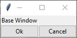
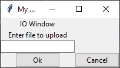

# Using Classes with `tkinter` to Standardize Windows

If you design an interface that uses multiple windows, you may find that you
are repeating the same code when defining each window.  If your windows have
similar layouts, it is possible to design a "base" window and then modify
that base design with the additional needs of each window.  You can do this
by defining custom classes of windows.

For a review of classes in Python, visit the [classes.md](../Lectures/classes.md) 
lecture notes.  A general understanding of class inheritance is also helpful.
Consult the [Python Documentation](https://docs.python.org/3/tutorial/classes.html#inheritance)
or checking out the many tutorials on-line about this subject (for example:
<https://www.w3schools.com/python/python_inheritance.asp>).

First, design your base window in a class as follows:

```python
class BaseWin:

    def __init__(self, win):

        super().__init__()
        self.win = win
        self.win.title("My base window")
        self.name_label = ttk.Label(self.win, text="Base Window")
        self.name_label.grid(column=0, row=0)

        self.ok_button = ttk.Button(self.win, text="Ok")
        self.ok_button.grid(column=0, row=9)
        self.cancel_button = ttk.Button(self.win, text="Cancel",
                                        command=self.cancel_button_cmd)
        self.cancel_button.grid(column=1, row=9)

    def cancel_button_cmd(self):
        self.win.destroy()
        return
```
The `__init__` function is called when the class is initiated.  It receives
a variable `win` that contains the window we will create later and assigns
that to the `self.win` variable that is a class attribute.  The remaining
commands create a label, an 'Ok' button, and a 'Cancel' button that is linked
to a function to close the window.

Then, we create a window using this class as follows:
```python
root = tk.Tk()
my_window = BaseWin(root)
root.mainloop()
``` 
We first create a root window using the `Tk()` function from `tkinter`.  We
then create a variable that will contain our customized version of the window 
by calling the `BaseWin` class and sending it the variable in which we created 
the window.  Then, we start the GUI interface by calling `root.mainloop()`.
Here is the result:

  

The cancel button will close the window, but the "Ok" button doesn't have
any functionality yet.  Now, this is our "base" window, but we want to be
able to customize it.  

Now, let's define another window class based onthe base window with some 
additional features.

```python
class IOWindow(BaseWin):

    def __init__(self, win):
        super().__init__(win)
        self.name_label.configure(text="IO Window")
        self.upload_label = ttk.Label(self.win, text="Enter file to upload")
        self.upload_label.grid(column=0, row=1)
        self.file_name = tk.StringVar()
        self.entry_box = ttk.Entry(self.win, textvariable=self.file_name)
        self.entry_box.grid(column=0, row=2)
        self.ok_button.configure(command=self.upload_command)

    def upload_command(self):
        file_name_to_get = self.file_name.get()
        print("Run code to upload file_name")
        return
```
First, you will notice that when we define this new class, we have it inherit
the functionality of the `BaseWin` class by including it in parenthesis after
the new class name.

Second, as the first line in the `__init__` function, we make a call to
`super().__init__(win)`.  This calls the `__init__` function of the class
from which this inherits, `BaseWin`, and makes sure that the widgets and such
that are a part of `BaseWin` are defined.  

Third, this class should make any desired changes to the existing `BaseWin` 
widgets by using the `.configure` method.  For example, 
`self.name_label.configure(text="IO Window")` changes the text of the name
label.  And, `self.ok_button.configure(command=self.upload_command)` adds a
command function to the Ok button when it is pressed.  This command function is
defined as a method in this new class.

Fourth, any additional widgets you want to add to this new window type can be
added.  (Note, if there is a widget that is defined in `BaseWin` that you no
longer want on the new class window, you can use the `.destroy()` or 
`.grid_remove` or `.grid_forget()` method as in `self.name_label.grid_forget()`.
Look up the differenes between these three methods to determine the best one
to use.


This window type can now be activated with code such as this:
```python
root = tk.Tk()
my_window = BaseWin(root)
root.mainloop()
```
The window will look like this:



If something is typed into the Entry box and then "Ok" pressed, the entry will
be printed in the console.

Now, this approach can be used with multiple windows.  If you have a root
window as your first window, and then want to create a second window using
one of your defined classes, you could simply create a `Toplevel()` variable
and then send it to the classes.  For example:

```python
root = tk.Tk()
ttk.Label(root, text="This is the root window.  Assume that we then want"
          "to open another window.")
second_window = tk.Toplevel()
my_second_window = IOWindow(second_window)
root.mainloop()
```