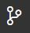
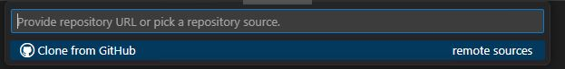
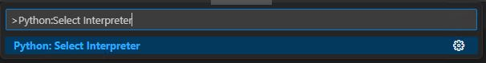
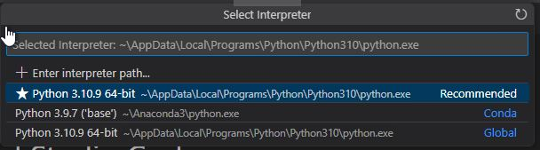
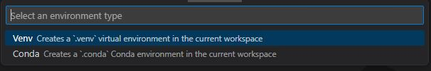
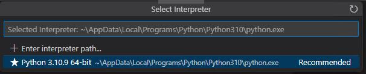
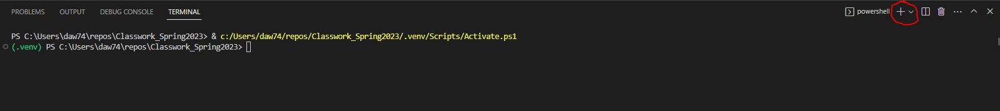
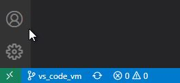

# Using Visual Studio Code

Note: Snapshot and specific instructions shown here were taken from a Windows
machine.  macOS and Linux versions may differ slightly.

## Installation
1. Make sure you have git and Python installed on your computer.  See
[01_tool_setup_git_intro.md](../Assignments/01_tool_setup_git_intro.md)
for instructions.
2. Visit <https://code.visualstudio.com/download>.  Download the appropriate
installer.
3. Run the installer.  Default options are acceptable.
4. Install the "Python" extension for Visual Studio Code.  You can do this by
either:  
    -- visiting the Python extension website on the VS Marketplace 
       [here](https://marketplace.visualstudio.com/items?itemName=ms-python.python)
       and clicking install  
    -- opening the Extensions side bar in VS Code by selecting the 
       `View/Extensions` menu item or clicking on the Extensions icon on the 
       left:
       .  Then, search
       for "Python" and select the "Python" extension by Microsoft.  Click on
       the install button.

## Clone a GitHub Repository
1. In VS Code, open the Source Control side bar by selecting 
   `View/Source Control` menu item or clicking on the Source Control icon on
   the left: 
2. Click on the "Clone Repository" button.
3. Enter the appropriate SSH string in the box that is displayed at the top and
   press return.  
   
4. In the file dialog that opens, select a folder in which to create a new
   folder for this respository.
5. The repository is now open in VS Code.  

## Open an Existing Git Repository
1. Follow step 1 from Clone a Git Repository
2. Click on the "Open Folder" button.
3. In the file dialog that opens, select the folder containing the repository
   to be opened.  

## Select a Python Interpreter
1. Open the Command Palette by either selecting the `View/Command Palette..`
   menu item, or pressing Ctrl-Shift-P (Windows).  
2. At the prompt, enter "Python: Select Interpreter".  
   
3. Select from one of the options, or click "Enter interpreter path..." to 
   choose one not shown.  
     
   If you have a previously created virtual environment that VS Code does not
   automatically recognize, you will need to select "Enter interpreter path..."
   and navigate to the `python.exe` file found in the `Scripts` or `bin` folder
   of the target virtual environment.

## Creating a Virtual Environment
1. Open the Command Palette and enter and select "Python: Create Environment".
2. Select from one of the two options:  
   
   Select `Venv` to use `pip` and `requirements.txt` to add packages.  Select
   `Conda` to use `conda` and `environment.yml` to add packages.  The rest of
   these instructions assume you select `Venv`.
3. You will then be asked for the default interpreter to use with this 
   environment.  Select one:  
   
4. You then may be asked what packages, or dependencies, to install.  If a
   `requirments.txt` file is found, you may have the option to select that.
5. VS Code will make a folder called `.venv` in which to put the virtual
   environment files.  

## Terminal Windows in VS Code
A terminal window for using the command line (so you can enter git commands,
run Python, create environments, etc.) can be opened by selecting the
`Terminal/New Terminal` menu item.  In my installation, this will open up a
powershell terminal.  Other types of terminals can be opened by selecting the
`+` icon in the Terminal Window:  

Options may include the command prompt or Git Bash.  To change the default
terminal type that is opened, open the Command Palette and enter "Terminal:
Select Default Profile" and then choose the desired terminal type for the
default.

## Git Workflow in VS Code
The git workflow can be implemented by using command line commands in the 
terminal window opened above.  VS Code also has git functionality built-in.
The built-in functionality is accessed by the Source Control side bar.  

### Making a new branch
In the Source Control side bar, click on the three horizontal dots in the
upper right.  From the pop-up menu, select "Branch/Create Branch..." to make
a new branch from the current branch.  The new branch is automatically
checked out.

### Adding and Committing a File to Repository
If a new file is made, it will initially be untracked.  This is indicated in 
the "Explorer" side bar by a "U" (Untracked) next to the file name.   It is 
also shown in the "Source Control" side bar under the "Changes" heading.  
If you modify an existing file 
already in the repository, it will have an "M" (Modified) next to its name.

To "add" the file or stage the change, go
to the "Source Control" side bar and click on the "+" found next to the file
to be added.  The file will be moved into the "Staged Changes" area.  The "U"
will become an "A" (Added) while the "M" will stay the same.  

To commit the changes added to the
staging area, enter a commit message in the "Message" box at the top of the
Source Control side bar and then click the blue "Commit" button.  If you 
forget to enter a commit message, an editor will pop up prompting you to enter
the message.  Once a file is committed to the repository, it will no longer 
have an "A", "U", or "M" next to its name.

### Pushing Branch
A branch can be pushed to GitHub by opening up the Source Control side bar,
clicking on the three horizontal dots in the upper right, and selecting "Push".
If the branch does not already exist on GitHub, you will be asked if you want
to publish it (i.e., create it on GitHub).  

### Changing Branches
The current branch is indicated in the lower left hand corner of the VS Code
window in the status bar:  
  
To switch branches, click on this branch name.  The Command Palette will open
at the top of the VS Code window and you can select the branch you would like
to check out.  

### Pulling Changes from GitHub
In the Source Control side bar, click on the three horizontal dots in the 
upper right and select "Pull"

## Using PycodeStyle / Flake8 in VS Code Editor
`pycodestyle` is no longer directly supported in VS Code.  However, a
package called `flake8` that is based on `pycodestyle` is supported.  To 
install the `flake8` extension in VS Code:
1. Click on the  icon 
   to open the Extensions tab.  In the "Search Extensions in Marketplace" 
   search box at the top of the tab, enter Flake 8.
2. Look for the Flake8 extension published by Microsoft:  
   
3. Click "Install".

PEP-8 errors should now be shown was wavy lines below the code lines.  If 
you hover over the wavy line, a message should be displayed with the PEP8 
error.  Look for both errors (which will be shown by a red wavy line and 
have an E error code, such as E302) and warnings (Yellow wavy lines and 
have a W error code, such as W391).

**Important Note**: The `flake8` extension does not act dynamically.  It 
only does its checks when a file is opened or saved.  So, after you make 
some changes to fix any issues, you will need to save the file in order to 
get `flake8` to update.    

In addition to these errors and warnings, `flake8` highlights some 
additional code issues that are not PEP-8 issues.  For example, if you 
declare a variable and never use it, `flake8` will highlight that.  These 
issues have an F error code (such as F841).  By default, `flake8` also 
shows these as red wavy lines.  To help distinguish between PEP8 errors 
that should be changed and these "F" issues, you can change the color, or 
entirely remove, the line for the "F" issues.  In VS Code, 
* go to the "File" menu and select "Preferences/Settings...".  
* In the left pane of the Settings tab, select "Extensions/Flake 8".
* In the right pane, scroll until you find "Severity".
* As an alternate to the above two steps, you can search for "Flake8: 
  Severity" in the "Search Settings" search bar.
* In Flake8: Severity, hover over the item code you want to change and 
  click on the pencil that will display on the right.  
* Select "Hint" or "Information" from the dropdown menu and then click Ok.  
  "Hint" will show a dotted line where the issue is found.  "Information" 
  will show a blue wavy line.

## References

https://code.visualstudio.com/docs

https://code.visualstudio.com/docs/python/python-tutorial

https://code.visualstudio.com/docs/sourcecontrol/overview

https://code.visualstudio.com/docs/python/environments#_creating-environments

